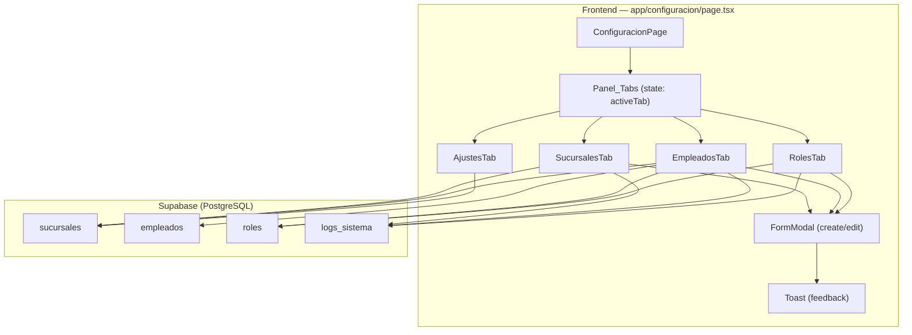

# Design Document — Módulo de Configuración

## Overview

El Módulo de Configuración centraliza la administración del sistema Body Xtreme Gym OS en una sola página (`/configuracion`) con cuatro pestañas: Sucursales, Empleados, Roles y Ajustes. Reemplaza las constantes hardcodeadas `SUCURSAL_ID` y `CAPACITY` con valores dinámicos leídos desde la base de datos. Toda operación CRUD genera registros de auditoría en `logs_sistema`.

La página sigue el mismo patrón de diseño que las páginas existentes (socios, pagos, planes): componente `"use client"` con estado local, llamadas directas a Supabase vía `@/lib/supabase`, dark theme (#020617), bordes #1e293b, acentos brand-green, tarjetas rounded-2xl, tipografía slate, y modales con overlay backdrop-blur.

## Architecture



La arquitectura es un componente de página único (`"use client"`) que gestiona el estado de las pestañas internamente con `useState`. Cada pestaña es un componente funcional interno que realiza queries directas a Supabase. No se requiere API route ni server component adicional — sigue el mismo patrón que `app/socios/page.tsx` y `app/pagos/page.tsx`.


## Components and Interfaces

### ConfiguracionPage (componente principal)

Componente de página exportado por defecto desde `app/configuracion/page.tsx`. Gestiona:
- `activeTab: "sucursales" | "empleados" | "roles" | "ajustes"` — pestaña activa (default: "sucursales")
- Renderiza el header con section-kicker/section-title/section-description
- Renderiza el Panel_Tabs como botones pill dentro de un contenedor rounded-2xl con borde #1e293b y fondo #0b1220
- Renderiza condicionalmente el componente de la pestaña activa

### Panel_Tabs

Barra de pestañas con el mismo patrón visual del Dashboard (tabs operativo/financiero):
- Contenedor: `rounded-2xl border border-[#1e293b] bg-[#0b1220] p-1 w-fit`
- Tab activa: `bg-brand-green/15 text-brand-green border border-brand-green/30 rounded-xl px-6 py-2`
- Tab inactiva: `text-slate-400 hover:text-slate-200 rounded-xl px-6 py-2`
- Pestañas: 🏢 Sucursales, 👥 Empleados, 🔑 Roles, ⚙️ Ajustes

### SucursalesTab

- Carga sucursales desde `supabase.from("sucursales").select("*")`
- Muestra Tabla_Listado con columnas: nombre, ciudad, teléfono, NIT, estado (Badge_Estado), acciones
- Botón "Nueva Sucursal" abre FormModal en modo create
- Botón editar por fila abre FormModal en modo edit precargado
- Toggle de estado alterna `esta_activa` con optimistic update
- Cada operación CRUD inserta log en `logs_sistema`

### EmpleadosTab

- Carga empleados con join: `supabase.from("empleados").select("*, roles(nombre), sucursales(nombre)")`
- Muestra Tabla_Listado con columnas: nombre completo, CI, email, rol, sucursal, estado, acciones
- FormModal incluye selectores de rol (desde tabla `roles`) y sucursal (desde tabla `sucursales` activas)
- Campo contraseña solo en modo create, excluido en modo edit
- Password se hashea con `crypto.subtle.digest('SHA-256', ...)` antes de insertar
- Validación de unicidad de CI y email contra la base de datos

### RolesTab

- Carga roles desde `supabase.from("roles").select("*")`
- Muestra Tabla_Listado con columnas: nombre, descripción, permisos activos (como badges), acciones
- Permisos se muestran como badges: verde para activo, gris para inactivo
- FormModal incluye tres toggles: permiso_ver_finanzas, permiso_editar_usuarios, permiso_gestionar_asistencias
- Validación de nombre único
- Protección contra eliminación de roles con empleados asignados (consulta count antes de eliminar)

### AjustesTab

- Selector de sucursal (dropdown con sucursales activas)
- Al seleccionar sucursal, carga `capacidad_maxima` desde la tabla `sucursales`
- Campo editable: capacidad máxima (numérico, > 0)
- Campos de solo lectura: zona horaria (America/La_Paz), moneda (BOB)
- Botón guardar actualiza `capacidad_maxima` en la tabla `sucursales`
- Toast de confirmación al guardar exitosamente

### FormModal (componente reutilizable)

Modal reutilizable para crear/editar registros, siguiendo el patrón visual de `SocioModal` en socios:
- Overlay: `bg-black/70 backdrop-blur-sm`
- Contenedor: `rounded-[28px] border border-[#1e293b] bg-[#020617] shadow-2xl`
- Gradiente decorativo: `bg-[radial-gradient(700px_circle_at_15%_0%,rgba(118,203,62,0.10),transparent_50%)]`
- Header con icono, kicker text, título, botón cerrar
- Barra de progreso (porcentaje de campos completados)
- Campos con componente Field (label, hint, error, success indicator)
- Inputs: `rounded-2xl border bg-[#0b1220] px-4 py-3 text-sm text-slate-100`
- Botón principal: `bg-brand-green text-[#020617] font-bold rounded-2xl`
- Botón cancelar: `border border-[#1e293b] bg-white/5 text-slate-400 rounded-2xl`

### Toast

Componente de notificación reutilizado del patrón existente:
- Posición: `fixed right-4 top-4 z-[70]`
- Estilo: `rounded-2xl border border-brand-green/25 bg-[#0b1220] shadow-2xl`
- Auto-dismiss después de 2.5 segundos

### Badge_Estado

Indicador visual de estado activo/inactivo:
- Activo: `border-brand-green/30 bg-brand-green/10 text-brand-green` con dot verde
- Inactivo: `border-red-500/30 bg-red-500/10 text-red-400` con dot rojo

### Funciones de Auditoría

```typescript
async function insertLog(params: {
  tabla_afectada: string;
  registro_id: number;
  operacion: "INSERT" | "UPDATE" | "DELETE";
  valor_anterior: Record<string, unknown> | null;
  valor_nuevo: Record<string, unknown> | null;
}): Promise<void>
```

- Sanitiza `valor_anterior` y `valor_nuevo` removiendo `password_hash` antes de insertar
- Inserta en `logs_sistema` con `empleado_id` y `sucursal_id` del contexto actual


## Data Models

### Tabla `sucursales` (existente — requiere migración para agregar `capacidad_maxima`)

| Columna | Tipo | Nullable | Default | Notas |
|---------|------|----------|---------|-------|
| id | integer (PK) | NO | autoincrement | — |
| nombre | varchar | NO | — | — |
| direccion | text | NO | — | — |
| telefono | varchar | SÍ | null | — |
| ciudad | varchar | NO | — | — |
| nit | varchar | SÍ | null | — |
| esta_activa | boolean | SÍ | true | — |
| fecha_creacion | timestamptz | SÍ | now() | — |
| capacidad_maxima | integer | NO | 50 | **NUEVA** — CHECK > 0 |

### Tabla `empleados` (existente, sin cambios)

| Columna | Tipo | Nullable | Default | Notas |
|---------|------|----------|---------|-------|
| id | integer (PK) | NO | autoincrement | — |
| rol_id | integer (FK → roles) | NO | — | — |
| sucursal_id | integer (FK → sucursales) | NO | — | — |
| ci | varchar (UNIQUE) | NO | — | — |
| nombre | varchar | NO | — | — |
| apellido | varchar | NO | — | — |
| email | varchar (UNIQUE) | NO | — | — |
| password_hash | text | NO | — | Excluido de logs |
| es_activo | boolean | SÍ | true | — |
| ultimo_login | timestamptz | SÍ | null | — |
| fecha_creacion | timestamptz | SÍ | now() | — |

### Tabla `roles` (existente, sin cambios)

| Columna | Tipo | Nullable | Default | Notas |
|---------|------|----------|---------|-------|
| id | integer (PK) | NO | autoincrement | — |
| nombre | varchar (UNIQUE) | NO | — | — |
| descripcion | text | SÍ | null | — |
| permiso_ver_finanzas | boolean | SÍ | false | — |
| permiso_editar_usuarios | boolean | SÍ | false | — |
| permiso_gestionar_asistencias | boolean | SÍ | true | — |

### Tabla `logs_sistema` (existente, sin cambios)

| Columna | Tipo | Nullable | Default | Notas |
|---------|------|----------|---------|-------|
| id | bigint (PK) | NO | autoincrement | — |
| empleado_id | integer (FK) | SÍ | null | — |
| sucursal_id | integer (FK) | SÍ | null | — |
| tabla_afectada | varchar | NO | — | "sucursales", "empleados", "roles" |
| registro_id | integer | NO | — | ID del registro afectado |
| operacion | varchar | NO | — | CHECK: INSERT, UPDATE, DELETE |
| valor_anterior | jsonb | SÍ | null | Sin password_hash |
| valor_nuevo | jsonb | SÍ | null | Sin password_hash |
| direccion_ip | varchar | SÍ | null | — |
| agente_usuario | text | SÍ | null | — |
| fecha_evento | timestamptz | SÍ | now() | — |

### Migración requerida

```sql
ALTER TABLE sucursales
  ADD COLUMN capacidad_maxima integer NOT NULL DEFAULT 50
  CONSTRAINT capacidad_maxima_positiva CHECK (capacidad_maxima > 0);
```

### TypeScript Types

```typescript
type SucursalRow = {
  id: number;
  nombre: string;
  direccion: string;
  telefono: string | null;
  ciudad: string;
  nit: string | null;
  esta_activa: boolean;
  fecha_creacion: string;
  capacidad_maxima: number;
};

type EmpleadoRow = {
  id: number;
  rol_id: number;
  sucursal_id: number;
  ci: string;
  nombre: string;
  apellido: string;
  email: string;
  es_activo: boolean;
  fecha_creacion: string;
  roles: { nombre: string } | null;
  sucursales: { nombre: string } | null;
};

type RolRow = {
  id: number;
  nombre: string;
  descripcion: string | null;
  permiso_ver_finanzas: boolean;
  permiso_editar_usuarios: boolean;
  permiso_gestionar_asistencias: boolean;
};

type SucursalForm = {
  nombre: string;
  direccion: string;
  telefono: string;
  ciudad: string;
  nit: string;
  capacidad_maxima: string;
};

type EmpleadoForm = {
  nombre: string;
  apellido: string;
  ci: string;
  email: string;
  password: string;
  rol_id: string;
  sucursal_id: string;
};

type RolForm = {
  nombre: string;
  descripcion: string;
  permiso_ver_finanzas: boolean;
  permiso_editar_usuarios: boolean;
  permiso_gestionar_asistencias: boolean;
};
```


## Correctness Properties

*A property is a characteristic or behavior that should hold true across all valid executions of a system — essentially, a formal statement about what the system should do. Properties serve as the bridge between human-readable specifications and machine-verifiable correctness guarantees.*

### Property 1: Validación de formulario de sucursal rechaza campos obligatorios vacíos

*For any* combinación de campos del formulario de sucursal donde al menos un campo obligatorio (nombre, dirección, ciudad, capacidad_maxima) esté vacío o solo contenga espacios en blanco, la función de validación SHALL retornar un error para cada campo obligatorio vacío, y la cantidad de errores SHALL ser igual a la cantidad de campos obligatorios vacíos.

**Validates: Requirements 2.4**

### Property 2: Validación de capacidad rechaza valores no positivos

*For any* valor numérico menor o igual a 0 (incluyendo 0, negativos y decimales no positivos), la función de validación de capacidad SHALL rechazar el valor y retornar un mensaje de error indicando que la capacidad debe ser mayor a 0.

**Validates: Requirements 5.4**

### Property 3: Pre-llenado del formulario de edición preserva datos de la entidad

*For any* registro de sucursal o rol con valores arbitrarios en sus campos, al abrir el formulario de edición, cada campo del formulario SHALL contener exactamente el valor correspondiente del registro original.

**Validates: Requirements 2.5, 4.5**

### Property 4: Edición de empleado excluye contraseña del formulario

*For any* registro de empleado con datos arbitrarios, al abrir el formulario de edición, el formulario SHALL pre-llenar todos los campos editables (nombre, apellido, CI, email, rol, sucursal) con los valores del registro, y el campo contraseña SHALL estar ausente o vacío.

**Validates: Requirements 3.5**

### Property 5: Sanitización de logs excluye campos sensibles

*For any* objeto de datos de empleado que contenga el campo `password_hash`, la función de sanitización de logs SHALL producir un objeto que NO contenga la clave `password_hash`, y SHALL preservar todos los demás campos sin modificación.

**Validates: Requirements 7.4**

### Property 6: Renderizado de tabla incluye todas las columnas requeridas por entidad

*For any* array de registros de sucursales, empleados o roles con datos arbitrarios, el componente de tabla correspondiente SHALL renderizar una celda para cada columna requerida (según la especificación de cada entidad) para cada fila de datos.

**Validates: Requirements 2.1, 3.1, 4.1**

## Error Handling

### Errores de Base de Datos

- Todas las operaciones Supabase (`insert`, `update`, `select`) verifican el campo `error` del resultado
- Si `error` no es null, se muestra un Toast con el mensaje de error traducido al español
- Errores de unicidad (CI, email, nombre de rol duplicado) se detectan por el código de error de PostgreSQL (`23505`) y se muestran mensajes específicos:
  - CI duplicado: "El CI ya está registrado"
  - Email duplicado: "El email ya está registrado"
  - Nombre de rol duplicado: "El nombre de rol ya existe"

### Errores de Validación

- Validación client-side antes de enviar al servidor
- Campos obligatorios vacíos muestran error inline en rojo (`text-red-400`) con animación shake
- Capacidad máxima ≤ 0 muestra mensaje de validación
- Email con formato inválido muestra mensaje de validación
- Los errores se muestran junto al campo correspondiente, no como alert global

### Protección de Integridad Referencial

- Antes de eliminar un rol, se consulta `empleados` con `count` para verificar si tiene empleados asignados
- Si tiene empleados, se muestra advertencia en lugar de proceder con la eliminación
- Toggle de estado de sucursal no elimina el registro, solo alterna `esta_activa`

### Fallback de Constantes

- Si la consulta de sucursal falla en el Dashboard, se usan valores por defecto: `SUCURSAL_ID = 1`, `capacidad = 50`
- Esto garantiza que el Dashboard nunca se rompa por falta de configuración

## Testing Strategy

### Unit Tests (ejemplo-based)

- Renderizado de la página con las 4 pestañas
- Navegación entre pestañas sin recarga
- Pestaña "Sucursales" activa por defecto
- Apertura de modales de creación para cada entidad
- Campos de solo lectura en Ajustes (timezone, moneda)
- Toast de confirmación al guardar
- Advertencia al intentar eliminar rol con empleados
- Sidebar resalta "Configuración" como activo

### Integration Tests

- CRUD completo de sucursales contra Supabase
- CRUD completo de empleados con hash de contraseña
- CRUD completo de roles con validación de unicidad
- Actualización de capacidad en Ajustes y reflejo en Dashboard
- Registro de auditoría en `logs_sistema` para cada operación
- Detección de CI/email duplicado en empleados
- Detección de nombre duplicado en roles
- Fallback a valores por defecto cuando no hay sucursal configurada

### Property-Based Tests

Se utilizará `fast-check` como librería de property-based testing para TypeScript/JavaScript. Cada test ejecutará un mínimo de 100 iteraciones.

- **Feature: configuracion, Property 1**: Validación de formulario de sucursal rechaza campos obligatorios vacíos
- **Feature: configuracion, Property 2**: Validación de capacidad rechaza valores no positivos
- **Feature: configuracion, Property 3**: Pre-llenado del formulario de edición preserva datos de la entidad
- **Feature: configuracion, Property 4**: Edición de empleado excluye contraseña del formulario
- **Feature: configuracion, Property 5**: Sanitización de logs excluye campos sensibles
- **Feature: configuracion, Property 6**: Renderizado de tabla incluye todas las columnas requeridas por entidad

