# 📊 Diagramas para Tesis - Body Xtreme Gym OS

Sistema de Inteligencia de Negocios con Análisis Predictivo y Prescriptivo para la Gestión Estratégica y Retención de Clientes en Gimnasios Multisucursal

---

## 1. Diagramas de Casos de Uso

### 1.1 Descripción de Actores del Sistema

| Actor | Rol | Permisos | Descripción |
|-------|-----|----------|-------------|
| **Administrador** | Gerente/Dueño | Acceso total | Puede ver todas las sucursales, gestionar empleados, configurar el sistema, acceder a BI y reportes |
| **Recepcionista** | Personal de recepción | Operaciones diarias | Solo ve su sucursal, registra pagos, asistencias, gestiona casilleros |
| **Entrenador** | Personal de entrenamiento | Gestión de asistencias | Solo ve su sucursal, registra entrada/salida de socios |
| **Sistema BI** | Motor automático | N/A | Actor secundario que ejecuta análisis automáticos sin intervención humana |

---

### 1.2 Diagrama de Casos de Uso: Autenticación

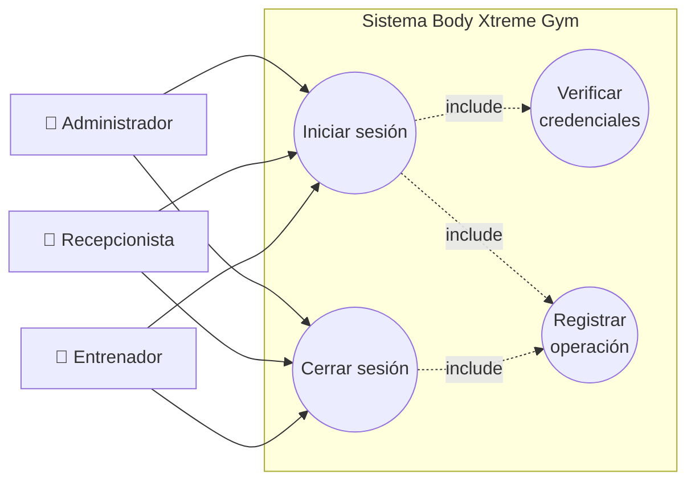
```mermaid
flowchart LR
    Admin[👤 Administrador]
    Recep[👤 Recepcionista]
    Trainer[👤 Entrenador]
    
    subgraph Sistema["Sistema Body Xtreme Gym"]
        UC01((Iniciar sesión))
        UC02((Verificar<br/>credenciales))
        UC03((Registrar<br/>operación))
        UC04((Cerrar sesión))
    end
    
    Admin --> UC01
    Recep --> UC01
    Trainer --> UC01
    
    Admin --> UC04
    Recep --> UC04
    Trainer --> UC04
    
    UC01 -.->|include| UC02
    UC01 -.->|include| UC03
    UC04 -.->|include| UC03
```

**Figura 1.** Diagrama de casos de uso del módulo de autenticación.

---

### 1.3 Diagrama de Casos de Uso: Gestión de Socios

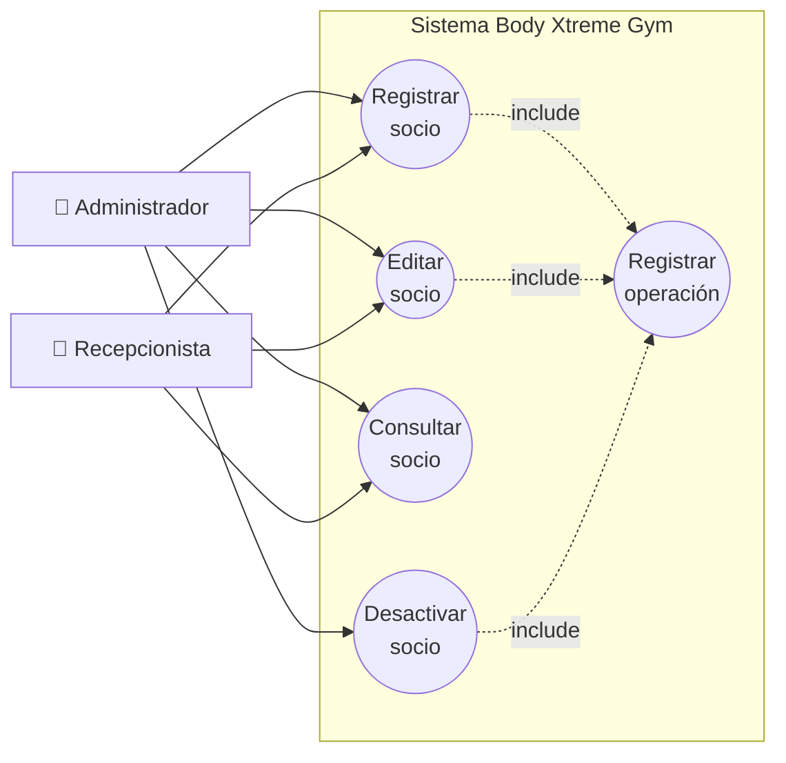
```mermaid
flowchart LR
    Admin[👤 Administrador]
    Recep[👤 Recepcionista]
    
    subgraph Sistema["Sistema Body Xtreme Gym"]
        UC05((Registrar<br/>socio))
        UC06((Editar<br/>socio))
        UC07((Consultar<br/>socio))
        UC08((Desactivar<br/>socio))
        UC09((Registrar<br/>operación))
    end
    
    Admin --> UC05
    Admin --> UC06
    Admin --> UC07
    Admin --> UC08
    
    Recep --> UC05
    Recep --> UC06
    Recep --> UC07
    
    UC05 -.->|include| UC09
    UC06 -.->|include| UC09
    UC08 -.->|include| UC09
```

**Figura 2.** Diagrama de casos de uso del módulo de gestión de socios.

---

### 1.4 Diagrama de Casos de Uso: Gestión de Asistencias

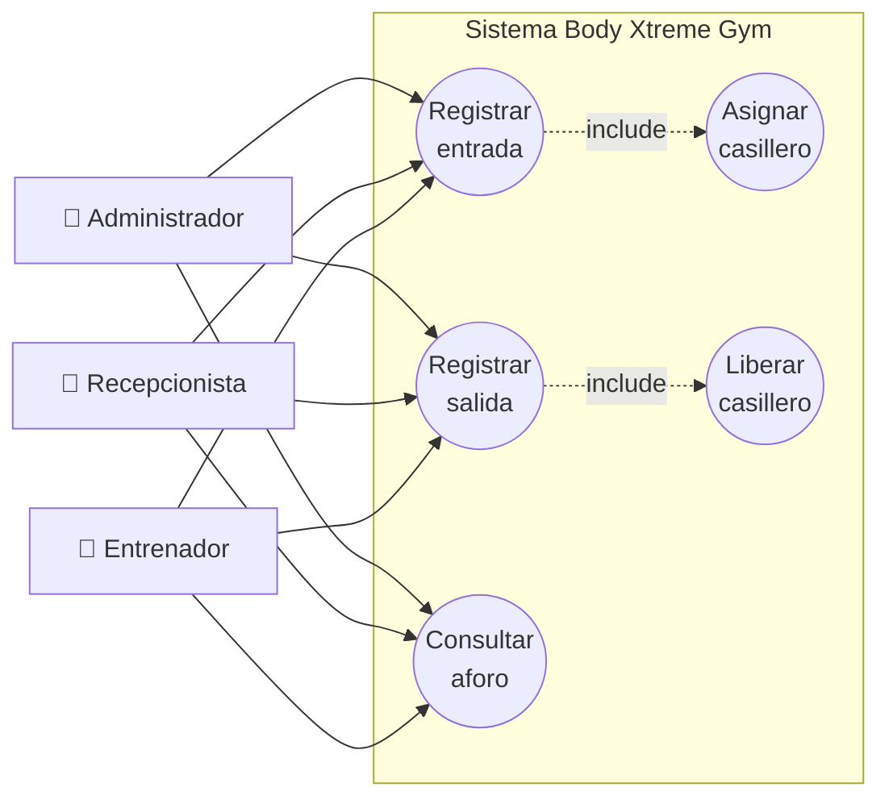
```mermaid
flowchart LR
    Admin[👤 Administrador]
    Recep[👤 Recepcionista]
    Trainer[👤 Entrenador]
    
    subgraph Sistema["Sistema Body Xtreme Gym"]
        UC10((Registrar<br/>entrada))
        UC11((Registrar<br/>salida))
        UC12((Asignar<br/>casillero))
        UC13((Liberar<br/>casillero))
        UC14((Consultar<br/>aforo))
    end
    
    Admin --> UC10
    Admin --> UC11
    Admin --> UC14
    
    Recep --> UC10
    Recep --> UC11
    Recep --> UC14
    
    Trainer --> UC10
    Trainer --> UC11
    Trainer --> UC14
    
    UC10 -.->|include| UC12
    UC11 -.->|include| UC13
```

**Figura 3.** Diagrama de casos de uso del módulo de gestión de asistencias.

---

### 1.5 Diagrama de Casos de Uso: Gestión Financiera

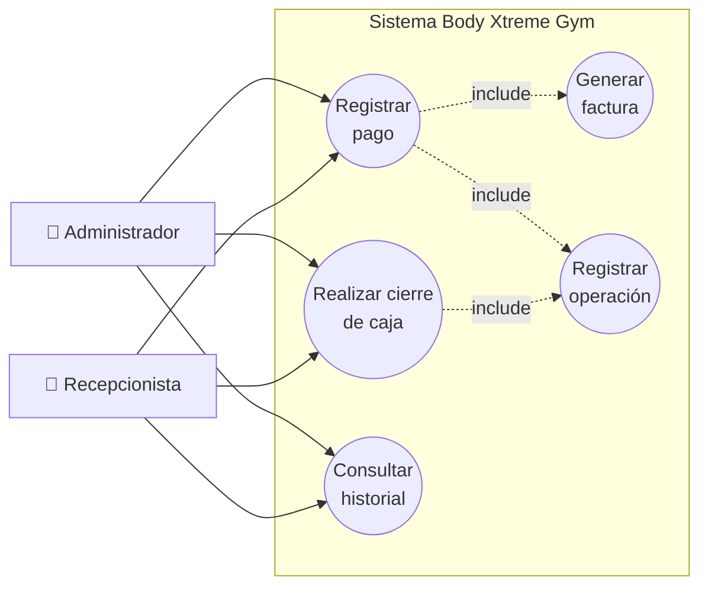
```mermaid
flowchart LR
    Admin[👤 Administrador]
    Recep[👤 Recepcionista]
    
    subgraph Sistema["Sistema Body Xtreme Gym"]
        UC15((Registrar<br/>pago))
        UC16((Generar<br/>factura))
        UC17((Realizar cierre<br/>de caja))
        UC18((Consultar<br/>historial))
        UC19((Registrar<br/>operación))
    end
    
    Admin --> UC15
    Admin --> UC17
    Admin --> UC18
    
    Recep --> UC15
    Recep --> UC17
    Recep --> UC18
    
    UC15 -.->|include| UC16
    UC15 -.->|include| UC19
    UC17 -.->|include| UC19
```

**Figura 4.** Diagrama de casos de uso del módulo de gestión financiera.

---

### 1.6 Diagrama de Casos de Uso: Retención de Clientes

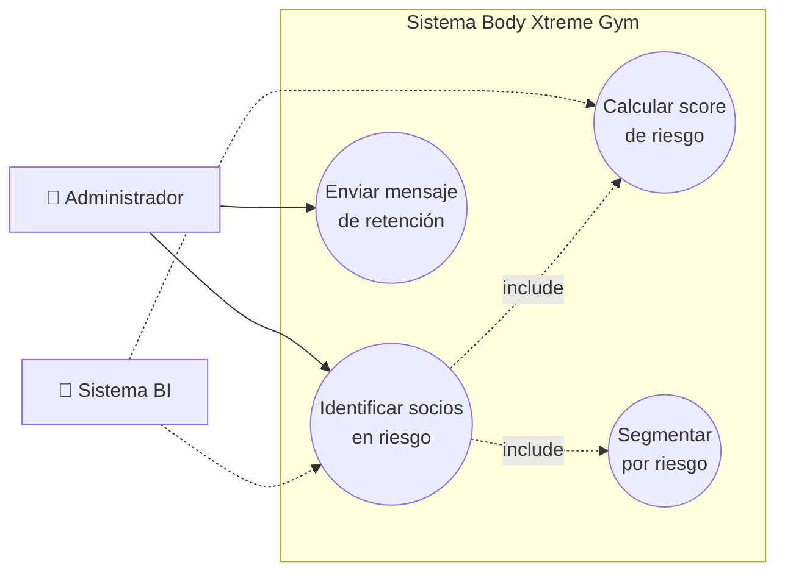
```mermaid
flowchart LR
    Admin[👤 Administrador]
    SistemaBI[🤖 Sistema BI]
    
    subgraph Sistema["Sistema Body Xtreme Gym"]
        UC20((Identificar socios<br/>en riesgo))
        UC21((Calcular score<br/>de riesgo))
        UC22((Enviar mensaje<br/>de retención))
        UC23((Segmentar<br/>por riesgo))
    end
    
    Admin --> UC20
    Admin --> UC22
    
    SistemaBI -.-> UC20
    SistemaBI -.-> UC21
    
    UC20 -.->|include| UC21
    UC20 -.->|include| UC23
```

**Figura 5.** Diagrama de casos de uso del módulo de retención de clientes.

---

### 1.7 Diagrama de Casos de Uso: Campañas de Marketing

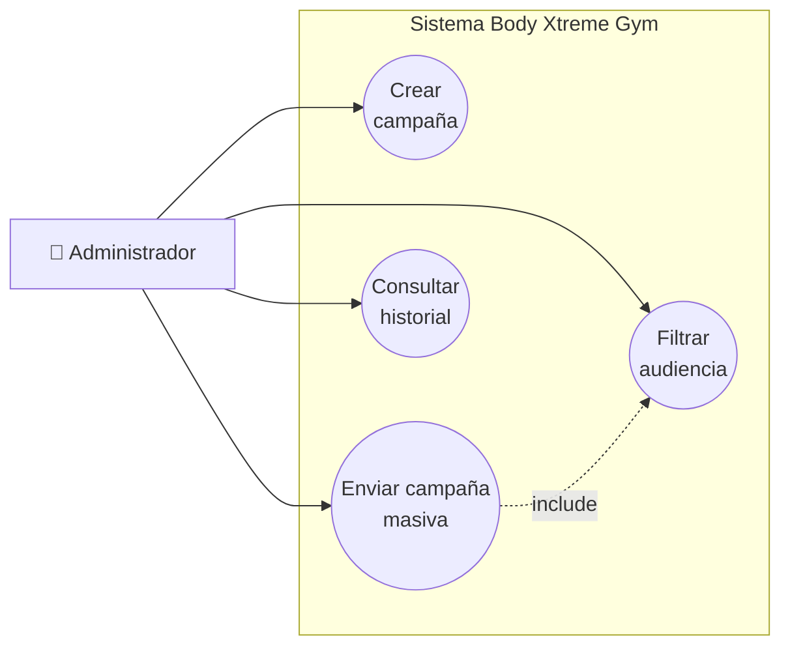
```mermaid
flowchart LR
    Admin[👤 Administrador]
    
    subgraph Sistema["Sistema Body Xtreme Gym"]
        UC24((Crear<br/>campaña))
        UC25((Filtrar<br/>audiencia))
        UC26((Enviar campaña<br/>masiva))
        UC27((Consultar<br/>historial))
    end
    
    Admin --> UC24
    Admin --> UC25
    Admin --> UC26
    Admin --> UC27
    
    UC26 -.->|include| UC25
```

**Figura 6.** Diagrama de casos de uso del módulo de campañas de marketing.

---

### 1.8 Diagrama de Casos de Uso: Business Intelligence

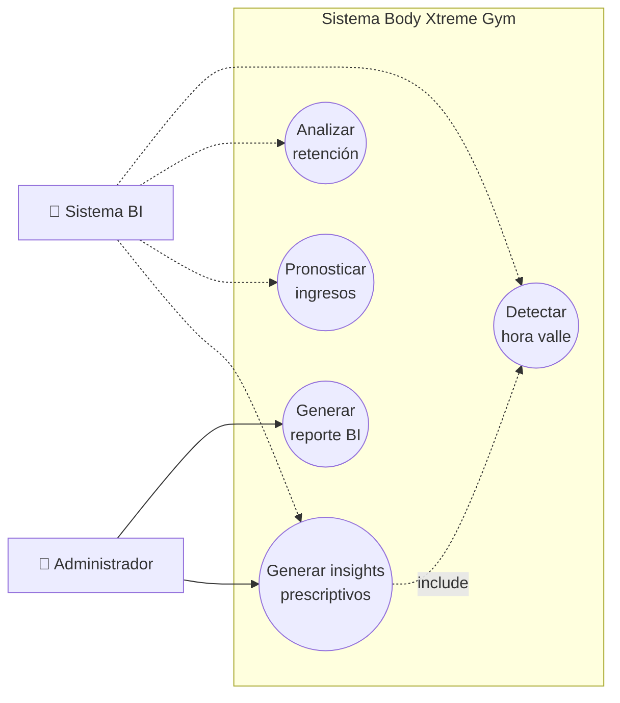
```mermaid
flowchart LR
    Admin[👤 Administrador]
    SistemaBI[🤖 Sistema BI]
    
    subgraph Sistema["Sistema Body Xtreme Gym"]
        UC28((Generar insights<br/>prescriptivos))
        UC29((Pronosticar<br/>ingresos))
        UC30((Analizar<br/>retención))
        UC31((Detectar<br/>hora valle))
        UC32((Generar<br/>reporte BI))
    end
    
    Admin --> UC28
    Admin --> UC32
    
    SistemaBI -.-> UC28
    SistemaBI -.-> UC29
    SistemaBI -.-> UC30
    SistemaBI -.-> UC31
    
    UC28 -.->|include| UC31
```

**Figura 7.** Diagrama de casos de uso del módulo de Business Intelligence.

---

### 1.9 Diagrama de Casos de Uso: Configuración del Sistema

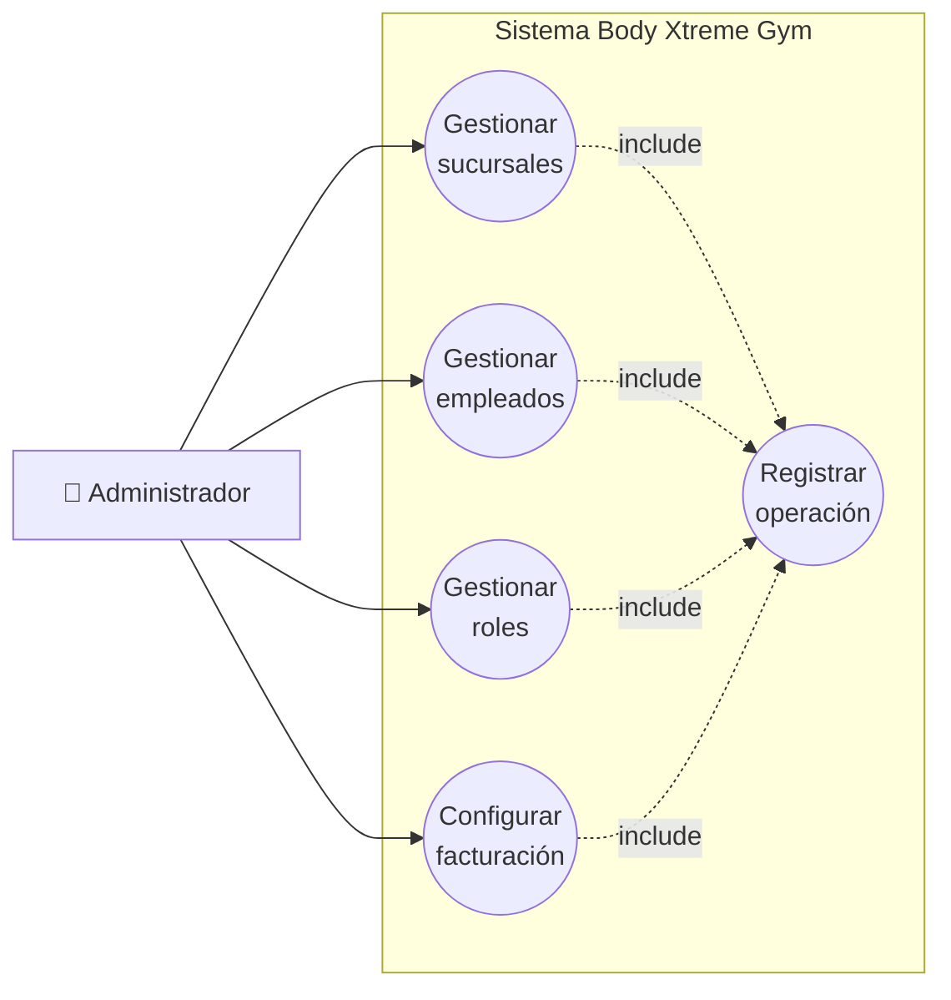
```mermaid
flowchart LR
    Admin[👤 Administrador]
    
    subgraph Sistema["Sistema Body Xtreme Gym"]
        UC33((Gestionar<br/>sucursales))
        UC34((Gestionar<br/>empleados))
        UC35((Gestionar<br/>roles))
        UC36((Configurar<br/>facturación))
        UC37((Registrar<br/>operación))
    end
    
    Admin --> UC33
    Admin --> UC34
    Admin --> UC35
    Admin --> UC36
    
    UC33 -.->|include| UC37
    UC34 -.->|include| UC37
    UC35 -.->|include| UC37
    UC36 -.->|include| UC37
```

**Figura 8.** Diagrama de casos de uso del módulo de configuración del sistema.

---

### 1.10 Diagrama de Casos de Uso: Auditoría

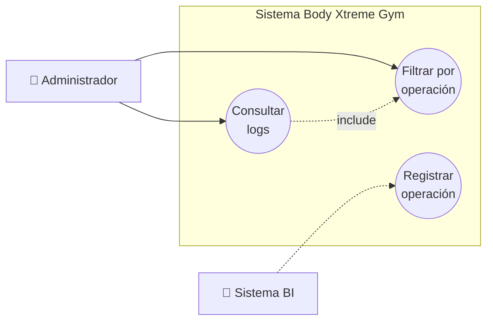
```mermaid
flowchart LR
    Admin[👤 Administrador]
    SistemaBI[🤖 Sistema BI]
    
    subgraph Sistema["Sistema Body Xtreme Gym"]
        UC38((Consultar<br/>logs))
        UC39((Filtrar por<br/>operación))
        UC40((Registrar<br/>operación))
    end
    
    Admin --> UC38
    Admin --> UC39
    
    SistemaBI -.-> UC40
    
    UC38 -.->|include| UC39
```

**Figura 9.** Diagrama de casos de uso del módulo de auditoría

---

### 1.11 Matriz de Trazabilidad Actor-Caso de Uso

| Caso de Uso | Admin | Recep | Trainer | Sistema BI |
|-------------|-------|-------|---------|------------|
| **Autenticación** |
| UC-01: Iniciar sesión | ✓ | ✓ | ✓ | |
| UC-02: Verificar credenciales | ✓ | ✓ | ✓ | |
| UC-03: Registrar operación | | | | ✓ |
| UC-04: Cerrar sesión | ✓ | ✓ | ✓ | |
| **Gestión de Socios** |
| UC-05: Registrar socio | ✓ | ✓ | | |
| UC-06: Editar socio | ✓ | ✓ | | |
| UC-07: Consultar socio | ✓ | ✓ | | |
| UC-08: Desactivar socio | ✓ | | | |
| UC-09: Registrar operación | | | | ✓ |
| **Gestión de Asistencias** |
| UC-10: Registrar entrada | ✓ | ✓ | ✓ | |
| UC-11: Registrar salida | ✓ | ✓ | ✓ | |
| UC-12: Asignar casillero | ✓ | ✓ | | |
| UC-13: Liberar casillero | ✓ | ✓ | | |
| UC-14: Consultar aforo | ✓ | ✓ | ✓ | |
| **Gestión Financiera** |
| UC-15: Registrar pago | ✓ | ✓ | | |
| UC-16: Generar factura | ✓ | ✓ | | |
| UC-17: Realizar cierre de caja | ✓ | ✓ | | |
| UC-18: Consultar historial | ✓ | ✓ | | |
| UC-19: Registrar operación | | | | ✓ |
| **Retención de Clientes** |
| UC-20: Identificar socios en riesgo | ✓ | | | ✓ |
| UC-21: Calcular score de riesgo | | | | ✓ |
| UC-22: Enviar mensaje de retención | ✓ | | | |
| UC-23: Segmentar por riesgo | | | | ✓ |
| **Campañas de Marketing** |
| UC-24: Crear campaña | ✓ | | | |
| UC-25: Filtrar audiencia | ✓ | | | |
| UC-26: Enviar campaña masiva | ✓ | | | |
| UC-27: Consultar historial | ✓ | | | |
| **Business Intelligence** |
| UC-28: Generar insights prescriptivos | ✓ | | | ✓ |
| UC-29: Pronosticar ingresos | ✓ | | | ✓ |
| UC-30: Analizar retención | ✓ | | | ✓ |
| UC-31: Detectar hora valle | ✓ | | | ✓ |
| UC-32: Generar reporte BI | ✓ | | | |
| **Configuración del Sistema** |
| UC-33: Gestionar sucursales | ✓ | | | |
| UC-34: Gestionar empleados | ✓ | | | |
| UC-35: Gestionar roles | ✓ | | | |
| UC-36: Configurar facturación | ✓ | | | |
| UC-37: Registrar operación | | | | ✓ |
| **Auditoría** |
| UC-38: Consultar logs | ✓ | | | |
| UC-39: Filtrar por operación | ✓ | | | |
| UC-40: Registrar operación | | | | ✓ |

**Total de Casos de Uso:** 40  
**Total de Actores:** 4 (3 humanos + 1 sistema)

---

### 1.12 Resumen de Diagramas de Casos de Uso

| Módulo | Figura | Casos de Uso | Actores | Complejidad |
|--------|--------|--------------|---------|-------------|
| Autenticación | 1 | 4 | 3 | Baja |
| Gestión de Socios | 2 | 5 | 2 | Media |
| Gestión de Asistencias | 3 | 5 | 3 | Media |
| Gestión Financiera | 4 | 5 | 2 | Alta |
| Retención de Clientes | 5 | 4 | 2 | Alta |
| Campañas de Marketing | 6 | 4 | 1 | Media |
| Business Intelligence | 7 | 5 | 2 | Alta |
| Configuración del Sistema | 8 | 5 | 1 | Media |
| Auditoría | 9 | 3 | 2 | Baja |

**Características de los Diagramas:**
- ✅ Estilo académico tradicional (minimalista, monocromático)
- ✅ Actores fuera del sistema (stick figures)
- ✅ Casos de uso dentro de rectángulo (subgraph)
- ✅ Máximo 5 casos de uso por diagrama
- ✅ Divididos por módulos funcionales
- ✅ Relaciones include con líneas punteadas
- ✅ Diseño limpio y legible

---

## 1.13 Especificación Detallada de Casos de Uso Clave

A continuación se detallan los casos de uso más importantes del sistema:

---

#### UC-01: Iniciar Sesión
**Actor Principal:** Administrador, Recepcionista, Entrenador  
**Precondiciones:** El empleado debe estar registrado en el sistema  
**Flujo Principal:**
1. El empleado ingresa su email y contraseña
2. El sistema valida las credenciales (SHA-256)
3. El sistema verifica que el empleado esté activo
4. El sistema crea la sesión y registra el login en auditoría
5. El sistema redirige al dashboard según el rol

**Flujo Alternativo:**
- 2a. Credenciales inválidas: mostrar error
- 3a. Empleado inactivo: denegar acceso

---

#### UC-15: Registrar Pago
**Actor Principal:** Recepcionista, Entrenador  
**Precondiciones:** El socio debe estar registrado y tener suscripción activa  
**Flujo Principal:**
1. El empleado busca al socio por CI o nombre
2. El sistema valida que la suscripción esté activa
3. El sistema verifica que el socio no esté ya dentro
4. El empleado asigna un casillero disponible (include UC-09)
5. El sistema registra la entrada con fecha/hora
6. El sistema actualiza el aforo en tiempo real

**Flujo Alternativo:**
- 2a. Suscripción vencida: mostrar alerta y ofrecer renovación
- 3a. Socio ya dentro: mostrar mensaje de error
- 4a. No hay casilleros disponibles: permitir entrada sin casillero

---

#### UC-12: Registrar Pago
**Actor Principal:** Administrador, Recepcionista  
**Precondiciones:** El socio debe estar registrado  
**Flujo Principal:**
1. El empleado selecciona al socio
2. El empleado selecciona el plan y fechas de vigencia
3. El empleado ingresa monto y método de pago
4. El empleado ingresa datos de facturación (NIT/CI, razón social)
5. El sistema crea el registro de pago
6. El sistema genera la factura (include UC-16)
7. El sistema actualiza el estado de suscripción del socio
8. El sistema registra la operación en auditoría

**Postcondiciones:** 
- Pago registrado
- Factura generada
- Suscripción actualizada

---

#### UC-10: Registrar Entrada
**Actor Principal:** Recepcionista, Entrenador  
**Precondiciones:** El socio debe estar registrado y tener suscripción activa  
**Flujo Principal:**
1. El empleado busca al socio por CI o nombre
2. El sistema valida que la suscripción esté activa
3. El sistema verifica que el socio no esté ya dentro
4. El empleado asigna un casillero disponible (include UC-12)
5. El sistema registra la entrada con fecha/hora
6. El sistema actualiza el aforo en tiempo real

**Flujo Alternativo:**
- 2a. Suscripción vencida: mostrar alerta y ofrecer renovación
- 3a. Socio ya dentro: mostrar mensaje de error
- 4a. No hay casilleros disponibles: permitir entrada sin casillero

---

#### UC-20: Identificar Socios en Riesgo
**Actor Principal:** Sistema BI (automático), Administrador (consulta)  
**Precondiciones:** Debe haber datos de asistencias y suscripciones  
**Flujo Principal:**
1. El sistema analiza las asistencias de los últimos 30 días
2. El sistema identifica suscripciones próximas a vencer
3. El sistema calcula el score de riesgo (include UC-21)
4. El sistema clasifica socios en 4 segmentos:
   - Baja asistencia (0-2 visitas en 30 días)
   - No renovaron (suscripción vencida)
   - Racha perdida (pararon hace 10+ días)
   - Próximos a vencer (vence en 7 días)
5. El sistema presenta la lista de socios en riesgo

**Postcondiciones:** Lista de socios en riesgo disponible para acción

---

#### UC-28: Generar Insights Prescriptivos
**Actor Principal:** Sistema BI (automático)  
**Precondiciones:** Debe haber datos históricos de al menos 2 meses  
**Flujo Principal:**
1. El sistema analiza ingresos mensuales
2. El sistema analiza tasa de retención
3. El sistema identifica socios en riesgo (include UC-19)
4. El sistema detecta horas valle (include UC-30)
5. El sistema genera pronósticos de ingresos (include UC-26)
6. El sistema crea insights con 3 tipos:
   - Alertas (prioridad alta): caída de ingresos, retención baja
   - Acciones (prioridad media): socios en riesgo, sin asistencia
   - Oportunidades (prioridad baja): hora valle, pronóstico positivo
7. El sistema ordena insights por prioridad
8. El sistema presenta insights con acciones sugeridas

**Postcondiciones:** Insights disponibles en el dashboard de BI

---

#### UC-29: Pronosticar Ingresos
**Actor Principal:** Sistema BI (automático)  
**Precondiciones:** Debe haber datos históricos de al menos 3 meses  
**Flujo Principal:**
1. El sistema obtiene serie temporal de ingresos mensuales
2. El sistema aplica 3 modelos predictivos:
   - Regresión Lineal: tendencia general
   - Media Móvil Ponderada (WMA): suaviza picos
   - Suavizado Exponencial de Holt: nivel + tendencia
3. El sistema proyecta ingresos a 3 meses
4. El sistema presenta gráfico comparativo de modelos
5. El sistema identifica el modelo con mejor ajuste

**Postcondiciones:** Pronósticos disponibles en Analytics

---

#### UC-31: Detectar Hora Valle
**Actor Principal:** Sistema BI (automático)  
**Precondiciones:** Debe haber datos de asistencias de los últimos 30 días  
**Flujo Principal:**
1. El sistema agrupa asistencias por hora del día
2. El sistema identifica las 3 horas pico (más asistencias)
3. El sistema identifica las 3 horas valle (menos asistencias entre 6:00-20:00)
4. El sistema compara hora valle vs hora pico
5. Si hora_valle < hora_pico * 0.4:
   - El sistema genera insight de oportunidad
   - El sistema sugiere campaña de promoción hora valle
   - El sistema pre-configura template de mensaje

**Postcondiciones:** Insight de hora valle disponible con acción sugerida

---

### 1.4 Matriz de Trazabilidad Actor-Caso de Uso

| Caso de Uso | Admin | Recep | Trainer | Sistema BI | WhatsApp |
|-------------|-------|-------|---------|------------|----------|
| UC-01: Iniciar Sesión | ✓ | ✓ | ✓ | | |
| UC-02: Cerrar Sesión | ✓ | ✓ | ✓ | | |
| UC-03: Registrar Socio | ✓ | ✓ | | | |
| UC-04: Editar Socio | ✓ | ✓ | | | |
| UC-05: Consultar Socio | ✓ | ✓ | | | |
| UC-06: Desactivar Socio | ✓ | | | | |
| UC-07: Registrar Entrada | ✓ | ✓ | ✓ | | |
| UC-08: Registrar Salida | ✓ | ✓ | ✓ | | |
| UC-09: Asignar Casillero | ✓ | ✓ | | | |
| UC-10: Liberar Casillero | ✓ | ✓ | | | |
| UC-11: Consultar Aforo | ✓ | ✓ | ✓ | | |
| UC-12: Registrar Pago | ✓ | ✓ | | | |
| UC-13: Generar Factura | ✓ | ✓ | | | |
| UC-14: Realizar Cierre de Caja | ✓ | ✓ | | | |
| UC-15: Consultar Historial de Pagos | ✓ | ✓ | | | |
| UC-16: Crear Plan | ✓ | | | | |
| UC-17: Editar Plan | ✓ | | | | |
| UC-18: Activar/Desactivar Plan | ✓ | | | | |
| UC-19: Identificar Socios en Riesgo | ✓ | | | ✓ | |
| UC-20: Enviar Mensaje de Retención | ✓ | | | | ✓ |
| UC-21: Calcular Score de Riesgo | | | | ✓ | |
| UC-22: Crear Campaña | ✓ | | | | |
| UC-23: Filtrar Audiencia | ✓ | | | | |
| UC-24: Enviar Campaña Masiva | ✓ | | | | ✓ |
| UC-25: Generar Insights Prescriptivos | ✓ | | | ✓ | |
| UC-26: Pronosticar Ingresos | ✓ | | | ✓ | |
| UC-27: Analizar Retención | ✓ | | | ✓ | |
| UC-28: Generar Reporte BI | ✓ | | | | |
| UC-29: Analizar Cohortes | ✓ | | | ✓ | |
| UC-30: Detectar Hora Valle | ✓ | | | ✓ | |
| UC-31: Gestionar Sucursales | ✓ | | | | |
| UC-32: Gestionar Empleados | ✓ | | | | |
| UC-33: Gestionar Roles | ✓ | | | | |
| UC-34: Configurar Facturación | ✓ | | | | |
| UC-35: Consultar Logs | ✓ | | | | |
| UC-36: Registrar Operación | | | | ✓ | |

**Total de Casos de Uso:** 36

---

### 1.5 Diagrama de Casos de Uso por Módulo

#### Módulo de Retención (Detallado)

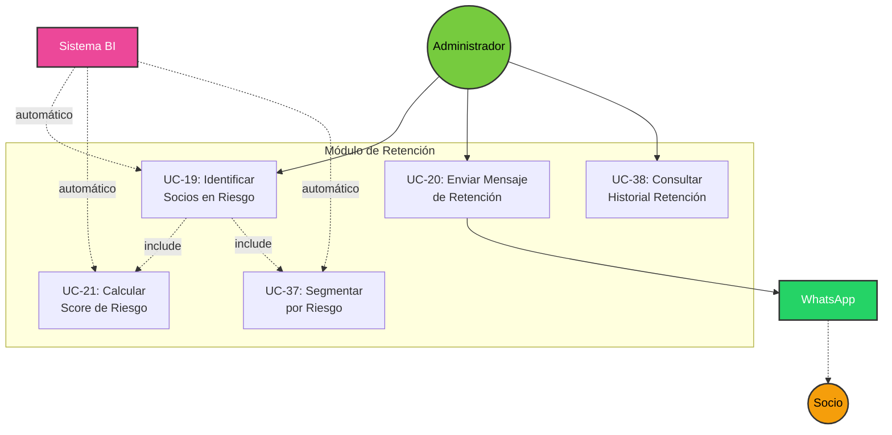
```mermaid
graph TB
    Admin((Administrador))
    SistemaBI[Sistema BI]
    WhatsApp[WhatsApp]
    Socio((Socio))
    
    subgraph "Módulo de Retención"
        UC19[UC-19: Identificar<br/>Socios en Riesgo]
        UC21[UC-21: Calcular<br/>Score de Riesgo]
        UC20[UC-20: Enviar Mensaje<br/>de Retención]
        UC37[UC-37: Segmentar<br/>por Riesgo]
        UC38[UC-38: Consultar<br/>Historial Retención]
    end
    
    Admin --> UC19
    Admin --> UC20
    Admin --> UC38
    
    SistemaBI -.->|automático| UC19
    SistemaBI -.->|automático| UC21
    SistemaBI -.->|automático| UC37
    
    UC19 -.->|include| UC21
    UC19 -.->|include| UC37
    UC20 --> WhatsApp
    WhatsApp -.-> Socio
    
    style Admin fill:#76CB3E,stroke:#333,stroke-width:2px,color:#000
    style SistemaBI fill:#ec4899,stroke:#333,stroke-width:2px,color:#fff
    style WhatsApp fill:#25D366,stroke:#333,stroke-width:2px,color:#fff
    style Socio fill:#f59e0b,stroke:#333,stroke-width:2px,color:#000
```

#### Módulo de BI & Analytics (Detallado)

```mermaid
graph TB
    Admin((Administrador))
    SistemaBI[Sistema BI]
    
    subgraph "Módulo de BI & Analytics"
        direction TB
        
        subgraph "Análisis Descriptivo"
            UC39[UC-39: Visualizar KPIs]
            UC40[UC-40: Generar Mapa de Calor]
            UC41[UC-41: Analizar Distribución]
        end
        
        subgraph "Análisis Predictivo"
            UC26[UC-26: Pronosticar Ingresos]
            UC42[UC-42: Aplicar Regresión Lineal]
            UC43[UC-43: Aplicar WMA]
            UC44[UC-44: Aplicar Holt]
        end
        
        subgraph "Análisis Prescriptivo"
            UC25[UC-25: Generar Insights]
            UC30[UC-30: Detectar Hora Valle]
            UC45[UC-45: Sugerir Acciones]
        end
        
        subgraph "Análisis Avanzado"
            UC29[UC-29: Analizar Cohortes]
            UC27[UC-27: Analizar Retención]
            UC46[UC-46: Segmentar Demografía]
        end
        
        UC28[UC-28: Generar Reporte BI]
    end
    
    Admin --> UC39
    Admin --> UC40
    Admin --> UC41
    Admin --> UC28
    
    SistemaBI -.->|automático| UC26
    SistemaBI -.->|automático| UC25
    SistemaBI -.->|automático| UC29
    SistemaBI -.->|automático| UC27
    SistemaBI -.->|automático| UC30
    SistemaBI -.->|automático| UC46
    
    UC26 -.->|include| UC42
    UC26 -.->|include| UC43
    UC26 -.->|include| UC44
    UC25 -.->|include| UC30
    UC25 -.->|include| UC45
    
    style Admin fill:#76CB3E,stroke:#333,stroke-width:2px,color:#000
    style SistemaBI fill:#ec4899,stroke:#333,stroke-width:2px,color:#fff
```

---

## Notas para la Tesis

### Justificación de Actores

1. **Sistema BI como Actor Secundario**: Se incluye como actor porque ejecuta procesos automáticos de análisis sin intervención humana directa. Genera insights, pronósticos y recomendaciones de forma autónoma.

2. **WhatsApp como Actor Externo**: Se incluye porque es un sistema externo que proporciona servicios de mensajería al sistema principal.

3. **Socio como Actor Pasivo**: Aunque no interactúa directamente con el sistema, recibe notificaciones y genera datos de asistencia, por lo que se incluye en algunos casos de uso.

### Relaciones entre Casos de Uso

- **Include (inclusión)**: Indica que un caso de uso siempre incluye el comportamiento de otro
  - Ejemplo: "Registrar Pago" siempre incluye "Generar Factura"
  
- **Extend (extensión)**: Indica comportamiento opcional o condicional
  - Ejemplo: "Registrar Entrada" puede extender a "Asignar Casillero" si hay disponibles

### Priorización de Casos de Uso

**Alta Prioridad (Core Business):**
- UC-07, UC-08: Gestión de asistencias (operación diaria)
- UC-12, UC-13: Gestión de pagos y facturación (ingresos)
- UC-19, UC-20: Retención de clientes (reducir churn)
- UC-25, UC-26: Análisis prescriptivo y predictivo (BI)

**Media Prioridad (Soporte):**
- UC-03, UC-04, UC-05: Gestión de socios
- UC-16, UC-17, UC-18: Gestión de planes
- UC-22, UC-23, UC-24: Campañas de marketing

**Baja Prioridad (Administrativo):**
- UC-31, UC-32, UC-33, UC-34: Configuración
- UC-35, UC-36: Auditoría

---

**Fecha de creación:** 2026-05-08  
**Versión:** 1.0  
**Autor:** Sistema Body Xtreme Gym OS

---

## 2. Diagramas de Secuencia

Los diagramas de secuencia muestran la interacción entre objetos a lo largo del tiempo, representando el flujo de mensajes para cada caso de uso.

---

### 2.1 UC-12: Registrar Pago (con Facturación)

**Descripción:** Flujo completo de registro de pago, generación de factura y actualización de suscripción.

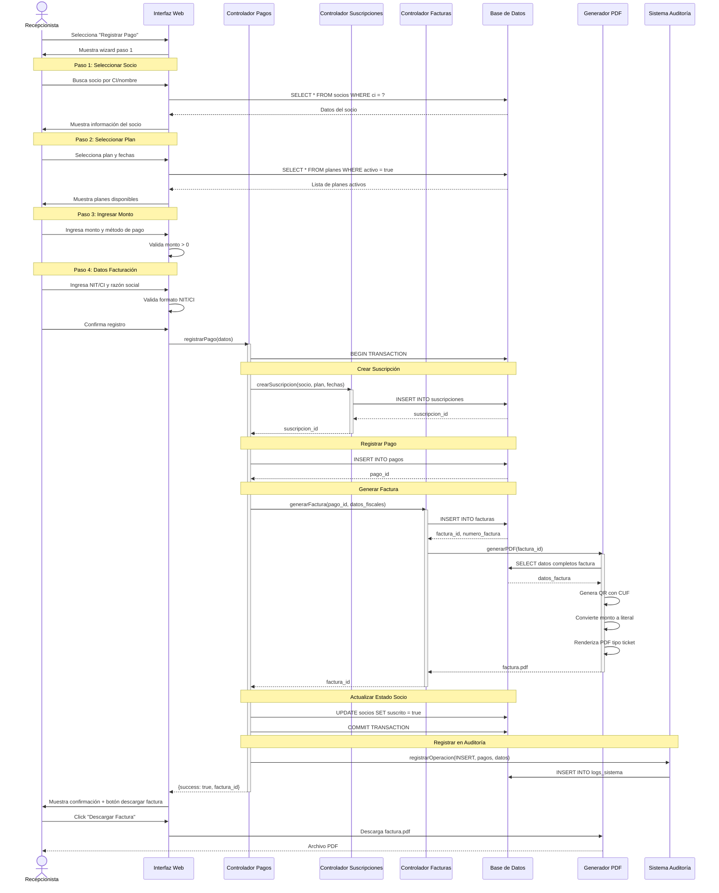
```mermaid
sequenceDiagram
    actor Recep as Recepcionista
    participant UI as Interfaz Web
    participant PagosCtrl as Controlador Pagos
    participant SuscCtrl as Controlador Suscripciones
    participant FactCtrl as Controlador Facturas
    participant DB as Base de Datos
    participant PDF as Generador PDF
    participant Audit as Sistema Auditoría
    
    Recep->>UI: Selecciona "Registrar Pago"
    UI->>Recep: Muestra wizard paso 1
    
    Note over Recep,UI: Paso 1: Seleccionar Socio
    Recep->>UI: Busca socio por CI/nombre
    UI->>DB: SELECT * FROM socios WHERE ci = ?
    DB-->>UI: Datos del socio
    UI->>Recep: Muestra información del socio
    
    Note over Recep,UI: Paso 2: Seleccionar Plan
    Recep->>UI: Selecciona plan y fechas
    UI->>DB: SELECT * FROM planes WHERE activo = true
    DB-->>UI: Lista de planes activos
    UI->>Recep: Muestra planes disponibles
    
    Note over Recep,UI: Paso 3: Ingresar Monto
    Recep->>UI: Ingresa monto y método de pago
    UI->>UI: Valida monto > 0
    
    Note over Recep,UI: Paso 4: Datos Facturación
    Recep->>UI: Ingresa NIT/CI y razón social
    UI->>UI: Valida formato NIT/CI
    
    Recep->>UI: Confirma registro
    
    UI->>PagosCtrl: registrarPago(datos)
    activate PagosCtrl
    
    PagosCtrl->>DB: BEGIN TRANSACTION
    
    Note over PagosCtrl,DB: Crear Suscripción
    PagosCtrl->>SuscCtrl: crearSuscripcion(socio, plan, fechas)
    activate SuscCtrl
    SuscCtrl->>DB: INSERT INTO suscripciones
    DB-->>SuscCtrl: suscripcion_id
    SuscCtrl-->>PagosCtrl: suscripcion_id
    deactivate SuscCtrl
    
    Note over PagosCtrl,DB: Registrar Pago
    PagosCtrl->>DB: INSERT INTO pagos
    DB-->>PagosCtrl: pago_id
    
    Note over PagosCtrl,DB: Generar Factura
    PagosCtrl->>FactCtrl: generarFactura(pago_id, datos_fiscales)
    activate FactCtrl
    FactCtrl->>DB: INSERT INTO facturas
    DB-->>FactCtrl: factura_id, numero_factura
    FactCtrl->>PDF: generarPDF(factura_id)
    activate PDF
    PDF->>DB: SELECT datos completos factura
    DB-->>PDF: datos_factura
    PDF->>PDF: Genera QR con CUF
    PDF->>PDF: Convierte monto a literal
    PDF->>PDF: Renderiza PDF tipo ticket
    PDF-->>FactCtrl: factura.pdf
    deactivate PDF
    FactCtrl-->>PagosCtrl: factura_id
    deactivate FactCtrl
    
    Note over PagosCtrl,DB: Actualizar Estado Socio
    PagosCtrl->>DB: UPDATE socios SET suscrito = true
    
    PagosCtrl->>DB: COMMIT TRANSACTION
    
    Note over PagosCtrl,Audit: Registrar en Auditoría
    PagosCtrl->>Audit: registrarOperacion(INSERT, pagos, datos)
    Audit->>DB: INSERT INTO logs_sistema
    
    PagosCtrl-->>UI: {success: true, factura_id}
    deactivate PagosCtrl
    
    UI->>Recep: Muestra confirmación + botón descargar factura
    Recep->>UI: Click "Descargar Factura"
    UI->>PDF: Descarga factura.pdf
    PDF-->>Recep: Archivo PDF
```

**Objetos Participantes:**
- **Recepcionista**: Actor que inicia el proceso
- **Interfaz Web**: Capa de presentación (React/Next.js)
- **Controlador Pagos**: Lógica de negocio de pagos
- **Controlador Suscripciones**: Lógica de negocio de suscripciones
- **Controlador Facturas**: Lógica de negocio de facturación
- **Base de Datos**: PostgreSQL (Supabase)
- **Generador PDF**: @react-pdf/renderer
- **Sistema Auditoría**: Registro de operaciones

**Flujo Alternativo:**
- Si el monto es inválido: mostrar error en paso 3
- Si el NIT/CI es inválido: mostrar error en paso 4
- Si falla la transacción: ROLLBACK y mostrar error

---

### 2.2 UC-07: Registrar Entrada (con Asignación de Casillero)

**Descripción:** Flujo de registro de entrada de un socio al gimnasio con asignación automática de casillero.

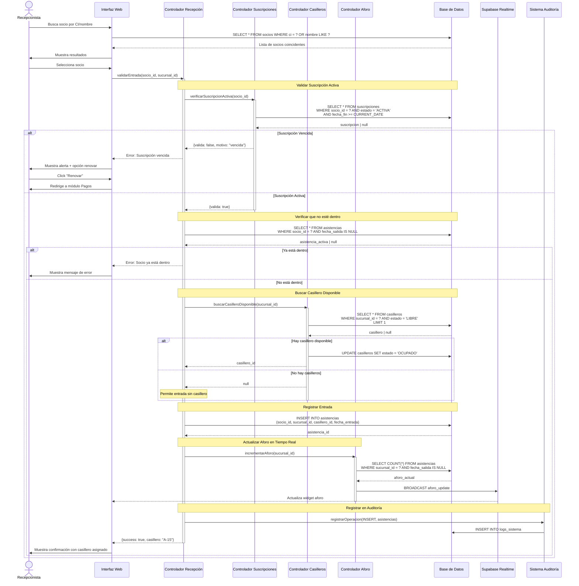
```mermaid
sequenceDiagram
    actor Recep as Recepcionista
    participant UI as Interfaz Web
    participant RecepCtrl as Controlador Recepción
    participant SuscCtrl as Controlador Suscripciones
    participant CasCtrl as Controlador Casilleros
    participant AforoCtrl as Controlador Aforo
    participant DB as Base de Datos
    participant Realtime as Supabase Realtime
    participant Audit as Sistema Auditoría
    
    Recep->>UI: Busca socio por CI/nombre
    UI->>DB: SELECT * FROM socios WHERE ci = ? OR nombre LIKE ?
    DB-->>UI: Lista de socios coincidentes
    UI->>Recep: Muestra resultados
    
    Recep->>UI: Selecciona socio
    
    UI->>RecepCtrl: validarEntrada(socio_id, sucursal_id)
    activate RecepCtrl
    
    Note over RecepCtrl,DB: Validar Suscripción Activa
    RecepCtrl->>SuscCtrl: verificarSuscripcionActiva(socio_id)
    activate SuscCtrl
    SuscCtrl->>DB: SELECT * FROM suscripciones<br/>WHERE socio_id = ? AND estado = 'ACTIVA'<br/>AND fecha_fin >= CURRENT_DATE
    DB-->>SuscCtrl: suscripcion | null
    
    alt Suscripción Vencida
        SuscCtrl-->>RecepCtrl: {valida: false, motivo: "vencida"}
        RecepCtrl-->>UI: Error: Suscripción vencida
        UI->>Recep: Muestra alerta + opción renovar
        Recep->>UI: Click "Renovar"
        UI->>Recep: Redirige a módulo Pagos
    else Suscripción Activa
        SuscCtrl-->>RecepCtrl: {valida: true}
        deactivate SuscCtrl
        
        Note over RecepCtrl,DB: Verificar que no esté dentro
        RecepCtrl->>DB: SELECT * FROM asistencias<br/>WHERE socio_id = ? AND fecha_salida IS NULL
        DB-->>RecepCtrl: asistencia_activa | null
        
        alt Ya está dentro
            RecepCtrl-->>UI: Error: Socio ya está dentro
            UI->>Recep: Muestra mensaje de error
        else No está dentro
            Note over RecepCtrl,DB: Buscar Casillero Disponible
            RecepCtrl->>CasCtrl: buscarCasilleroDisponible(sucursal_id)
            activate CasCtrl
            CasCtrl->>DB: SELECT * FROM casilleros<br/>WHERE sucursal_id = ? AND estado = 'LIBRE'<br/>LIMIT 1
            DB-->>CasCtrl: casillero | null
            
            alt Hay casillero disponible
                CasCtrl->>DB: UPDATE casilleros SET estado = 'OCUPADO'
                CasCtrl-->>RecepCtrl: casillero_id
            else No hay casilleros
                CasCtrl-->>RecepCtrl: null
                Note over RecepCtrl: Permite entrada sin casillero
            end
            deactivate CasCtrl
            
            Note over RecepCtrl,DB: Registrar Entrada
            RecepCtrl->>DB: INSERT INTO asistencias<br/>(socio_id, sucursal_id, casillero_id, fecha_entrada)
            DB-->>RecepCtrl: asistencia_id
            
            Note over RecepCtrl,AforoCtrl: Actualizar Aforo en Tiempo Real
            RecepCtrl->>AforoCtrl: incrementarAforo(sucursal_id)
            activate AforoCtrl
            AforoCtrl->>DB: SELECT COUNT(*) FROM asistencias<br/>WHERE sucursal_id = ? AND fecha_salida IS NULL
            DB-->>AforoCtrl: aforo_actual
            AforoCtrl->>Realtime: BROADCAST aforo_update
            Realtime-->>UI: Actualiza widget aforo
            deactivate AforoCtrl
            
            Note over RecepCtrl,Audit: Registrar en Auditoría
            RecepCtrl->>Audit: registrarOperacion(INSERT, asistencias)
            Audit->>DB: INSERT INTO logs_sistema
            
            RecepCtrl-->>UI: {success: true, casillero: "A-15"}
            deactivate RecepCtrl
            
            UI->>Recep: Muestra confirmación con casillero asignado
        end
    end
```

**Objetos Participantes:**
- **Recepcionista**: Actor que registra la entrada
- **Interfaz Web**: Capa de presentación
- **Controlador Recepción**: Lógica de negocio de recepción
- **Controlador Suscripciones**: Validación de suscripciones
- **Controlador Casilleros**: Gestión de casilleros
- **Controlador Aforo**: Cálculo de aforo en tiempo real
- **Base de Datos**: PostgreSQL
- **Supabase Realtime**: WebSocket para actualizaciones en tiempo real
- **Sistema Auditoría**: Registro de operaciones

**Flujos Alternativos:**
1. **Suscripción vencida**: Ofrecer renovación inmediata
2. **Socio ya dentro**: Mostrar error y hora de entrada
3. **Sin casilleros disponibles**: Permitir entrada sin casillero

---

### 2.3 UC-25: Generar Insights Prescriptivos (Proceso Automático)

**Descripción:** Proceso automático del motor de BI que analiza datos y genera recomendaciones accionables.

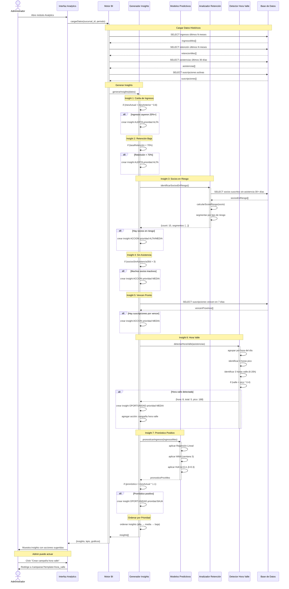
```mermaid
sequenceDiagram
    actor Admin as Administrador
    participant UI as Interfaz Analytics
    participant BIEngine as Motor BI
    participant InsightGen as Generador Insights
    participant PredModel as Modelos Predictivos
    participant RetAnalyzer as Analizador Retención
    participant HoraValleDetector as Detector Hora Valle
    participant DB as Base de Datos
    
    Admin->>UI: Abre módulo Analytics
    UI->>BIEngine: cargarDatos(sucursal_id, periodo)
    activate BIEngine
    
    Note over BIEngine,DB: Cargar Datos Históricos
    BIEngine->>DB: SELECT ingresos últimos N meses
    DB-->>BIEngine: ingresosMes[]
    BIEngine->>DB: SELECT retención últimos N meses
    DB-->>BIEngine: retencionMes[]
    BIEngine->>DB: SELECT asistencias últimos 30 días
    DB-->>BIEngine: asistencias[]
    BIEngine->>DB: SELECT suscripciones activas
    DB-->>BIEngine: suscripciones[]
    
    Note over BIEngine,InsightGen: Generar Insights
    BIEngine->>InsightGen: generarInsights(datos)
    activate InsightGen
    
    Note over InsightGen: Insight 1: Caída de Ingresos
    InsightGen->>InsightGen: if (mesActual < mesAnterior * 0.8)
    alt Ingresos cayeron 20%+
        InsightGen->>InsightGen: crear insight ALERTA prioridad ALTA
    end
    
    Note over InsightGen: Insight 2: Retención Baja
    InsightGen->>InsightGen: if (tasaRetención < 70%)
    alt Retención < 70%
        InsightGen->>InsightGen: crear insight ALERTA prioridad ALTA
    end
    
    Note over InsightGen,RetAnalyzer: Insight 3: Socios en Riesgo
    InsightGen->>RetAnalyzer: identificarSociosEnRiesgo()
    activate RetAnalyzer
    RetAnalyzer->>DB: SELECT socios suscritos sin asistencia 30+ días
    DB-->>RetAnalyzer: sociosEnRiesgo[]
    RetAnalyzer->>RetAnalyzer: calcularScoreRiesgo(socio)
    RetAnalyzer->>RetAnalyzer: segmentar por tipo de riesgo
    RetAnalyzer-->>InsightGen: {count: 15, segmentos: [...]}
    deactivate RetAnalyzer
    
    alt Hay socios en riesgo
        InsightGen->>InsightGen: crear insight ACCION prioridad ALTA/MEDIA
    end
    
    Note over InsightGen: Insight 4: Sin Asistencia
    InsightGen->>InsightGen: if (sociosSinAsistencia30d > 3)
    alt Muchos socios inactivos
        InsightGen->>InsightGen: crear insight ACCION prioridad MEDIA
    end
    
    Note over InsightGen: Insight 5: Vencen Pronto
    InsightGen->>DB: SELECT suscripciones vencen en 7 días
    DB-->>InsightGen: vencenProximos[]
    alt Hay suscripciones por vencer
        InsightGen->>InsightGen: crear insight ACCION prioridad MEDIA
    end
    
    Note over InsightGen,HoraValleDetector: Insight 6: Hora Valle
    InsightGen->>HoraValleDetector: detectarHoraValle(asistencias)
    activate HoraValleDetector
    HoraValleDetector->>HoraValleDetector: agrupar por hora del día
    HoraValleDetector->>HoraValleDetector: identificar 3 horas pico
    HoraValleDetector->>HoraValleDetector: identificar 3 horas valle (6-20h)
    HoraValleDetector->>HoraValleDetector: if (valle < pico * 0.4)
    alt Hora valle detectada
        HoraValleDetector-->>InsightGen: {hora: 8, total: 5, pico: 188}
        InsightGen->>InsightGen: crear insight OPORTUNIDAD prioridad MEDIA
        InsightGen->>InsightGen: agregar acción: campaña hora valle
    end
    deactivate HoraValleDetector
    
    Note over InsightGen,PredModel: Insight 7: Pronóstico Positivo
    InsightGen->>PredModel: pronosticarIngresos(ingresosMes)
    activate PredModel
    PredModel->>PredModel: aplicar Regresión Lineal
    PredModel->>PredModel: aplicar WMA (ventana 3)
    PredModel->>PredModel: aplicar Holt (α=0.4, β=0.3)
    PredModel-->>InsightGen: pronosticoProxMes
    deactivate PredModel
    
    InsightGen->>InsightGen: if (pronóstico > mesActual * 1.1)
    alt Pronóstico positivo
        InsightGen->>InsightGen: crear insight OPORTUNIDAD prioridad BAJA
    end
    
    Note over InsightGen: Ordenar por Prioridad
    InsightGen->>InsightGen: ordenar insights (alta → media → baja)
    InsightGen-->>BIEngine: insights[]
    deactivate InsightGen
    
    BIEngine-->>UI: {insights, kpis, graficos}
    deactivate BIEngine
    
    UI->>Admin: Muestra insights con acciones sugeridas
    
    Note over Admin,UI: Admin puede actuar
    Admin->>UI: Click "Crear campaña hora valle"
    UI->>Admin: Redirige a /campanas?template=hora_valle
```

**Objetos Participantes:**
- **Administrador**: Usuario que consulta los insights
- **Interfaz Analytics**: Módulo de BI & Analytics
- **Motor BI**: Orquestador principal del análisis
- **Generador Insights**: Lógica de generación de insights
- **Modelos Predictivos**: Algoritmos de pronóstico
- **Analizador Retención**: Cálculo de riesgo de churn
- **Detector Hora Valle**: Identificación de oportunidades
- **Base de Datos**: Fuente de datos históricos

**Características Clave:**
- **Proceso automático**: Se ejecuta cada vez que se carga Analytics
- **7 tipos de insights**: Alertas, acciones y oportunidades
- **Priorización inteligente**: Alta → Media → Baja
- **Acciones sugeridas**: Links directos a módulos relevantes

---

### 2.4 UC-20: Enviar Mensaje de Retención (Integración WhatsApp)

**Descripción:** Flujo de envío de mensaje de retención a socios en riesgo a través de WhatsApp.

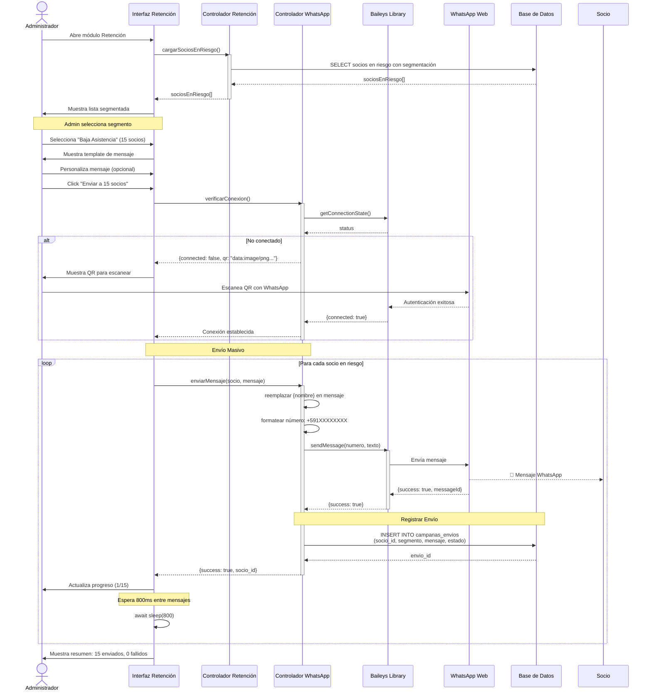
```mermaid
sequenceDiagram
    actor Admin as Administrador
    participant UI as Interfaz Retención
    participant RetCtrl as Controlador Retención
    participant WACtrl as Controlador WhatsApp
    participant Baileys as Baileys Library
    participant WhatsApp as WhatsApp Web
    participant DB as Base de Datos
    participant Socio as Socio
    
    Admin->>UI: Abre módulo Retención
    UI->>RetCtrl: cargarSociosEnRiesgo()
    activate RetCtrl
    RetCtrl->>DB: SELECT socios en riesgo con segmentación
    DB-->>RetCtrl: sociosEnRiesgo[]
    RetCtrl-->>UI: sociosEnRiesgo[]
    deactivate RetCtrl
    
    UI->>Admin: Muestra lista segmentada
    
    Note over Admin,UI: Admin selecciona segmento
    Admin->>UI: Selecciona "Baja Asistencia" (15 socios)
    UI->>Admin: Muestra template de mensaje
    
    Admin->>UI: Personaliza mensaje (opcional)
    Admin->>UI: Click "Enviar a 15 socios"
    
    UI->>WACtrl: verificarConexion()
    activate WACtrl
    WACtrl->>Baileys: getConnectionState()
    Baileys-->>WACtrl: status
    
    alt No conectado
        WACtrl-->>UI: {connected: false, qr: "data:image/png..."}
        UI->>Admin: Muestra QR para escanear
        Admin->>WhatsApp: Escanea QR con WhatsApp
        WhatsApp-->>Baileys: Autenticación exitosa
        Baileys-->>WACtrl: {connected: true}
        WACtrl-->>UI: Conexión establecida
    end
    deactivate WACtrl
    
    Note over UI,WACtrl: Envío Masivo
    loop Para cada socio en riesgo
        UI->>WACtrl: enviarMensaje(socio, mensaje)
        activate WACtrl
        
        WACtrl->>WACtrl: reemplazar {nombre} en mensaje
        WACtrl->>WACtrl: formatear número: +591XXXXXXXX
        
        WACtrl->>Baileys: sendMessage(numero, texto)
        activate Baileys
        Baileys->>WhatsApp: Envía mensaje
        WhatsApp-->>Socio: 📱 Mensaje WhatsApp
        WhatsApp-->>Baileys: {success: true, messageId}
        Baileys-->>WACtrl: {success: true}
        deactivate Baileys
        
        Note over WACtrl,DB: Registrar Envío
        WACtrl->>DB: INSERT INTO campanas_envios<br/>(socio_id, segmento, mensaje, estado)
        DB-->>WACtrl: envio_id
        
        WACtrl-->>UI: {success: true, socio_id}
        deactivate WACtrl
        
        UI->>Admin: Actualiza progreso (1/15)
        
        Note over UI: Espera 800ms entre mensajes
        UI->>UI: await sleep(800)
    end
    
    UI->>Admin: Muestra resumen: 15 enviados, 0 fallidos
```

**Objetos Participantes:**
- **Administrador**: Usuario que envía los mensajes
- **Interfaz Retención**: Módulo de retención
- **Controlador Retención**: Lógica de negocio de retención
- **Controlador WhatsApp**: Gestión de conexión y envío
- **Baileys Library**: Librería de conexión a WhatsApp
- **WhatsApp Web**: Servicio externo de mensajería
- **Base de Datos**: Registro de envíos
- **Socio**: Destinatario del mensaje

**Características Clave:**
- **Autenticación QR**: Si no está conectado, muestra QR
- **Personalización**: Reemplaza {nombre} con el nombre del socio
- **Envío controlado**: 800ms entre mensajes para evitar bloqueo
- **Registro completo**: Cada envío se guarda en la BD
- **Progreso en tiempo real**: UI actualiza contador

---

### 2.5 UC-26: Pronosticar Ingresos (Modelos Predictivos)

**Descripción:** Aplicación de 3 modelos predictivos para pronosticar ingresos a 3 meses.

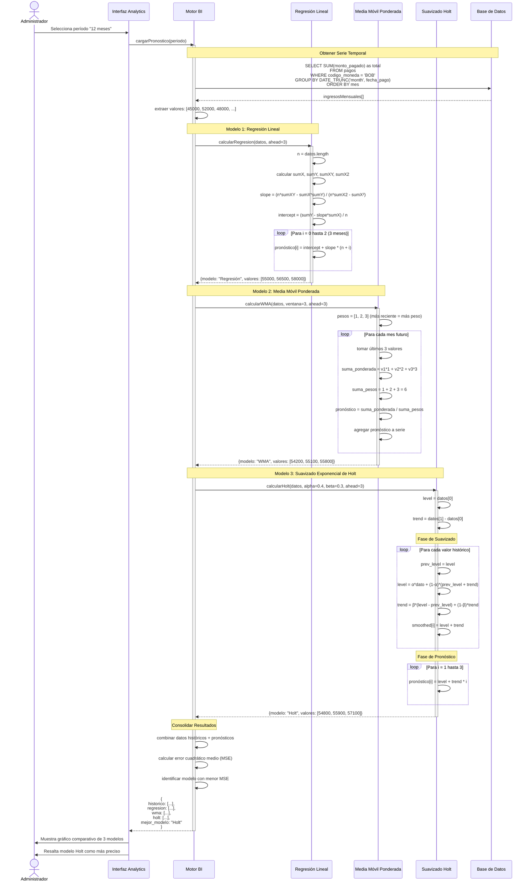
```mermaid
sequenceDiagram
    actor Admin as Administrador
    participant UI as Interfaz Analytics
    participant BIEngine as Motor BI
    participant RegLineal as Regresión Lineal
    participant WMA as Media Móvil Ponderada
    participant Holt as Suavizado Holt
    participant DB as Base de Datos
    
    Admin->>UI: Selecciona período "12 meses"
    UI->>BIEngine: cargarPronostico(periodo)
    activate BIEngine
    
    Note over BIEngine,DB: Obtener Serie Temporal
    BIEngine->>DB: SELECT SUM(monto_pagado) as total<br/>FROM pagos<br/>WHERE codigo_moneda = 'BOB'<br/>GROUP BY DATE_TRUNC('month', fecha_pago)<br/>ORDER BY mes
    DB-->>BIEngine: ingresosMensuales[]
    
    BIEngine->>BIEngine: extraer valores: [45000, 52000, 48000, ...]
    
    Note over BIEngine,RegLineal: Modelo 1: Regresión Lineal
    BIEngine->>RegLineal: calcularRegresion(datos, ahead=3)
    activate RegLineal
    
    RegLineal->>RegLineal: n = datos.length
    RegLineal->>RegLineal: calcular sumX, sumY, sumXY, sumX2
    RegLineal->>RegLineal: slope = (n*sumXY - sumX*sumY) / (n*sumX2 - sumX²)
    RegLineal->>RegLineal: intercept = (sumY - slope*sumX) / n
    
    loop Para i = 0 hasta 2 (3 meses)
        RegLineal->>RegLineal: pronóstico[i] = intercept + slope * (n + i)
    end
    
    RegLineal-->>BIEngine: {modelo: "Regresión", valores: [55000, 56500, 58000]}
    deactivate RegLineal
    
    Note over BIEngine,WMA: Modelo 2: Media Móvil Ponderada
    BIEngine->>WMA: calcularWMA(datos, ventana=3, ahead=3)
    activate WMA
    
    WMA->>WMA: pesos = [1, 2, 3] (más reciente = más peso)
    
    loop Para cada mes futuro
        WMA->>WMA: tomar últimos 3 valores
        WMA->>WMA: suma_ponderada = v1*1 + v2*2 + v3*3
        WMA->>WMA: suma_pesos = 1 + 2 + 3 = 6
        WMA->>WMA: pronóstico = suma_ponderada / suma_pesos
        WMA->>WMA: agregar pronóstico a serie
    end
    
    WMA-->>BIEngine: {modelo: "WMA", valores: [54200, 55100, 55800]}
    deactivate WMA
    
    Note over BIEngine,Holt: Modelo 3: Suavizado Exponencial de Holt
    BIEngine->>Holt: calcularHolt(datos, alpha=0.4, beta=0.3, ahead=3)
    activate Holt
    
    Holt->>Holt: level = datos[0]
    Holt->>Holt: trend = datos[1] - datos[0]
    
    Note over Holt: Fase de Suavizado
    loop Para cada valor histórico
        Holt->>Holt: prev_level = level
        Holt->>Holt: level = α*dato + (1-α)*(prev_level + trend)
        Holt->>Holt: trend = β*(level - prev_level) + (1-β)*trend
        Holt->>Holt: smoothed[i] = level + trend
    end
    
    Note over Holt: Fase de Pronóstico
    loop Para i = 1 hasta 3
        Holt->>Holt: pronóstico[i] = level + trend * i
    end
    
    Holt-->>BIEngine: {modelo: "Holt", valores: [54800, 55900, 57100]}
    deactivate Holt
    
    Note over BIEngine: Consolidar Resultados
    BIEngine->>BIEngine: combinar datos históricos + pronósticos
    BIEngine->>BIEngine: calcular error cuadrático medio (MSE)
    BIEngine->>BIEngine: identificar modelo con menor MSE
    
    BIEngine-->>UI: {<br/>  historico: [...],<br/>  regresion: [...],<br/>  wma: [...],<br/>  holt: [...],<br/>  mejor_modelo: "Holt"<br/>}
    deactivate BIEngine
    
    UI->>Admin: Muestra gráfico comparativo de 3 modelos
    UI->>Admin: Resalta modelo Holt como más preciso
```

**Objetos Participantes:**
- **Administrador**: Usuario que consulta el pronóstico
- **Interfaz Analytics**: Módulo de BI
- **Motor BI**: Orquestador de modelos
- **Regresión Lineal**: Modelo 1 (tendencia lineal)
- **Media Móvil Ponderada**: Modelo 2 (suavizado)
- **Suavizado Holt**: Modelo 3 (nivel + tendencia)
- **Base de Datos**: Fuente de datos históricos

**Modelos Implementados:**

1. **Regresión Lineal**
   - Fórmula: y = mx + b
   - Ventaja: Simple, muestra tendencia general
   - Limitación: No captura estacionalidad

2. **Media Móvil Ponderada (WMA)**
   - Ventana: 3 meses
   - Pesos: [1, 2, 3] (más reciente = más peso)
   - Ventaja: Suaviza picos atípicos
   - Limitación: Solo considera valores recientes

3. **Suavizado Exponencial de Holt**
   - Parámetros: α=0.4 (nivel), β=0.3 (tendencia)
   - Ventaja: Captura nivel actual + tendencia de cambio
   - Mejor modelo: Generalmente el más preciso

**Métricas de Evaluación:**
- MSE (Mean Squared Error): Mide precisión del modelo
- Modelo con menor MSE = más confiable

---

## 2.6 Resumen de Diagramas de Secuencia

| Diagrama | Caso de Uso | Complejidad | Objetos | Transacciones |
|----------|-------------|-------------|---------|---------------|
| 2.1 | UC-12: Registrar Pago | Alta | 8 | Sí (BEGIN/COMMIT) |
| 2.2 | UC-07: Registrar Entrada | Media | 8 | No |
| 2.3 | UC-25: Generar Insights | Alta | 7 | No |
| 2.4 | UC-20: Enviar Mensaje | Media | 8 | No |
| 2.5 | UC-26: Pronosticar Ingresos | Alta | 6 | No |

**Características Comunes:**
- Todos incluyen validaciones de negocio
- Todos registran en auditoría (excepto procesos automáticos)
- Todos manejan flujos alternativos (errores)
- Todos interactúan con la base de datos

**Patrones Identificados:**
1. **Patrón Transaccional**: UC-12 usa BEGIN/COMMIT para garantizar consistencia
2. **Patrón Tiempo Real**: UC-07 usa Supabase Realtime para aforo
3. **Patrón Automático**: UC-25 se ejecuta sin intervención humana
4. **Patrón Integración Externa**: UC-20 integra con WhatsApp
5. **Patrón Analítico**: UC-26 aplica múltiples algoritmos

---

