# 📊 Diagramas para Tesis - Body Xtreme Gym OS

Sistema de Inteligencia de Negocios con Análisis Predictivo y Prescriptivo para la Gestión Estratégica y Retención de Clientes en Gimnasios Multisucursal

---

## 1. Diagramas de Casos de Uso

### 1.1 Descripción de Actores del Sistema

| Actor | Rol | Permisos | Descripción |
|-------|-----|----------|-------------|
| **Administrador** | Dueño del gimnasio | Acceso total | Puede ver todas las sucursales, gestionar empleados, configurar el sistema, acceder a todas las funcionalidades |
| **Recepcionista** | Personal de recepción | Operaciones diarias | Solo ve su sucursal, registra pagos, asistencias, gestiona casilleros, registra entrada/salida de socios |
| **Gerencia** | Personal gerencial | Consulta y reportes | Acceso a BI, Analytics, reportes financieros y operativos. Solo visualización, sin modificación de datos |
| **Sistema BI** | Motor automático | N/A | Actor secundario que ejecuta análisis automáticos sin intervención humana (insights, pronósticos, detección de patrones) |

**Nota:** Se planea agregar el actor **Usuario/Socio** en futuras versiones para consulta de aforo, recomendación de sucursales y visualización de ubicaciones con mapas.

---

### 1.2 Diagrama de Casos de Uso: Autenticación

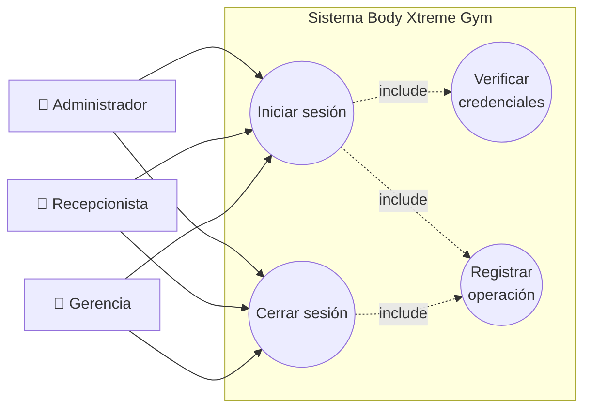
```mermaid
flowchart LR
    Admin[👤 Administrador]
    Recep[👤 Recepcionista]
    Gerencia[👤 Gerencia]
    
    subgraph Sistema["Sistema Body Xtreme Gym"]
        UC01((Iniciar sesión))
        UC02((Verificar<br/>credenciales))
        UC03((Registrar<br/>operación))
        UC04((Cerrar sesión))
    end
    
    Admin --> UC01
    Recep --> UC01
    Gerencia --> UC01
    
    Admin --> UC04
    Recep --> UC04
    Gerencia --> UC04
    
    UC01 -.->|include| UC02
    UC01 -.->|include| UC03
    UC04 -.->|include| UC03
```

**Figura 1.** Diagrama de casos de uso del módulo de autenticación.

---

### 1.3 Diagrama de Casos de Uso: Gestión de Socios

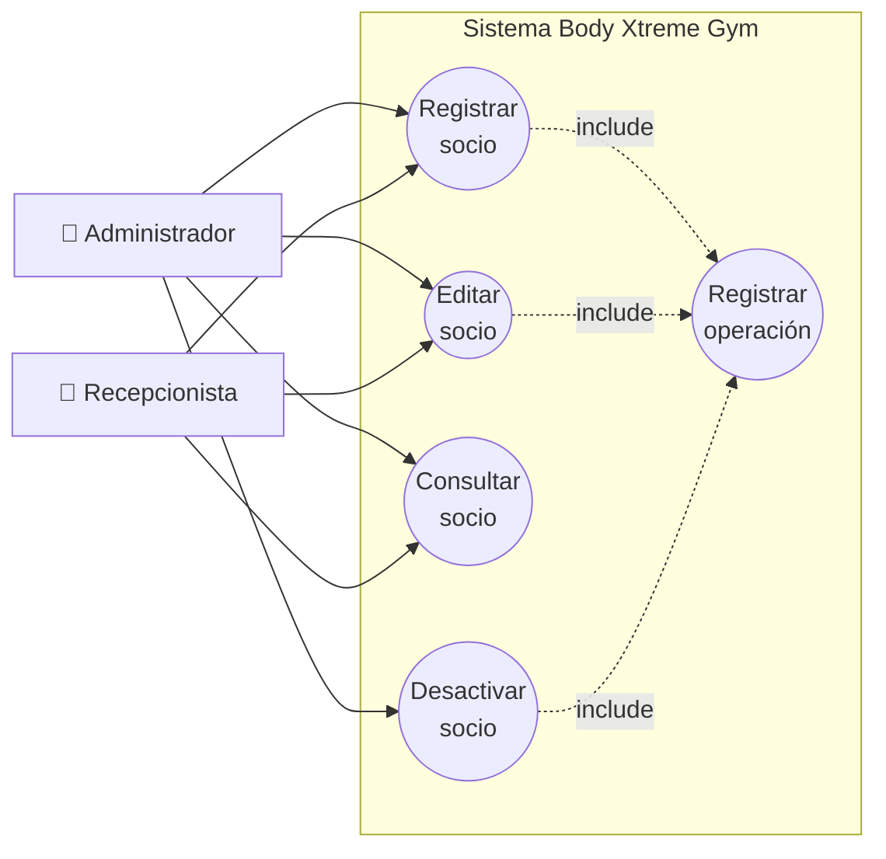
```mermaid
flowchart LR
    Admin[👤 Administrador]
    Recep[👤 Recepcionista]
    
    subgraph Sistema["Sistema Body Xtreme Gym"]
        UC05((Registrar<br/>socio))
        UC06((Editar<br/>socio))
        UC07((Consultar<br/>socio))
        UC08((Desactivar<br/>socio))
        UC09((Registrar<br/>operación))
    end
    
    Admin --> UC05
    Admin --> UC06
    Admin --> UC07
    Admin --> UC08
    
    Recep --> UC05
    Recep --> UC06
    Recep --> UC07
    
    UC05 -.->|include| UC09
    UC06 -.->|include| UC09
    UC08 -.->|include| UC09
```

**Figura 2.** Diagrama de casos de uso del módulo de gestión de socios.

---

### 1.4 Diagrama de Casos de Uso: Gestión de Asistencias

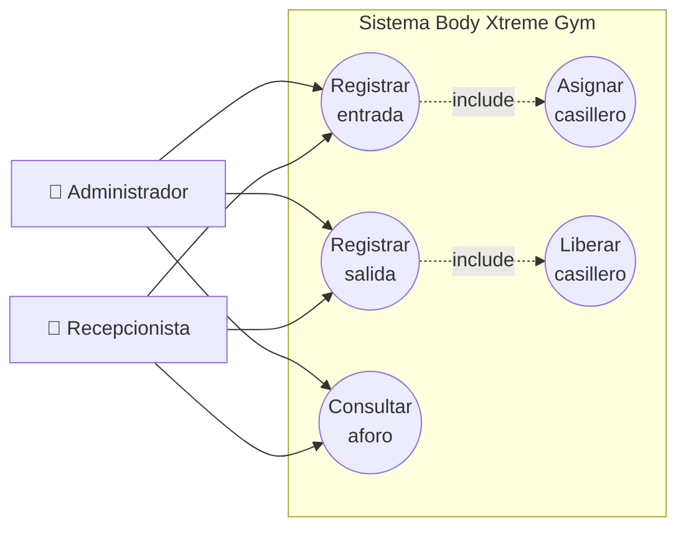
```mermaid
flowchart LR
    Admin[👤 Administrador]
    Recep[👤 Recepcionista]
    
    subgraph Sistema["Sistema Body Xtreme Gym"]
        UC10((Registrar<br/>entrada))
        UC11((Registrar<br/>salida))
        UC12((Asignar<br/>casillero))
        UC13((Liberar<br/>casillero))
        UC14((Consultar<br/>aforo))
    end
    
    Admin --> UC10
    Admin --> UC11
    Admin --> UC14
    
    Recep --> UC10
    Recep --> UC11
    Recep --> UC14
    
    UC10 -.->|include| UC12
    UC11 -.->|include| UC13
```

**Figura 3.** Diagrama de casos de uso del módulo de gestión de asistencias.

---

### 1.5 Diagrama de Casos de Uso: Gestión Financiera

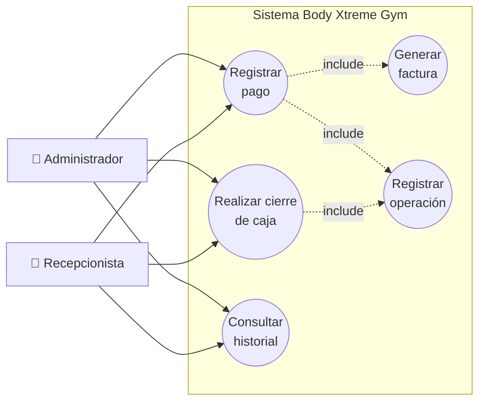
```mermaid
flowchart LR
    Admin[👤 Administrador]
    Recep[👤 Recepcionista]
    
    subgraph Sistema["Sistema Body Xtreme Gym"]
        UC15((Registrar<br/>pago))
        UC16((Generar<br/>factura))
        UC17((Realizar cierre<br/>de caja))
        UC18((Consultar<br/>historial))
        UC19((Registrar<br/>operación))
    end
    
    Admin --> UC15
    Admin --> UC17
    Admin --> UC18
    
    Recep --> UC15
    Recep --> UC17
    Recep --> UC18
    
    UC15 -.->|include| UC16
    UC15 -.->|include| UC19
    UC17 -.->|include| UC19
```

**Figura 4.** Diagrama de casos de uso del módulo de gestión financiera.

---

### 1.6 Diagrama de Casos de Uso: Retención de Clientes

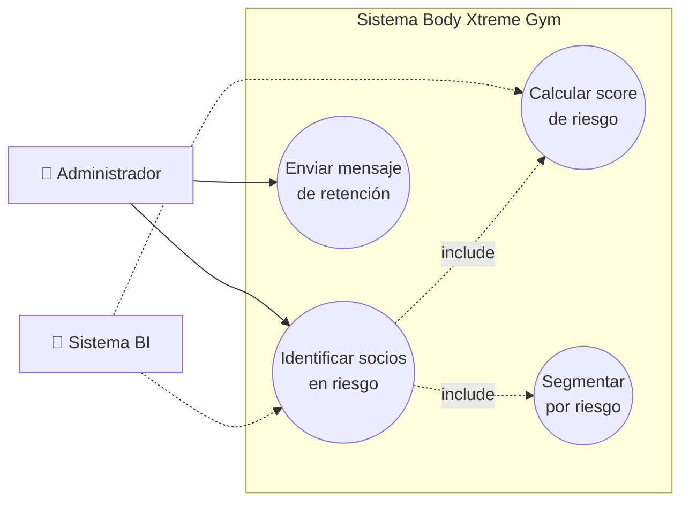
```mermaid
flowchart LR
    Admin[👤 Administrador]
    SistemaBI[🤖 Sistema BI]
    
    subgraph Sistema["Sistema Body Xtreme Gym"]
        UC20((Identificar socios<br/>en riesgo))
        UC21((Calcular score<br/>de riesgo))
        UC22((Enviar mensaje<br/>de retención))
        UC23((Segmentar<br/>por riesgo))
    end
    
    Admin --> UC20
    Admin --> UC22
    
    SistemaBI -.-> UC20
    SistemaBI -.-> UC21
    
    UC20 -.->|include| UC21
    UC20 -.->|include| UC23
```

**Figura 5.** Diagrama de casos de uso del módulo de retención de clientes.

---

### 1.7 Diagrama de Casos de Uso: Campañas de Marketing

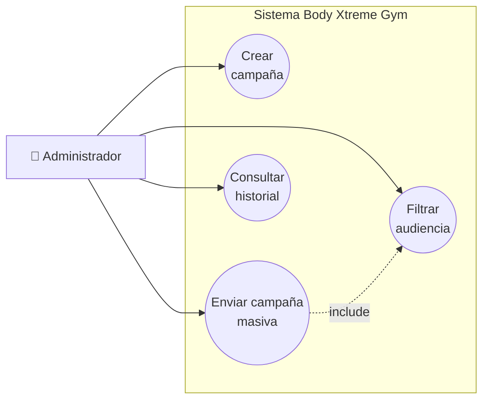
```mermaid
flowchart LR
    Admin[👤 Administrador]
    
    subgraph Sistema["Sistema Body Xtreme Gym"]
        UC24((Crear<br/>campaña))
        UC25((Filtrar<br/>audiencia))
        UC26((Enviar campaña<br/>masiva))
        UC27((Consultar<br/>historial))
    end
    
    Admin --> UC24
    Admin --> UC25
    Admin --> UC26
    Admin --> UC27
    
    UC26 -.->|include| UC25
```

**Figura 6.** Diagrama de casos de uso del módulo de campañas de marketing.

---

### 1.8 Diagrama de Casos de Uso: Business Intelligence

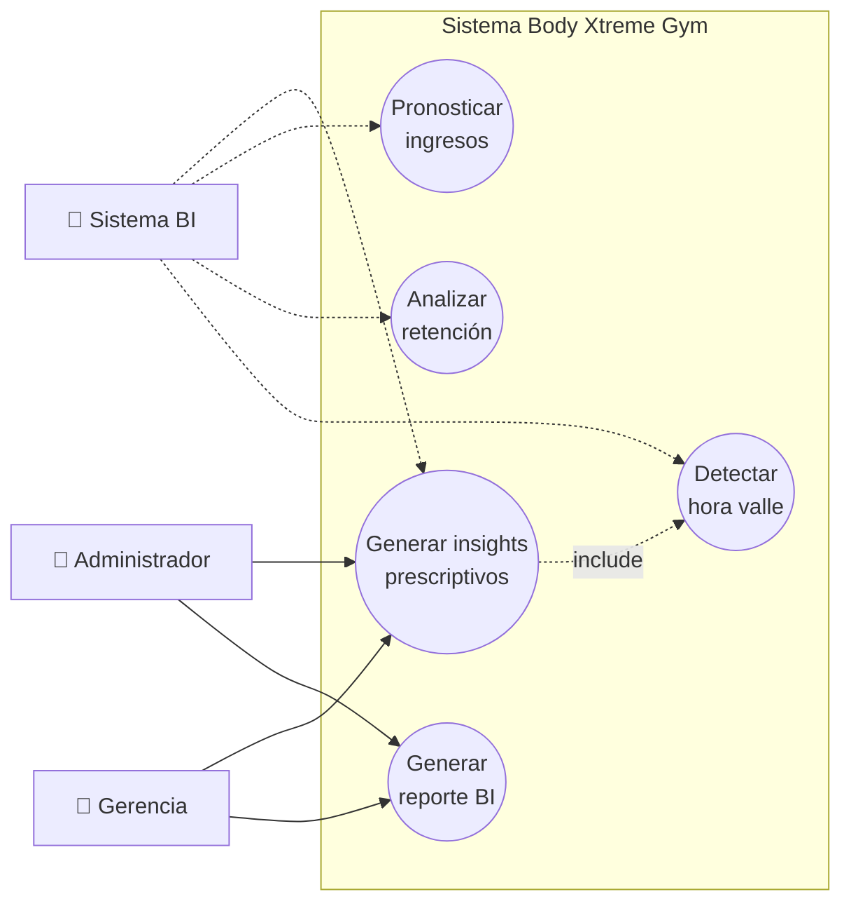
```mermaid
flowchart LR
    Admin[👤 Administrador]
    Gerencia[👤 Gerencia]
    SistemaBI[🤖 Sistema BI]
    
    subgraph Sistema["Sistema Body Xtreme Gym"]
        UC28((Generar insights<br/>prescriptivos))
        UC29((Pronosticar<br/>ingresos))
        UC30((Analizar<br/>retención))
        UC31((Detectar<br/>hora valle))
        UC32((Generar<br/>reporte BI))
    end
    
    Admin --> UC28
    Admin --> UC32
    Gerencia --> UC28
    Gerencia --> UC32
    
    SistemaBI -.-> UC28
    SistemaBI -.-> UC29
    SistemaBI -.-> UC30
    SistemaBI -.-> UC31
    
    UC28 -.->|include| UC31
```

**Figura 7.** Diagrama de casos de uso del módulo de Business Intelligence.

---

### 1.9 Diagrama de Casos de Uso: Configuración del Sistema

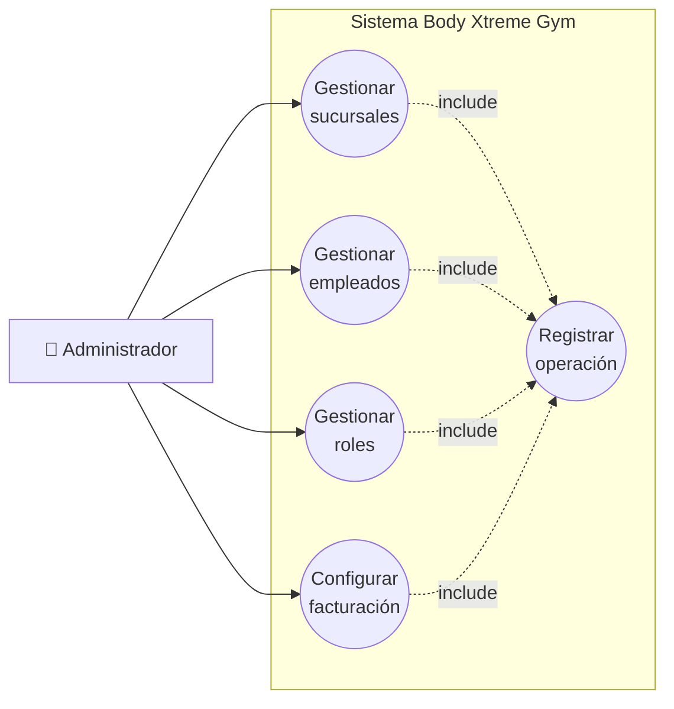
```mermaid
flowchart LR
    Admin[👤 Administrador]
    
    subgraph Sistema["Sistema Body Xtreme Gym"]
        UC33((Gestionar<br/>sucursales))
        UC34((Gestionar<br/>empleados))
        UC35((Gestionar<br/>roles))
        UC36((Configurar<br/>facturación))
        UC37((Registrar<br/>operación))
    end
    
    Admin --> UC33
    Admin --> UC34
    Admin --> UC35
    Admin --> UC36
    
    UC33 -.->|include| UC37
    UC34 -.->|include| UC37
    UC35 -.->|include| UC37
    UC36 -.->|include| UC37
```

**Figura 8.** Diagrama de casos de uso del módulo de configuración del sistema.

---

### 1.10 Diagrama de Casos de Uso: Auditoría

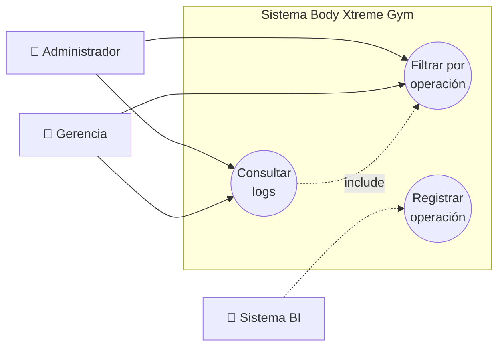
```mermaid
flowchart LR
    Admin[👤 Administrador]
    Gerencia[👤 Gerencia]
    SistemaBI[🤖 Sistema BI]
    
    subgraph Sistema["Sistema Body Xtreme Gym"]
        UC38((Consultar<br/>logs))
        UC39((Filtrar por<br/>operación))
        UC40((Registrar<br/>operación))
    end
    
    Admin --> UC38
    Admin --> UC39
    Gerencia --> UC38
    Gerencia --> UC39
    
    SistemaBI -.-> UC40
    
    UC38 -.->|include| UC39
```

**Figura 9.** Diagrama de casos de uso del módulo de auditoría

---

### 1.11 Matriz de Trazabilidad Actor-Caso de Uso

| Caso de Uso | Admin | Recep | Gerencia | Sistema BI |
|-------------|-------|-------|----------|------------|
| **Autenticación** |
| UC-01: Iniciar sesión | ✓ | ✓ | ✓ | |
| UC-02: Verificar credenciales | ✓ | ✓ | ✓ | |
| UC-03: Registrar operación | | | | ✓ |
| UC-04: Cerrar sesión | ✓ | ✓ | ✓ | |
| **Gestión de Socios** |
| UC-05: Registrar socio | ✓ | ✓ | | |
| UC-06: Editar socio | ✓ | ✓ | | |
| UC-07: Consultar socio | ✓ | ✓ | | |
| UC-08: Desactivar socio | ✓ | | | |
| UC-09: Registrar operación | | | | ✓ |
| **Gestión de Asistencias** |
| UC-10: Registrar entrada | ✓ | ✓ | | |
| UC-11: Registrar salida | ✓ | ✓ | | |
| UC-12: Asignar casillero | ✓ | ✓ | | |
| UC-13: Liberar casillero | ✓ | ✓ | | |
| UC-14: Consultar aforo | ✓ | ✓ | | |
| **Gestión Financiera** |
| UC-15: Registrar pago | ✓ | ✓ | | |
| UC-16: Generar factura | ✓ | ✓ | | |
| UC-17: Realizar cierre de caja | ✓ | ✓ | | |
| UC-18: Consultar historial | ✓ | ✓ | ✓ | |
| UC-19: Registrar operación | | | | ✓ |
| **Retención de Clientes** |
| UC-20: Identificar socios en riesgo | ✓ | | | ✓ |
| UC-21: Calcular score de riesgo | | | | ✓ |
| UC-22: Enviar mensaje de retención | ✓ | | | |
| UC-23: Segmentar por riesgo | | | | ✓ |
| **Campañas de Marketing** |
| UC-24: Crear campaña | ✓ | | | |
| UC-25: Filtrar audiencia | ✓ | | | |
| UC-26: Enviar campaña masiva | ✓ | | | |
| UC-27: Consultar historial | ✓ | | | |
| **Business Intelligence** |
| UC-28: Generar insights prescriptivos | ✓ | | ✓ | ✓ |
| UC-29: Pronosticar ingresos | ✓ | | ✓ | ✓ |
| UC-30: Analizar retención | ✓ | | ✓ | ✓ |
| UC-31: Detectar hora valle | ✓ | | ✓ | ✓ |
| UC-32: Generar reporte BI | ✓ | | ✓ | |
| **Configuración del Sistema** |
| UC-33: Gestionar sucursales | ✓ | | | |
| UC-34: Gestionar empleados | ✓ | | | |
| UC-35: Gestionar roles | ✓ | | | |
| UC-36: Configurar facturación | ✓ | | | |
| UC-37: Registrar operación | | | | ✓ |
| **Auditoría** |
| UC-38: Consultar logs | ✓ | | ✓ | |
| UC-39: Filtrar por operación | ✓ | | ✓ | |
| UC-40: Registrar operación | | | | ✓ |

**Total de Casos de Uso:** 40  
**Total de Actores:** 4 (3 humanos + 1 sistema)

---

### 1.12 Resumen de Diagramas de Casos de Uso

| Módulo | Figura | Casos de Uso | Actores | Complejidad |
|--------|--------|--------------|---------|-------------|
| Autenticación | 1 | 4 | 3 | Baja |
| Gestión de Socios | 2 | 5 | 2 | Media |
| Gestión de Asistencias | 3 | 5 | 2 | Media |
| Gestión Financiera | 4 | 5 | 2 | Alta |
| Retención de Clientes | 5 | 4 | 2 | Alta |
| Campañas de Marketing | 6 | 4 | 1 | Media |
| Business Intelligence | 7 | 5 | 3 | Alta |
| Configuración del Sistema | 8 | 5 | 1 | Media |
| Auditoría | 9 | 3 | 3 | Baja |

**Características de los Diagramas:**
- ✅ Estilo académico tradicional (minimalista, monocromático)
- ✅ Actores fuera del sistema (stick figures)
- ✅ Casos de uso dentro de rectángulo (subgraph)
- ✅ Máximo 5 casos de uso por diagrama
- ✅ Divididos por módulos funcionales
- ✅ Relaciones include con líneas punteadas
- ✅ Diseño limpio y legible

---

## 1.13 Especificación Detallada de Casos de Uso Clave

A continuación se detallan los casos de uso más importantes del sistema:

---

#### UC-01: Iniciar Sesión
**Actor Principal:** Administrador, Recepcionista, Gerencia  
**Precondiciones:** El empleado debe estar registrado en el sistema  
**Flujo Principal:**
1. El empleado ingresa su email y contraseña
2. El sistema valida las credenciales (SHA-256)
3. El sistema verifica que el empleado esté activo
4. El sistema crea la sesión y registra el login en auditoría
5. El sistema redirige al dashboard según el rol

**Flujo Alternativo:**
- 2a. Credenciales inválidas: mostrar error
- 3a. Empleado inactivo: denegar acceso

---

#### UC-15: Registrar Pago
**Actor Principal:** Administrador, Recepcionista  
**Precondiciones:** El socio debe estar registrado  
**Flujo Principal:**
1. El empleado selecciona al socio
2. El empleado selecciona el plan y fechas de vigencia
3. El empleado ingresa monto y método de pago
4. El empleado ingresa datos de facturación (NIT/CI, razón social)
5. El sistema crea el registro de pago
6. El sistema genera la factura (include UC-16)
7. El sistema actualiza el estado de suscripción del socio
8. El sistema registra la operación en auditoría

**Postcondiciones:** 
- Pago registrado
- Factura generada
- Suscripción actualizada

---

#### UC-12: Registrar Pago
**Actor Principal:** Administrador, Recepcionista  
**Precondiciones:** El socio debe estar registrado  
**Flujo Principal:**
1. El empleado selecciona al socio
2. El empleado selecciona el plan y fechas de vigencia
3. El empleado ingresa monto y método de pago
4. El empleado ingresa datos de facturación (NIT/CI, razón social)
5. El sistema crea el registro de pago
6. El sistema genera la factura (include UC-16)
7. El sistema actualiza el estado de suscripción del socio
8. El sistema registra la operación en auditoría

**Postcondiciones:** 
- Pago registrado
- Factura generada
- Suscripción actualizada

---

#### UC-10: Registrar Entrada
**Actor Principal:** Administrador, Recepcionista  
**Precondiciones:** El socio debe estar registrado y tener suscripción activa  
**Flujo Principal:**
1. El empleado busca al socio por CI o nombre
2. El sistema valida que la suscripción esté activa
3. El sistema verifica que el socio no esté ya dentro
4. El empleado asigna un casillero disponible (include UC-12)
5. El sistema registra la entrada con fecha/hora
6. El sistema actualiza el aforo en tiempo real

**Flujo Alternativo:**
- 2a. Suscripción vencida: mostrar alerta y ofrecer renovación
- 3a. Socio ya dentro: mostrar mensaje de error
- 4a. No hay casilleros disponibles: permitir entrada sin casillero

---

#### UC-20: Identificar Socios en Riesgo
**Actor Principal:** Sistema BI (automático), Administrador (consulta)  
**Precondiciones:** Debe haber datos de asistencias y suscripciones  
**Flujo Principal:**
1. El sistema analiza las asistencias de los últimos 30 días
2. El sistema identifica suscripciones próximas a vencer
3. El sistema calcula el score de riesgo (include UC-21)
4. El sistema clasifica socios en 4 segmentos:
   - Baja asistencia (0-2 visitas en 30 días)
   - No renovaron (suscripción vencida)
   - Racha perdida (pararon hace 10+ días)
   - Próximos a vencer (vence en 7 días)
5. El sistema presenta la lista de socios en riesgo

**Postcondiciones:** Lista de socios en riesgo disponible para acción

---

#### UC-28: Generar Insights Prescriptivos
**Actor Principal:** Sistema BI (automático), Administrador y Gerencia (consulta)  
**Precondiciones:** Debe haber datos históricos de al menos 2 meses  
**Flujo Principal:**
1. El sistema analiza ingresos mensuales
2. El sistema analiza tasa de retención
3. El sistema identifica socios en riesgo (include UC-19)
4. El sistema detecta horas valle (include UC-30)
5. El sistema genera pronósticos de ingresos (include UC-26)
6. El sistema crea insights con 3 tipos:
   - Alertas (prioridad alta): caída de ingresos, retención baja
   - Acciones (prioridad media): socios en riesgo, sin asistencia
   - Oportunidades (prioridad baja): hora valle, pronóstico positivo
7. El sistema ordena insights por prioridad
8. El sistema presenta insights con acciones sugeridas

**Postcondiciones:** Insights disponibles en el dashboard de BI para Admin y Gerencia

---

#### UC-29: Pronosticar Ingresos
**Actor Principal:** Sistema BI (automático)  
**Precondiciones:** Debe haber datos históricos de al menos 3 meses  
**Flujo Principal:**
1. El sistema obtiene serie temporal de ingresos mensuales
2. El sistema aplica 3 modelos predictivos:
   - Regresión Lineal: tendencia general
   - Media Móvil Ponderada (WMA): suaviza picos
   - Suavizado Exponencial de Holt: nivel + tendencia
3. El sistema proyecta ingresos a 3 meses
4. El sistema presenta gráfico comparativo de modelos
5. El sistema identifica el modelo con mejor ajuste

**Postcondiciones:** Pronósticos disponibles en Analytics

---

#### UC-31: Detectar Hora Valle
**Actor Principal:** Sistema BI (automático)  
**Precondiciones:** Debe haber datos de asistencias de los últimos 30 días  
**Flujo Principal:**
1. El sistema agrupa asistencias por hora del día
2. El sistema identifica las 3 horas pico (más asistencias)
3. El sistema identifica las 3 horas valle (menos asistencias entre 6:00-20:00)
4. El sistema compara hora valle vs hora pico
5. Si hora_valle < hora_pico * 0.4:
   - El sistema genera insight de oportunidad
   - El sistema sugiere campaña de promoción hora valle
   - El sistema pre-configura template de mensaje

**Postcondiciones:** Insight de hora valle disponible con acción sugerida

---

### 1.4 Matriz de Trazabilidad Actor-Caso de Uso

| Caso de Uso | Admin | Recep | Trainer | Sistema BI | WhatsApp |
|-------------|-------|-------|---------|------------|----------|
| UC-01: Iniciar Sesión | ✓ | ✓ | ✓ | | |
| UC-02: Cerrar Sesión | ✓ | ✓ | ✓ | | |
| UC-03: Registrar Socio | ✓ | ✓ | | | |
| UC-04: Editar Socio | ✓ | ✓ | | | |
| UC-05: Consultar Socio | ✓ | ✓ | | | |
| UC-06: Desactivar Socio | ✓ | | | | |
| UC-07: Registrar Entrada | ✓ | ✓ | ✓ | | |
| UC-08: Registrar Salida | ✓ | ✓ | ✓ | | |
| UC-09: Asignar Casillero | ✓ | ✓ | | | |
| UC-10: Liberar Casillero | ✓ | ✓ | | | |
| UC-11: Consultar Aforo | ✓ | ✓ | ✓ | | |
| UC-12: Registrar Pago | ✓ | ✓ | | | |
| UC-13: Generar Factura | ✓ | ✓ | | | |
| UC-14: Realizar Cierre de Caja | ✓ | ✓ | | | |
| UC-15: Consultar Historial de Pagos | ✓ | ✓ | | | |
| UC-16: Crear Plan | ✓ | | | | |
| UC-17: Editar Plan | ✓ | | | | |
| UC-18: Activar/Desactivar Plan | ✓ | | | | |
| UC-19: Identificar Socios en Riesgo | ✓ | | | ✓ | |
| UC-20: Enviar Mensaje de Retención | ✓ | | | | ✓ |
| UC-21: Calcular Score de Riesgo | | | | ✓ | |
| UC-22: Crear Campaña | ✓ | | | | |
| UC-23: Filtrar Audiencia | ✓ | | | | |
| UC-24: Enviar Campaña Masiva | ✓ | | | | ✓ |
| UC-25: Generar Insights Prescriptivos | ✓ | | | ✓ | |
| UC-26: Pronosticar Ingresos | ✓ | | | ✓ | |
| UC-27: Analizar Retención | ✓ | | | ✓ | |
| UC-28: Generar Reporte BI | ✓ | | | | |
| UC-29: Analizar Cohortes | ✓ | | | ✓ | |
| UC-30: Detectar Hora Valle | ✓ | | | ✓ | |
| UC-31: Gestionar Sucursales | ✓ | | | | |
| UC-32: Gestionar Empleados | ✓ | | | | |
| UC-33: Gestionar Roles | ✓ | | | | |
| UC-34: Configurar Facturación | ✓ | | | | |
| UC-35: Consultar Logs | ✓ | | | | |
| UC-36: Registrar Operación | | | | ✓ | |

**Total de Casos de Uso:** 36

---

### 1.5 Diagrama de Casos de Uso por Módulo

#### Módulo de Retención (Detallado)

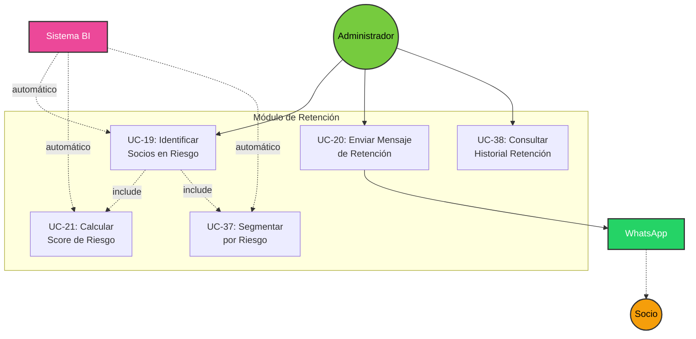
```mermaid
graph TB
    Admin((Administrador))
    SistemaBI[Sistema BI]
    WhatsApp[WhatsApp]
    Socio((Socio))
    
    subgraph "Módulo de Retención"
        UC19[UC-19: Identificar<br/>Socios en Riesgo]
        UC21[UC-21: Calcular<br/>Score de Riesgo]
        UC20[UC-20: Enviar Mensaje<br/>de Retención]
        UC37[UC-37: Segmentar<br/>por Riesgo]
        UC38[UC-38: Consultar<br/>Historial Retención]
    end
    
    Admin --> UC19
    Admin --> UC20
    Admin --> UC38
    
    SistemaBI -.->|automático| UC19
    SistemaBI -.->|automático| UC21
    SistemaBI -.->|automático| UC37
    
    UC19 -.->|include| UC21
    UC19 -.->|include| UC37
    UC20 --> WhatsApp
    WhatsApp -.-> Socio
    
    style Admin fill:#76CB3E,stroke:#333,stroke-width:2px,color:#000
    style SistemaBI fill:#ec4899,stroke:#333,stroke-width:2px,color:#fff
    style WhatsApp fill:#25D366,stroke:#333,stroke-width:2px,color:#fff
    style Socio fill:#f59e0b,stroke:#333,stroke-width:2px,color:#000
```

#### Módulo de BI & Analytics (Detallado)

```mermaid
graph TB
    Admin((Administrador))
    SistemaBI[Sistema BI]
    
    subgraph "Módulo de BI & Analytics"
        direction TB
        
        subgraph "Análisis Descriptivo"
            UC39[UC-39: Visualizar KPIs]
            UC40[UC-40: Generar Mapa de Calor]
            UC41[UC-41: Analizar Distribución]
        end
        
        subgraph "Análisis Predictivo"
            UC26[UC-26: Pronosticar Ingresos]
            UC42[UC-42: Aplicar Regresión Lineal]
            UC43[UC-43: Aplicar WMA]
            UC44[UC-44: Aplicar Holt]
        end
        
        subgraph "Análisis Prescriptivo"
            UC25[UC-25: Generar Insights]
            UC30[UC-30: Detectar Hora Valle]
            UC45[UC-45: Sugerir Acciones]
        end
        
        subgraph "Análisis Avanzado"
            UC29[UC-29: Analizar Cohortes]
            UC27[UC-27: Analizar Retención]
            UC46[UC-46: Segmentar Demografía]
        end
        
        UC28[UC-28: Generar Reporte BI]
    end
    
    Admin --> UC39
    Admin --> UC40
    Admin --> UC41
    Admin --> UC28
    
    SistemaBI -.->|automático| UC26
    SistemaBI -.->|automático| UC25
    SistemaBI -.->|automático| UC29
    SistemaBI -.->|automático| UC27
    SistemaBI -.->|automático| UC30
    SistemaBI -.->|automático| UC46
    
    UC26 -.->|include| UC42
    UC26 -.->|include| UC43
    UC26 -.->|include| UC44
    UC25 -.->|include| UC30
    UC25 -.->|include| UC45
    
    style Admin fill:#76CB3E,stroke:#333,stroke-width:2px,color:#000
    style SistemaBI fill:#ec4899,stroke:#333,stroke-width:2px,color:#fff
```

---

## Notas para la Tesis

### Justificación de Actores

1. **Sistema BI como Actor Secundario**: Se incluye como actor porque ejecuta procesos automáticos de análisis sin intervención humana directa. Genera insights, pronósticos y recomendaciones de forma autónoma.

2. **WhatsApp como Actor Externo**: Se incluye porque es un sistema externo que proporciona servicios de mensajería al sistema principal.

3. **Socio como Actor Pasivo**: Aunque no interactúa directamente con el sistema, recibe notificaciones y genera datos de asistencia, por lo que se incluye en algunos casos de uso.

### Relaciones entre Casos de Uso

- **Include (inclusión)**: Indica que un caso de uso siempre incluye el comportamiento de otro
  - Ejemplo: "Registrar Pago" siempre incluye "Generar Factura"
  
- **Extend (extensión)**: Indica comportamiento opcional o condicional
  - Ejemplo: "Registrar Entrada" puede extender a "Asignar Casillero" si hay disponibles

### Priorización de Casos de Uso

**Alta Prioridad (Core Business):**
- UC-07, UC-08: Gestión de asistencias (operación diaria)
- UC-12, UC-13: Gestión de pagos y facturación (ingresos)
- UC-19, UC-20: Retención de clientes (reducir churn)
- UC-25, UC-26: Análisis prescriptivo y predictivo (BI)

**Media Prioridad (Soporte):**
- UC-03, UC-04, UC-05: Gestión de socios
- UC-16, UC-17, UC-18: Gestión de planes
- UC-22, UC-23, UC-24: Campañas de marketing

**Baja Prioridad (Administrativo):**
- UC-31, UC-32, UC-33, UC-34: Configuración
- UC-35, UC-36: Auditoría

---

**Fecha de creación:** 2026-05-08  
**Versión:** 1.0  
**Autor:** Sistema Body Xtreme Gym OS

---

## 2. Diagramas de Secuencia

Los diagramas de secuencia muestran la interacción entre objetos a lo largo del tiempo, representando el flujo de mensajes para cada caso de uso.

---

### 2.1 UC-12: Registrar Pago (con Facturación)

**Descripción:** Flujo completo de registro de pago, generación de factura y actualización de suscripción.

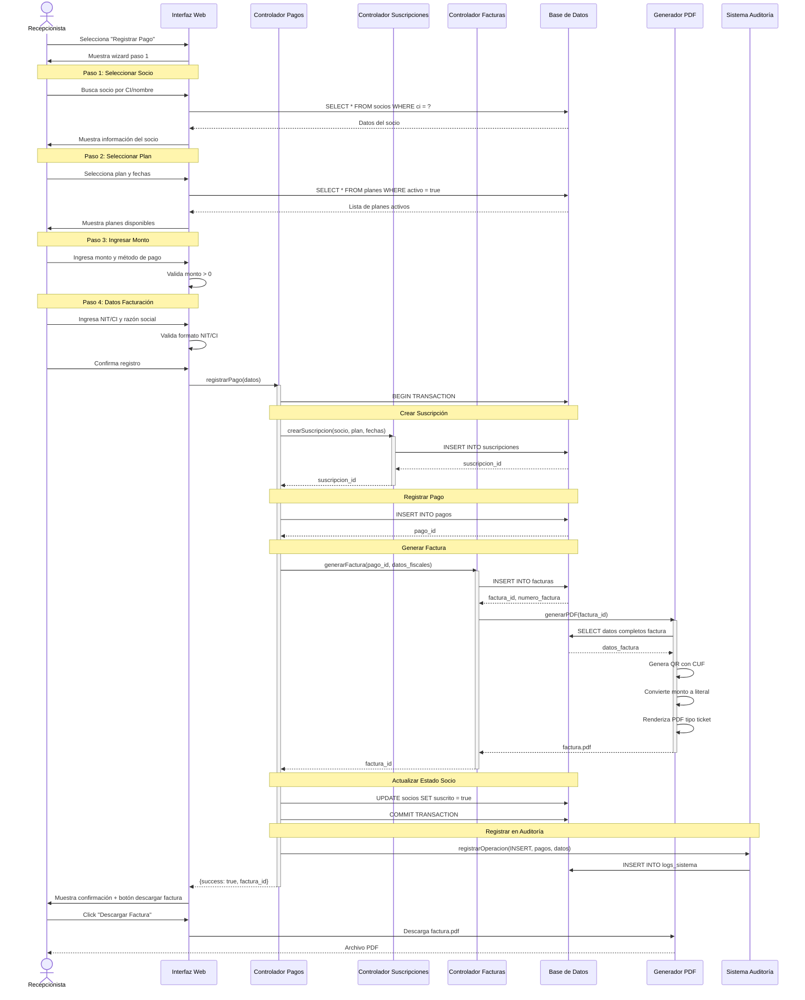
```mermaid
sequenceDiagram
    actor Recep as Recepcionista
    participant UI as Interfaz Web
    participant PagosCtrl as Controlador Pagos
    participant SuscCtrl as Controlador Suscripciones
    participant FactCtrl as Controlador Facturas
    participant DB as Base de Datos
    participant PDF as Generador PDF
    participant Audit as Sistema Auditoría
    
    Recep->>UI: Selecciona "Registrar Pago"
    UI->>Recep: Muestra wizard paso 1
    
    Note over Recep,UI: Paso 1: Seleccionar Socio
    Recep->>UI: Busca socio por CI/nombre
    UI->>DB: SELECT * FROM socios WHERE ci = ?
    DB-->>UI: Datos del socio
    UI->>Recep: Muestra información del socio
    
    Note over Recep,UI: Paso 2: Seleccionar Plan
    Recep->>UI: Selecciona plan y fechas
    UI->>DB: SELECT * FROM planes WHERE activo = true
    DB-->>UI: Lista de planes activos
    UI->>Recep: Muestra planes disponibles
    
    Note over Recep,UI: Paso 3: Ingresar Monto
    Recep->>UI: Ingresa monto y método de pago
    UI->>UI: Valida monto > 0
    
    Note over Recep,UI: Paso 4: Datos Facturación
    Recep->>UI: Ingresa NIT/CI y razón social
    UI->>UI: Valida formato NIT/CI
    
    Recep->>UI: Confirma registro
    
    UI->>PagosCtrl: registrarPago(datos)
    activate PagosCtrl
    
    PagosCtrl->>DB: BEGIN TRANSACTION
    
    Note over PagosCtrl,DB: Crear Suscripción
    PagosCtrl->>SuscCtrl: crearSuscripcion(socio, plan, fechas)
    activate SuscCtrl
    SuscCtrl->>DB: INSERT INTO suscripciones
    DB-->>SuscCtrl: suscripcion_id
    SuscCtrl-->>PagosCtrl: suscripcion_id
    deactivate SuscCtrl
    
    Note over PagosCtrl,DB: Registrar Pago
    PagosCtrl->>DB: INSERT INTO pagos
    DB-->>PagosCtrl: pago_id
    
    Note over PagosCtrl,DB: Generar Factura
    PagosCtrl->>FactCtrl: generarFactura(pago_id, datos_fiscales)
    activate FactCtrl
    FactCtrl->>DB: INSERT INTO facturas
    DB-->>FactCtrl: factura_id, numero_factura
    FactCtrl->>PDF: generarPDF(factura_id)
    activate PDF
    PDF->>DB: SELECT datos completos factura
    DB-->>PDF: datos_factura
    PDF->>PDF: Genera QR con CUF
    PDF->>PDF: Convierte monto a literal
    PDF->>PDF: Renderiza PDF tipo ticket
    PDF-->>FactCtrl: factura.pdf
    deactivate PDF
    FactCtrl-->>PagosCtrl: factura_id
    deactivate FactCtrl
    
    Note over PagosCtrl,DB: Actualizar Estado Socio
    PagosCtrl->>DB: UPDATE socios SET suscrito = true
    
    PagosCtrl->>DB: COMMIT TRANSACTION
    
    Note over PagosCtrl,Audit: Registrar en Auditoría
    PagosCtrl->>Audit: registrarOperacion(INSERT, pagos, datos)
    Audit->>DB: INSERT INTO logs_sistema
    
    PagosCtrl-->>UI: {success: true, factura_id}
    deactivate PagosCtrl
    
    UI->>Recep: Muestra confirmación + botón descargar factura
    Recep->>UI: Click "Descargar Factura"
    UI->>PDF: Descarga factura.pdf
    PDF-->>Recep: Archivo PDF
```

**Objetos Participantes:**
- **Recepcionista**: Actor que inicia el proceso
- **Interfaz Web**: Capa de presentación (React/Next.js)
- **Controlador Pagos**: Lógica de negocio de pagos
- **Controlador Suscripciones**: Lógica de negocio de suscripciones
- **Controlador Facturas**: Lógica de negocio de facturación
- **Base de Datos**: PostgreSQL (Supabase)
- **Generador PDF**: @react-pdf/renderer
- **Sistema Auditoría**: Registro de operaciones

**Flujo Alternativo:**
- Si el monto es inválido: mostrar error en paso 3
- Si el NIT/CI es inválido: mostrar error en paso 4
- Si falla la transacción: ROLLBACK y mostrar error

---

### 2.2 UC-07: Registrar Entrada (con Asignación de Casillero)

**Descripción:** Flujo de registro de entrada de un socio al gimnasio con asignación automática de casillero.

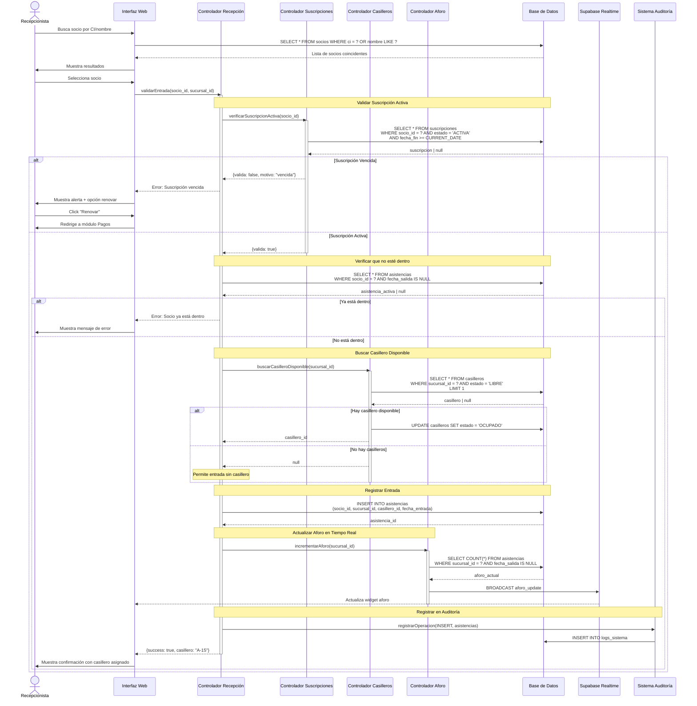
```mermaid
sequenceDiagram
    actor Recep as Recepcionista
    participant UI as Interfaz Web
    participant RecepCtrl as Controlador Recepción
    participant SuscCtrl as Controlador Suscripciones
    participant CasCtrl as Controlador Casilleros
    participant AforoCtrl as Controlador Aforo
    participant DB as Base de Datos
    participant Realtime as Supabase Realtime
    participant Audit as Sistema Auditoría
    
    Recep->>UI: Busca socio por CI/nombre
    UI->>DB: SELECT * FROM socios WHERE ci = ? OR nombre LIKE ?
    DB-->>UI: Lista de socios coincidentes
    UI->>Recep: Muestra resultados
    
    Recep->>UI: Selecciona socio
    
    UI->>RecepCtrl: validarEntrada(socio_id, sucursal_id)
    activate RecepCtrl
    
    Note over RecepCtrl,DB: Validar Suscripción Activa
    RecepCtrl->>SuscCtrl: verificarSuscripcionActiva(socio_id)
    activate SuscCtrl
    SuscCtrl->>DB: SELECT * FROM suscripciones<br/>WHERE socio_id = ? AND estado = 'ACTIVA'<br/>AND fecha_fin >= CURRENT_DATE
    DB-->>SuscCtrl: suscripcion | null
    
    alt Suscripción Vencida
        SuscCtrl-->>RecepCtrl: {valida: false, motivo: "vencida"}
        RecepCtrl-->>UI: Error: Suscripción vencida
        UI->>Recep: Muestra alerta + opción renovar
        Recep->>UI: Click "Renovar"
        UI->>Recep: Redirige a módulo Pagos
    else Suscripción Activa
        SuscCtrl-->>RecepCtrl: {valida: true}
        deactivate SuscCtrl
        
        Note over RecepCtrl,DB: Verificar que no esté dentro
        RecepCtrl->>DB: SELECT * FROM asistencias<br/>WHERE socio_id = ? AND fecha_salida IS NULL
        DB-->>RecepCtrl: asistencia_activa | null
        
        alt Ya está dentro
            RecepCtrl-->>UI: Error: Socio ya está dentro
            UI->>Recep: Muestra mensaje de error
        else No está dentro
            Note over RecepCtrl,DB: Buscar Casillero Disponible
            RecepCtrl->>CasCtrl: buscarCasilleroDisponible(sucursal_id)
            activate CasCtrl
            CasCtrl->>DB: SELECT * FROM casilleros<br/>WHERE sucursal_id = ? AND estado = 'LIBRE'<br/>LIMIT 1
            DB-->>CasCtrl: casillero | null
            
            alt Hay casillero disponible
                CasCtrl->>DB: UPDATE casilleros SET estado = 'OCUPADO'
                CasCtrl-->>RecepCtrl: casillero_id
            else No hay casilleros
                CasCtrl-->>RecepCtrl: null
                Note over RecepCtrl: Permite entrada sin casillero
            end
            deactivate CasCtrl
            
            Note over RecepCtrl,DB: Registrar Entrada
            RecepCtrl->>DB: INSERT INTO asistencias<br/>(socio_id, sucursal_id, casillero_id, fecha_entrada)
            DB-->>RecepCtrl: asistencia_id
            
            Note over RecepCtrl,AforoCtrl: Actualizar Aforo en Tiempo Real
            RecepCtrl->>AforoCtrl: incrementarAforo(sucursal_id)
            activate AforoCtrl
            AforoCtrl->>DB: SELECT COUNT(*) FROM asistencias<br/>WHERE sucursal_id = ? AND fecha_salida IS NULL
            DB-->>AforoCtrl: aforo_actual
            AforoCtrl->>Realtime: BROADCAST aforo_update
            Realtime-->>UI: Actualiza widget aforo
            deactivate AforoCtrl
            
            Note over RecepCtrl,Audit: Registrar en Auditoría
            RecepCtrl->>Audit: registrarOperacion(INSERT, asistencias)
            Audit->>DB: INSERT INTO logs_sistema
            
            RecepCtrl-->>UI: {success: true, casillero: "A-15"}
            deactivate RecepCtrl
            
            UI->>Recep: Muestra confirmación con casillero asignado
        end
    end
```

**Objetos Participantes:**
- **Recepcionista**: Actor que registra la entrada
- **Interfaz Web**: Capa de presentación
- **Controlador Recepción**: Lógica de negocio de recepción
- **Controlador Suscripciones**: Validación de suscripciones
- **Controlador Casilleros**: Gestión de casilleros
- **Controlador Aforo**: Cálculo de aforo en tiempo real
- **Base de Datos**: PostgreSQL
- **Supabase Realtime**: WebSocket para actualizaciones en tiempo real
- **Sistema Auditoría**: Registro de operaciones

**Flujos Alternativos:**
1. **Suscripción vencida**: Ofrecer renovación inmediata
2. **Socio ya dentro**: Mostrar error y hora de entrada
3. **Sin casilleros disponibles**: Permitir entrada sin casillero

---

### 2.3 UC-25: Generar Insights Prescriptivos (Proceso Automático)

**Descripción:** Proceso automático del motor de BI que analiza datos y genera recomendaciones accionables.

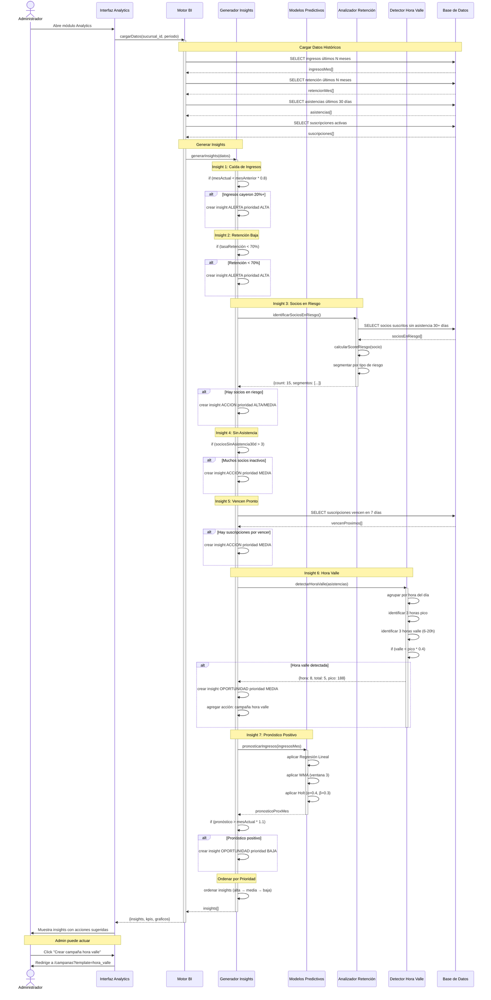
```mermaid
sequenceDiagram
    actor Admin as Administrador
    participant UI as Interfaz Analytics
    participant BIEngine as Motor BI
    participant InsightGen as Generador Insights
    participant PredModel as Modelos Predictivos
    participant RetAnalyzer as Analizador Retención
    participant HoraValleDetector as Detector Hora Valle
    participant DB as Base de Datos
    
    Admin->>UI: Abre módulo Analytics
    UI->>BIEngine: cargarDatos(sucursal_id, periodo)
    activate BIEngine
    
    Note over BIEngine,DB: Cargar Datos Históricos
    BIEngine->>DB: SELECT ingresos últimos N meses
    DB-->>BIEngine: ingresosMes[]
    BIEngine->>DB: SELECT retención últimos N meses
    DB-->>BIEngine: retencionMes[]
    BIEngine->>DB: SELECT asistencias últimos 30 días
    DB-->>BIEngine: asistencias[]
    BIEngine->>DB: SELECT suscripciones activas
    DB-->>BIEngine: suscripciones[]
    
    Note over BIEngine,InsightGen: Generar Insights
    BIEngine->>InsightGen: generarInsights(datos)
    activate InsightGen
    
    Note over InsightGen: Insight 1: Caída de Ingresos
    InsightGen->>InsightGen: if (mesActual < mesAnterior * 0.8)
    alt Ingresos cayeron 20%+
        InsightGen->>InsightGen: crear insight ALERTA prioridad ALTA
    end
    
    Note over InsightGen: Insight 2: Retención Baja
    InsightGen->>InsightGen: if (tasaRetención < 70%)
    alt Retención < 70%
        InsightGen->>InsightGen: crear insight ALERTA prioridad ALTA
    end
    
    Note over InsightGen,RetAnalyzer: Insight 3: Socios en Riesgo
    InsightGen->>RetAnalyzer: identificarSociosEnRiesgo()
    activate RetAnalyzer
    RetAnalyzer->>DB: SELECT socios suscritos sin asistencia 30+ días
    DB-->>RetAnalyzer: sociosEnRiesgo[]
    RetAnalyzer->>RetAnalyzer: calcularScoreRiesgo(socio)
    RetAnalyzer->>RetAnalyzer: segmentar por tipo de riesgo
    RetAnalyzer-->>InsightGen: {count: 15, segmentos: [...]}
    deactivate RetAnalyzer
    
    alt Hay socios en riesgo
        InsightGen->>InsightGen: crear insight ACCION prioridad ALTA/MEDIA
    end
    
    Note over InsightGen: Insight 4: Sin Asistencia
    InsightGen->>InsightGen: if (sociosSinAsistencia30d > 3)
    alt Muchos socios inactivos
        InsightGen->>InsightGen: crear insight ACCION prioridad MEDIA
    end
    
    Note over InsightGen: Insight 5: Vencen Pronto
    InsightGen->>DB: SELECT suscripciones vencen en 7 días
    DB-->>InsightGen: vencenProximos[]
    alt Hay suscripciones por vencer
        InsightGen->>InsightGen: crear insight ACCION prioridad MEDIA
    end
    
    Note over InsightGen,HoraValleDetector: Insight 6: Hora Valle
    InsightGen->>HoraValleDetector: detectarHoraValle(asistencias)
    activate HoraValleDetector
    HoraValleDetector->>HoraValleDetector: agrupar por hora del día
    HoraValleDetector->>HoraValleDetector: identificar 3 horas pico
    HoraValleDetector->>HoraValleDetector: identificar 3 horas valle (6-20h)
    HoraValleDetector->>HoraValleDetector: if (valle < pico * 0.4)
    alt Hora valle detectada
        HoraValleDetector-->>InsightGen: {hora: 8, total: 5, pico: 188}
        InsightGen->>InsightGen: crear insight OPORTUNIDAD prioridad MEDIA
        InsightGen->>InsightGen: agregar acción: campaña hora valle
    end
    deactivate HoraValleDetector
    
    Note over InsightGen,PredModel: Insight 7: Pronóstico Positivo
    InsightGen->>PredModel: pronosticarIngresos(ingresosMes)
    activate PredModel
    PredModel->>PredModel: aplicar Regresión Lineal
    PredModel->>PredModel: aplicar WMA (ventana 3)
    PredModel->>PredModel: aplicar Holt (α=0.4, β=0.3)
    PredModel-->>InsightGen: pronosticoProxMes
    deactivate PredModel
    
    InsightGen->>InsightGen: if (pronóstico > mesActual * 1.1)
    alt Pronóstico positivo
        InsightGen->>InsightGen: crear insight OPORTUNIDAD prioridad BAJA
    end
    
    Note over InsightGen: Ordenar por Prioridad
    InsightGen->>InsightGen: ordenar insights (alta → media → baja)
    InsightGen-->>BIEngine: insights[]
    deactivate InsightGen
    
    BIEngine-->>UI: {insights, kpis, graficos}
    deactivate BIEngine
    
    UI->>Admin: Muestra insights con acciones sugeridas
    
    Note over Admin,UI: Admin puede actuar
    Admin->>UI: Click "Crear campaña hora valle"
    UI->>Admin: Redirige a /campanas?template=hora_valle
```

**Objetos Participantes:**
- **Administrador**: Usuario que consulta los insights
- **Interfaz Analytics**: Módulo de BI & Analytics
- **Motor BI**: Orquestador principal del análisis
- **Generador Insights**: Lógica de generación de insights
- **Modelos Predictivos**: Algoritmos de pronóstico
- **Analizador Retención**: Cálculo de riesgo de churn
- **Detector Hora Valle**: Identificación de oportunidades
- **Base de Datos**: Fuente de datos históricos

**Características Clave:**
- **Proceso automático**: Se ejecuta cada vez que se carga Analytics
- **7 tipos de insights**: Alertas, acciones y oportunidades
- **Priorización inteligente**: Alta → Media → Baja
- **Acciones sugeridas**: Links directos a módulos relevantes

---

### 2.4 UC-20: Enviar Mensaje de Retención (Integración WhatsApp)

**Descripción:** Flujo de envío de mensaje de retención a socios en riesgo a través de WhatsApp.

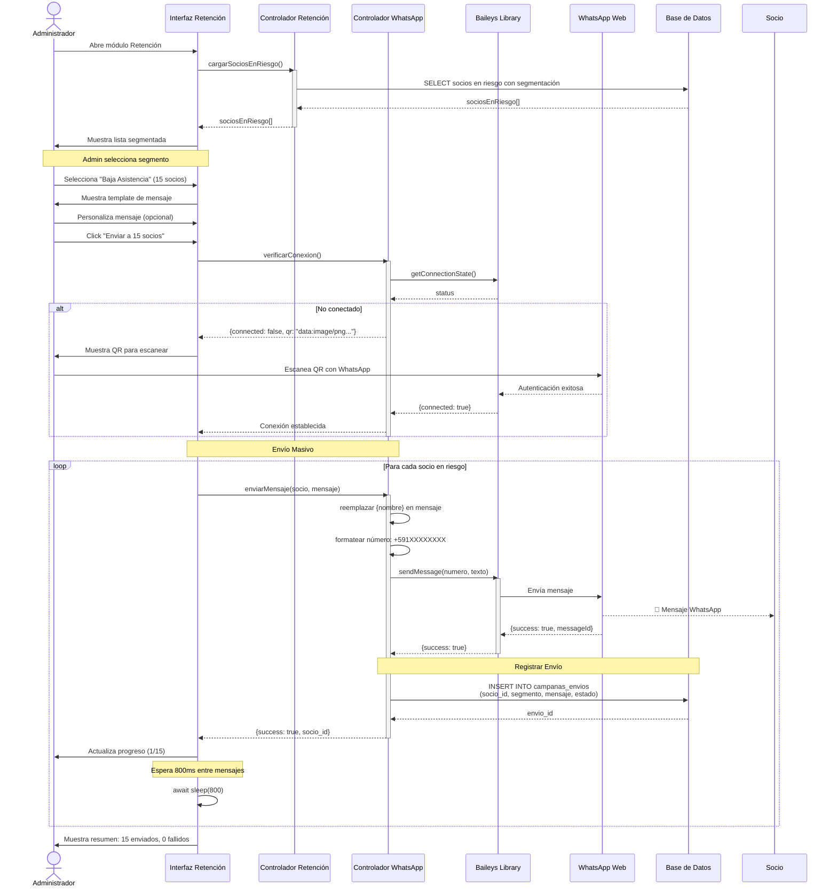
```mermaid
sequenceDiagram
    actor Admin as Administrador
    participant UI as Interfaz Retención
    participant RetCtrl as Controlador Retención
    participant WACtrl as Controlador WhatsApp
    participant Baileys as Baileys Library
    participant WhatsApp as WhatsApp Web
    participant DB as Base de Datos
    participant Socio as Socio
    
    Admin->>UI: Abre módulo Retención
    UI->>RetCtrl: cargarSociosEnRiesgo()
    activate RetCtrl
    RetCtrl->>DB: SELECT socios en riesgo con segmentación
    DB-->>RetCtrl: sociosEnRiesgo[]
    RetCtrl-->>UI: sociosEnRiesgo[]
    deactivate RetCtrl
    
    UI->>Admin: Muestra lista segmentada
    
    Note over Admin,UI: Admin selecciona segmento
    Admin->>UI: Selecciona "Baja Asistencia" (15 socios)
    UI->>Admin: Muestra template de mensaje
    
    Admin->>UI: Personaliza mensaje (opcional)
    Admin->>UI: Click "Enviar a 15 socios"
    
    UI->>WACtrl: verificarConexion()
    activate WACtrl
    WACtrl->>Baileys: getConnectionState()
    Baileys-->>WACtrl: status
    
    alt No conectado
        WACtrl-->>UI: {connected: false, qr: "data:image/png..."}
        UI->>Admin: Muestra QR para escanear
        Admin->>WhatsApp: Escanea QR con WhatsApp
        WhatsApp-->>Baileys: Autenticación exitosa
        Baileys-->>WACtrl: {connected: true}
        WACtrl-->>UI: Conexión establecida
    end
    deactivate WACtrl
    
    Note over UI,WACtrl: Envío Masivo
    loop Para cada socio en riesgo
        UI->>WACtrl: enviarMensaje(socio, mensaje)
        activate WACtrl
        
        WACtrl->>WACtrl: reemplazar {nombre} en mensaje
        WACtrl->>WACtrl: formatear número: +591XXXXXXXX
        
        WACtrl->>Baileys: sendMessage(numero, texto)
        activate Baileys
        Baileys->>WhatsApp: Envía mensaje
        WhatsApp-->>Socio: 📱 Mensaje WhatsApp
        WhatsApp-->>Baileys: {success: true, messageId}
        Baileys-->>WACtrl: {success: true}
        deactivate Baileys
        
        Note over WACtrl,DB: Registrar Envío
        WACtrl->>DB: INSERT INTO campanas_envios<br/>(socio_id, segmento, mensaje, estado)
        DB-->>WACtrl: envio_id
        
        WACtrl-->>UI: {success: true, socio_id}
        deactivate WACtrl
        
        UI->>Admin: Actualiza progreso (1/15)
        
        Note over UI: Espera 800ms entre mensajes
        UI->>UI: await sleep(800)
    end
    
    UI->>Admin: Muestra resumen: 15 enviados, 0 fallidos
```

**Objetos Participantes:**
- **Administrador**: Usuario que envía los mensajes
- **Interfaz Retención**: Módulo de retención
- **Controlador Retención**: Lógica de negocio de retención
- **Controlador WhatsApp**: Gestión de conexión y envío
- **Baileys Library**: Librería de conexión a WhatsApp
- **WhatsApp Web**: Servicio externo de mensajería
- **Base de Datos**: Registro de envíos
- **Socio**: Destinatario del mensaje

**Características Clave:**
- **Autenticación QR**: Si no está conectado, muestra QR
- **Personalización**: Reemplaza {nombre} con el nombre del socio
- **Envío controlado**: 800ms entre mensajes para evitar bloqueo
- **Registro completo**: Cada envío se guarda en la BD
- **Progreso en tiempo real**: UI actualiza contador

---

### 2.5 UC-26: Pronosticar Ingresos (Modelos Predictivos)

**Descripción:** Aplicación de 3 modelos predictivos para pronosticar ingresos a 3 meses.

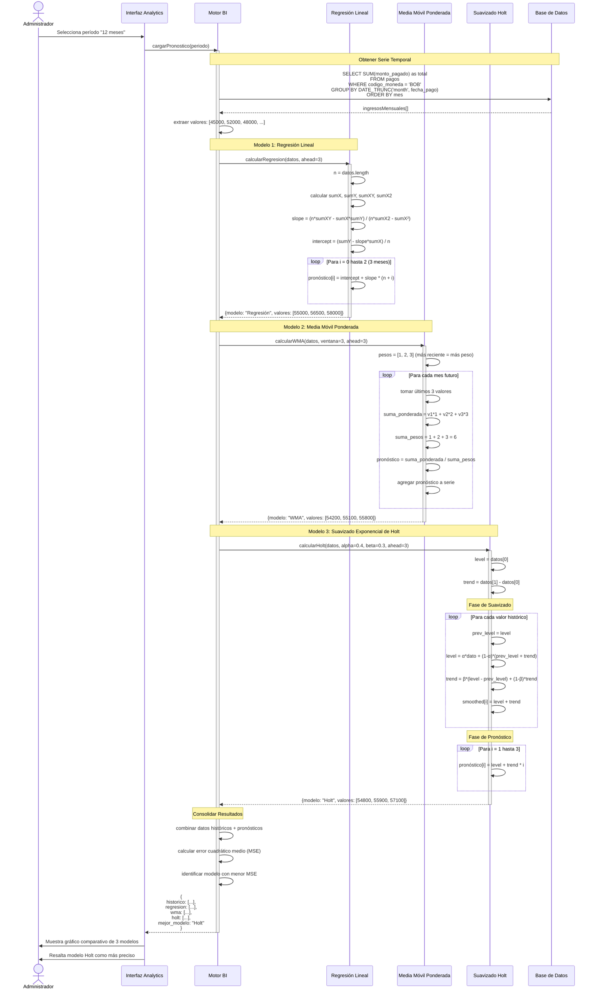
```mermaid
sequenceDiagram
    actor Admin as Administrador
    participant UI as Interfaz Analytics
    participant BIEngine as Motor BI
    participant RegLineal as Regresión Lineal
    participant WMA as Media Móvil Ponderada
    participant Holt as Suavizado Holt
    participant DB as Base de Datos
    
    Admin->>UI: Selecciona período "12 meses"
    UI->>BIEngine: cargarPronostico(periodo)
    activate BIEngine
    
    Note over BIEngine,DB: Obtener Serie Temporal
    BIEngine->>DB: SELECT SUM(monto_pagado) as total<br/>FROM pagos<br/>WHERE codigo_moneda = 'BOB'<br/>GROUP BY DATE_TRUNC('month', fecha_pago)<br/>ORDER BY mes
    DB-->>BIEngine: ingresosMensuales[]
    
    BIEngine->>BIEngine: extraer valores: [45000, 52000, 48000, ...]
    
    Note over BIEngine,RegLineal: Modelo 1: Regresión Lineal
    BIEngine->>RegLineal: calcularRegresion(datos, ahead=3)
    activate RegLineal
    
    RegLineal->>RegLineal: n = datos.length
    RegLineal->>RegLineal: calcular sumX, sumY, sumXY, sumX2
    RegLineal->>RegLineal: slope = (n*sumXY - sumX*sumY) / (n*sumX2 - sumX²)
    RegLineal->>RegLineal: intercept = (sumY - slope*sumX) / n
    
    loop Para i = 0 hasta 2 (3 meses)
        RegLineal->>RegLineal: pronóstico[i] = intercept + slope * (n + i)
    end
    
    RegLineal-->>BIEngine: {modelo: "Regresión", valores: [55000, 56500, 58000]}
    deactivate RegLineal
    
    Note over BIEngine,WMA: Modelo 2: Media Móvil Ponderada
    BIEngine->>WMA: calcularWMA(datos, ventana=3, ahead=3)
    activate WMA
    
    WMA->>WMA: pesos = [1, 2, 3] (más reciente = más peso)
    
    loop Para cada mes futuro
        WMA->>WMA: tomar últimos 3 valores
        WMA->>WMA: suma_ponderada = v1*1 + v2*2 + v3*3
        WMA->>WMA: suma_pesos = 1 + 2 + 3 = 6
        WMA->>WMA: pronóstico = suma_ponderada / suma_pesos
        WMA->>WMA: agregar pronóstico a serie
    end
    
    WMA-->>BIEngine: {modelo: "WMA", valores: [54200, 55100, 55800]}
    deactivate WMA
    
    Note over BIEngine,Holt: Modelo 3: Suavizado Exponencial de Holt
    BIEngine->>Holt: calcularHolt(datos, alpha=0.4, beta=0.3, ahead=3)
    activate Holt
    
    Holt->>Holt: level = datos[0]
    Holt->>Holt: trend = datos[1] - datos[0]
    
    Note over Holt: Fase de Suavizado
    loop Para cada valor histórico
        Holt->>Holt: prev_level = level
        Holt->>Holt: level = α*dato + (1-α)*(prev_level + trend)
        Holt->>Holt: trend = β*(level - prev_level) + (1-β)*trend
        Holt->>Holt: smoothed[i] = level + trend
    end
    
    Note over Holt: Fase de Pronóstico
    loop Para i = 1 hasta 3
        Holt->>Holt: pronóstico[i] = level + trend * i
    end
    
    Holt-->>BIEngine: {modelo: "Holt", valores: [54800, 55900, 57100]}
    deactivate Holt
    
    Note over BIEngine: Consolidar Resultados
    BIEngine->>BIEngine: combinar datos históricos + pronósticos
    BIEngine->>BIEngine: calcular error cuadrático medio (MSE)
    BIEngine->>BIEngine: identificar modelo con menor MSE
    
    BIEngine-->>UI: {<br/>  historico: [...],<br/>  regresion: [...],<br/>  wma: [...],<br/>  holt: [...],<br/>  mejor_modelo: "Holt"<br/>}
    deactivate BIEngine
    
    UI->>Admin: Muestra gráfico comparativo de 3 modelos
    UI->>Admin: Resalta modelo Holt como más preciso
```

**Objetos Participantes:**
- **Administrador**: Usuario que consulta el pronóstico
- **Interfaz Analytics**: Módulo de BI
- **Motor BI**: Orquestador de modelos
- **Regresión Lineal**: Modelo 1 (tendencia lineal)
- **Media Móvil Ponderada**: Modelo 2 (suavizado)
- **Suavizado Holt**: Modelo 3 (nivel + tendencia)
- **Base de Datos**: Fuente de datos históricos

**Modelos Implementados:**

1. **Regresión Lineal**
   - Fórmula: y = mx + b
   - Ventaja: Simple, muestra tendencia general
   - Limitación: No captura estacionalidad

2. **Media Móvil Ponderada (WMA)**
   - Ventana: 3 meses
   - Pesos: [1, 2, 3] (más reciente = más peso)
   - Ventaja: Suaviza picos atípicos
   - Limitación: Solo considera valores recientes

3. **Suavizado Exponencial de Holt**
   - Parámetros: α=0.4 (nivel), β=0.3 (tendencia)
   - Ventaja: Captura nivel actual + tendencia de cambio
   - Mejor modelo: Generalmente el más preciso

**Métricas de Evaluación:**
- MSE (Mean Squared Error): Mide precisión del modelo
- Modelo con menor MSE = más confiable

---

### 2.6 UC-05: Registrar Socio (CRUD Básico)

**Descripción:** Flujo de registro de un nuevo socio en el sistema.

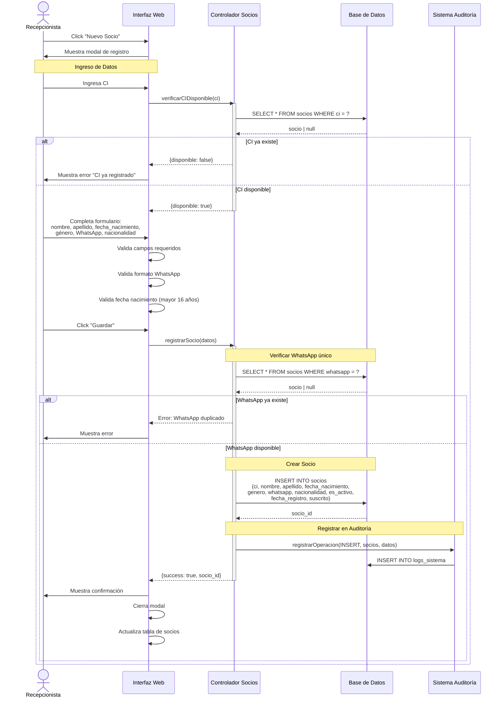
```mermaid
sequenceDiagram
    actor Recep as Recepcionista
    participant UI as Interfaz Web
    participant SociosCtrl as Controlador Socios
    participant DB as Base de Datos
    participant Audit as Sistema Auditoría
    
    Recep->>UI: Click "Nuevo Socio"
    UI->>Recep: Muestra modal de registro
    
    Note over Recep,UI: Ingreso de Datos
    Recep->>UI: Ingresa CI
    UI->>SociosCtrl: verificarCIDisponible(ci)
    activate SociosCtrl
    SociosCtrl->>DB: SELECT * FROM socios WHERE ci = ?
    DB-->>SociosCtrl: socio | null
    
    alt CI ya existe
        SociosCtrl-->>UI: {disponible: false}
        UI->>Recep: Muestra error "CI ya registrado"
    else CI disponible
        SociosCtrl-->>UI: {disponible: true}
        deactivate SociosCtrl
        
        Recep->>UI: Completa formulario:<br/>nombre, apellido, fecha_nacimiento,<br/>género, WhatsApp, nacionalidad
        
        UI->>UI: Valida campos requeridos
        UI->>UI: Valida formato WhatsApp
        UI->>UI: Valida fecha nacimiento (mayor 16 años)
        
        Recep->>UI: Click "Guardar"
        
        UI->>SociosCtrl: registrarSocio(datos)
        activate SociosCtrl
        
        Note over SociosCtrl,DB: Verificar WhatsApp único
        SociosCtrl->>DB: SELECT * FROM socios WHERE whatsapp = ?
        DB-->>SociosCtrl: socio | null
        
        alt WhatsApp ya existe
            SociosCtrl-->>UI: Error: WhatsApp duplicado
            UI->>Recep: Muestra error
        else WhatsApp disponible
            Note over SociosCtrl,DB: Crear Socio
            SociosCtrl->>DB: INSERT INTO socios<br/>(ci, nombre, apellido, fecha_nacimiento,<br/>genero, whatsapp, nacionalidad, es_activo,<br/>fecha_registro, suscrito)
            DB-->>SociosCtrl: socio_id
            
            Note over SociosCtrl,Audit: Registrar en Auditoría
            SociosCtrl->>Audit: registrarOperacion(INSERT, socios, datos)
            Audit->>DB: INSERT INTO logs_sistema
            
            SociosCtrl-->>UI: {success: true, socio_id}
            deactivate SociosCtrl
            
            UI->>Recep: Muestra confirmación
            UI->>UI: Cierra modal
            UI->>UI: Actualiza tabla de socios
        end
    end
```

**Objetos Participantes:**
- **Recepcionista**: Actor que registra al socio
- **Interfaz Web**: Formulario de registro
- **Controlador Socios**: Lógica de negocio
- **Base de Datos**: Almacenamiento
- **Sistema Auditoría**: Registro de operaciones

**Validaciones:**
- CI único en el sistema
- WhatsApp único en el sistema
- Formato de WhatsApp válido
- Fecha de nacimiento (mayor de 16 años)
- Campos requeridos completos

---

### 2.7 UC-17: Realizar Cierre de Caja

**Descripción:** Proceso de cierre diario de caja con comparación sistema vs efectivo físico.

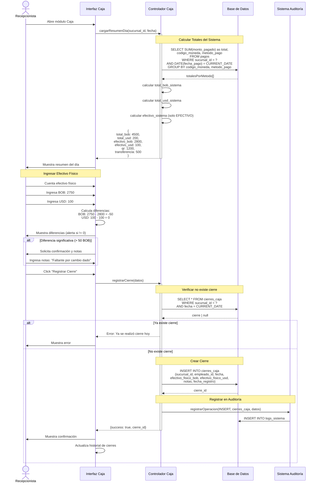
```mermaid
sequenceDiagram
    actor Recep as Recepcionista
    participant UI as Interfaz Caja
    participant CajaCtrl as Controlador Caja
    participant DB as Base de Datos
    participant Audit as Sistema Auditoría
    
    Recep->>UI: Abre módulo Caja
    UI->>CajaCtrl: cargarResumenDia(sucursal_id, fecha)
    activate CajaCtrl
    
    Note over CajaCtrl,DB: Calcular Totales del Sistema
    CajaCtrl->>DB: SELECT SUM(monto_pagado) as total,<br/>codigo_moneda, metodo_pago<br/>FROM pagos<br/>WHERE sucursal_id = ?<br/>AND DATE(fecha_pago) = CURRENT_DATE<br/>GROUP BY codigo_moneda, metodo_pago
    DB-->>CajaCtrl: totalesPorMetodo[]
    
    CajaCtrl->>CajaCtrl: calcular total_bob_sistema
    CajaCtrl->>CajaCtrl: calcular total_usd_sistema
    CajaCtrl->>CajaCtrl: calcular efectivo_sistema (solo EFECTIVO)
    
    CajaCtrl-->>UI: {<br/>  total_bob: 4500,<br/>  total_usd: 200,<br/>  efectivo_bob: 2800,<br/>  efectivo_usd: 100,<br/>  qr: 1200,<br/>  transferencia: 500<br/>}
    deactivate CajaCtrl
    
    UI->>Recep: Muestra resumen del día
    
    Note over Recep,UI: Ingresar Efectivo Físico
    Recep->>UI: Cuenta efectivo físico
    Recep->>UI: Ingresa BOB: 2750
    Recep->>UI: Ingresa USD: 100
    
    UI->>UI: Calcula diferencias:<br/>BOB: 2750 - 2800 = -50<br/>USD: 100 - 100 = 0
    
    UI->>Recep: Muestra diferencias (alerta si != 0)
    
    alt Diferencia significativa (> 50 BOB)
        UI->>Recep: Solicita confirmación y notas
        Recep->>UI: Ingresa notas: "Faltante por cambio dado"
    end
    
    Recep->>UI: Click "Registrar Cierre"
    
    UI->>CajaCtrl: registrarCierre(datos)
    activate CajaCtrl
    
    Note over CajaCtrl,DB: Verificar no existe cierre
    CajaCtrl->>DB: SELECT * FROM cierres_caja<br/>WHERE sucursal_id = ?<br/>AND fecha = CURRENT_DATE
    DB-->>CajaCtrl: cierre | null
    
    alt Ya existe cierre
        CajaCtrl-->>UI: Error: Ya se realizó cierre hoy
        UI->>Recep: Muestra error
    else No existe cierre
        Note over CajaCtrl,DB: Crear Cierre
        CajaCtrl->>DB: INSERT INTO cierres_caja<br/>(sucursal_id, empleado_id, fecha,<br/>efectivo_fisico_bob, efectivo_fisico_usd,<br/>notas, fecha_registro)
        DB-->>CajaCtrl: cierre_id
        
        Note over CajaCtrl,Audit: Registrar en Auditoría
        CajaCtrl->>Audit: registrarOperacion(INSERT, cierres_caja, datos)
        Audit->>DB: INSERT INTO logs_sistema
        
        CajaCtrl-->>UI: {success: true, cierre_id}
        deactivate CajaCtrl
        
        UI->>Recep: Muestra confirmación
        UI->>UI: Actualiza historial de cierres
    end
```

**Objetos Participantes:**
- **Recepcionista**: Actor que realiza el cierre
- **Interfaz Caja**: Módulo de caja
- **Controlador Caja**: Lógica de negocio
- **Base de Datos**: Fuente de datos y almacenamiento
- **Sistema Auditoría**: Registro de operaciones

**Características Clave:**
- **Cálculo automático**: Sistema calcula totales del día
- **Comparación**: Sistema vs efectivo físico contado
- **Detección de diferencias**: Alerta si hay faltantes/sobrantes
- **Validación**: Solo un cierre por día por sucursal
- **Trazabilidad**: Registro de quién hizo el cierre y cuándo

---

### 2.8 UC-31: Detectar Hora Valle (Análisis Automático)

**Descripción:** Proceso automático que identifica horas de baja asistencia para generar oportunidades de marketing.

```mermaid
sequenceDiagram
    participant BIEngine as Motor BI
    participant HoraValleDetector as Detector Hora Valle
    participant DB as Base de Datos
    participant InsightGen as Generador Insights
    
    Note over BIEngine: Ejecuta cada vez que se carga Analytics
    
    BIEngine->>HoraValleDetector: detectarHoraValle(sucursal_id)
    activate HoraValleDetector
    
    Note over HoraValleDetector,DB: Obtener Asistencias 30 días
    HoraValleDetector->>DB: SELECT EXTRACT(HOUR FROM fecha_entrada) as hora,<br/>COUNT(*) as total<br/>FROM asistencias<br/>WHERE sucursal_id = ?<br/>AND fecha_entrada >= CURRENT_DATE - INTERVAL '30 days'<br/>GROUP BY hora<br/>ORDER BY hora
    DB-->>HoraValleDetector: asistenciasPorHora[]
    
    Note over HoraValleDetector: Análisis de Patrones
    HoraValleDetector->>HoraValleDetector: filtrar horario operativo (6:00 - 22:00)
    
    HoraValleDetector->>HoraValleDetector: identificar 3 horas pico:<br/>ordenar por total DESC<br/>tomar top 3
    HoraValleDetector->>HoraValleDetector: horas_pico = [18h: 188, 19h: 175, 20h: 162]
    HoraValleDetector->>HoraValleDetector: promedio_pico = (188+175+162)/3 = 175
    
    HoraValleDetector->>HoraValleDetector: identificar 3 horas valle:<br/>ordenar por total ASC<br/>tomar bottom 3 (entre 6-20h)
    HoraValleDetector->>HoraValleDetector: horas_valle = [8h: 5, 9h: 12, 14h: 18]
    HoraValleDetector->>HoraValleDetector: promedio_valle = (5+12+18)/3 = 11.67
    
    Note over HoraValleDetector: Evaluar Oportunidad
    HoraValleDetector->>HoraValleDetector: ratio = promedio_valle / promedio_pico
    HoraValleDetector->>HoraValleDetector: ratio = 11.67 / 175 = 0.067 (6.7%)
    
    alt ratio < 0.4 (40%)
        Note over HoraValleDetector: ¡Oportunidad detectada!
        
        HoraValleDetector->>HoraValleDetector: crear objeto resultado:<br/>{<br/>  detectado: true,<br/>  hora_valle_critica: 8,<br/>  total_valle: 5,<br/>  hora_pico: 18,<br/>  total_pico: 188,<br/>  ratio: 0.067,<br/>  oportunidad: "ALTA"<br/>}
        
        HoraValleDetector-->>BIEngine: resultado
        deactivate HoraValleDetector
        
        Note over BIEngine,InsightGen: Generar Insight Prescriptivo
        BIEngine->>InsightGen: crearInsightHoraValle(resultado)
        activate InsightGen
        
        InsightGen->>InsightGen: crear insight:<br/>{<br/>  tipo: "OPORTUNIDAD",<br/>  prioridad: "MEDIA",<br/>  titulo: "Hora valle detectada",<br/>  descripcion: "8:00 AM tiene solo 5 asistencias<br/>  vs 188 en hora pico (6.7%)",<br/>  metrica: "6.7% de ocupación",<br/>  accion: "Crear campaña hora valle",<br/>  link: "/campanas?template=hora_valle"<br/>}
        
        InsightGen-->>BIEngine: insight
        deactivate InsightGen
        
        BIEngine->>BIEngine: agregar insight a lista
        
    else ratio >= 0.4
        Note over HoraValleDetector: No hay oportunidad significativa
        HoraValleDetector-->>BIEngine: {detectado: false}
        deactivate HoraValleDetector
    end
```

**Objetos Participantes:**
- **Motor BI**: Orquestador principal
- **Detector Hora Valle**: Algoritmo de detección
- **Base de Datos**: Fuente de datos de asistencias
- **Generador Insights**: Creador de recomendaciones

**Lógica del Algoritmo:**
1. **Recolección**: Obtiene asistencias de últimos 30 días
2. **Agrupación**: Agrupa por hora del día
3. **Identificación Pico**: Top 3 horas con más asistencias
4. **Identificación Valle**: Bottom 3 horas con menos asistencias (6-20h)
5. **Cálculo Ratio**: valle / pico
6. **Evaluación**: Si ratio < 40%, genera insight de oportunidad

**Umbral de Detección:**
- **Crítico** (ratio < 20%): Oportunidad ALTA
- **Moderado** (20% ≤ ratio < 40%): Oportunidad MEDIA
- **Normal** (ratio ≥ 40%): No genera insight

---

### 2.9 UC-21: Calcular Score de Riesgo (Modelo de Scoring)

**Descripción:** Algoritmo que calcula el score de riesgo de churn para cada socio.

```mermaid
sequenceDiagram
    participant RetAnalyzer as Analizador Retención
    participant DB as Base de Datos
    participant ScoreCalc as Calculador Score
    
    RetAnalyzer->>DB: SELECT * FROM socios<br/>WHERE suscrito = true AND es_activo = true
    DB-->>RetAnalyzer: sociosActivos[]
    
    loop Para cada socio
        RetAnalyzer->>ScoreCalc: calcularScoreRiesgo(socio_id)
        activate ScoreCalc
        
        Note over ScoreCalc,DB: Factor 1: Días para Vencer (40 pts)
        ScoreCalc->>DB: SELECT fecha_fin FROM suscripciones<br/>WHERE socio_id = ? AND estado = 'ACTIVA'
        DB-->>ScoreCalc: fecha_fin
        
        ScoreCalc->>ScoreCalc: dias_restantes = fecha_fin - CURRENT_DATE
        
        alt dias_restantes <= 0
            ScoreCalc->>ScoreCalc: puntos_vencimiento = 40
        else dias_restantes <= 7
            ScoreCalc->>ScoreCalc: puntos_vencimiento = 35
        else dias_restantes <= 15
            ScoreCalc->>ScoreCalc: puntos_vencimiento = 25
        else dias_restantes <= 30
            ScoreCalc->>ScoreCalc: puntos_vencimiento = 15
        else dias_restantes > 30
            ScoreCalc->>ScoreCalc: puntos_vencimiento = 0
        end
        
        Note over ScoreCalc,DB: Factor 2: Asistencias 30 días (35 pts)
        ScoreCalc->>DB: SELECT COUNT(*) FROM asistencias<br/>WHERE socio_id = ?<br/>AND fecha_entrada >= CURRENT_DATE - INTERVAL '30 days'
        DB-->>ScoreCalc: total_asistencias
        
        alt total_asistencias = 0
            ScoreCalc->>ScoreCalc: puntos_asistencia = 35
        else total_asistencias <= 2
            ScoreCalc->>ScoreCalc: puntos_asistencia = 30
        else total_asistencias <= 5
            ScoreCalc->>ScoreCalc: puntos_asistencia = 20
        else total_asistencias <= 8
            ScoreCalc->>ScoreCalc: puntos_asistencia = 10
        else total_asistencias > 8
            ScoreCalc->>ScoreCalc: puntos_asistencia = 0
        end
        
        Note over ScoreCalc,DB: Factor 3: Días sin Visita (25 pts)
        ScoreCalc->>DB: SELECT MAX(fecha_entrada) FROM asistencias<br/>WHERE socio_id = ?
        DB-->>ScoreCalc: ultima_visita
        
        alt ultima_visita IS NULL
            ScoreCalc->>ScoreCalc: puntos_inactividad = 25
        else
            ScoreCalc->>ScoreCalc: dias_sin_visita = CURRENT_DATE - ultima_visita
            
            alt dias_sin_visita >= 30
                ScoreCalc->>ScoreCalc: puntos_inactividad = 25
            else dias_sin_visita >= 20
                ScoreCalc->>ScoreCalc: puntos_inactividad = 20
            else dias_sin_visita >= 10
                ScoreCalc->>ScoreCalc: puntos_inactividad = 15
            else dias_sin_visita >= 5
                ScoreCalc->>ScoreCalc: puntos_inactividad = 10
            else dias_sin_visita < 5
                ScoreCalc->>ScoreCalc: puntos_inactividad = 0
            end
        end
        
        Note over ScoreCalc: Calcular Score Total
        ScoreCalc->>ScoreCalc: score_total = puntos_vencimiento +<br/>puntos_asistencia + puntos_inactividad
        ScoreCalc->>ScoreCalc: score_total = min(score_total, 100)
        
        Note over ScoreCalc: Clasificar Nivel de Riesgo
        alt score_total >= 65
            ScoreCalc->>ScoreCalc: nivel_riesgo = "ALTO"
        else score_total >= 35
            ScoreCalc->>ScoreCalc: nivel_riesgo = "MEDIO"
        else score_total < 35
            ScoreCalc->>ScoreCalc: nivel_riesgo = "BAJO"
        end
        
        Note over ScoreCalc: Determinar Segmento
        ScoreCalc->>ScoreCalc: if (dias_restantes <= 0):<br/>  segmento = "no_renovaron"<br/>else if (total_asistencias <= 2):<br/>  segmento = "baja_asistencia"<br/>else if (dias_sin_visita >= 10 AND total_asistencias > 5):<br/>  segmento = "racha_perdida"<br/>else if (dias_restantes <= 7):<br/>  segmento = "proximos_vencer"
        
        ScoreCalc-->>RetAnalyzer: {<br/>  socio_id,<br/>  score: 72,<br/>  nivel: "ALTO",<br/>  segmento: "baja_asistencia",<br/>  factores: {<br/>    vencimiento: 35,<br/>    asistencia: 30,<br/>    inactividad: 7<br/>  }<br/>}
        deactivate ScoreCalc
        
        RetAnalyzer->>RetAnalyzer: agregar a lista de riesgo
    end
    
    RetAnalyzer->>RetAnalyzer: ordenar por score DESC
    RetAnalyzer->>RetAnalyzer: agrupar por segmento
```

**Objetos Participantes:**
- **Analizador Retención**: Orquestador del análisis
- **Base de Datos**: Fuente de datos
- **Calculador Score**: Algoritmo de scoring

**Modelo de Scoring (100 puntos máximo):**

1. **Días para Vencer (40 puntos)**
   - Vencida: 40 pts
   - ≤ 7 días: 35 pts
   - ≤ 15 días: 25 pts
   - ≤ 30 días: 15 pts
   - > 30 días: 0 pts

2. **Asistencias en 30 días (35 puntos)**
   - 0 visitas: 35 pts
   - 1-2 visitas: 30 pts
   - 3-5 visitas: 20 pts
   - 6-8 visitas: 10 pts
   - 9+ visitas: 0 pts

3. **Días sin Visita (25 puntos)**
   - ≥ 30 días: 25 pts
   - 20-29 días: 20 pts
   - 10-19 días: 15 pts
   - 5-9 días: 10 pts
   - < 5 días: 0 pts

**Clasificación de Riesgo:**
- **ALTO** (≥ 65 pts): Requiere acción inmediata
- **MEDIO** (35-64 pts): Monitorear y contactar
- **BAJO** (< 35 pts): Socio saludable

---

## 2.10 Resumen de Diagramas de Secuencia

| Diagrama | Caso de Uso | Complejidad | Objetos | Transacciones | Patrón |
|----------|-------------|-------------|---------|---------------|--------|
| 2.1 | UC-12: Registrar Pago | Alta | 8 | Sí | Transaccional |
| 2.2 | UC-07: Registrar Entrada | Media | 8 | No | Tiempo Real |
| 2.3 | UC-25: Generar Insights | Alta | 7 | No | Automático |
| 2.4 | UC-20: Enviar Mensaje | Media | 8 | No | Integración Externa |
| 2.5 | UC-26: Pronosticar Ingresos | Alta | 6 | No | Analítico |
| 2.6 | UC-05: Registrar Socio | Baja | 5 | No | CRUD Básico |
| 2.7 | UC-17: Cierre de Caja | Media | 5 | No | Validación Financiera |
| 2.8 | UC-31: Detectar Hora Valle | Media | 4 | No | Análisis Automático |
| 2.9 | UC-21: Calcular Score | Alta | 3 | No | Modelo de Scoring |

**Total de Diagramas:** 9  
**Cobertura de Módulos:** 7 de 9 módulos principales

**Características Comunes:**
- ✅ Todos incluyen validaciones de negocio
- ✅ Todos registran en auditoría (excepto procesos automáticos)
- ✅ Todos manejan flujos alternativos (errores)
- ✅ Todos interactúan con la base de datos
- ✅ Todos incluyen notas explicativas

**Patrones Identificados:**

1. **Patrón Transaccional** (UC-12)
   - Usa BEGIN/COMMIT para garantizar consistencia
   - Rollback automático en caso de error
   - Múltiples operaciones atómicas

2. **Patrón Tiempo Real** (UC-07)
   - Usa Supabase Realtime para actualizaciones
   - Broadcast de cambios a todos los clientes
   - Sincronización automática de UI

3. **Patrón Automático** (UC-25, UC-31)
   - Se ejecuta sin intervención humana
   - Triggered por eventos o schedule
   - Genera insights y recomendaciones

4. **Patrón Integración Externa** (UC-20)
   - Integra con servicios de terceros (WhatsApp)
   - Maneja autenticación externa
   - Control de rate limiting

5. **Patrón Analítico** (UC-26, UC-21)
   - Aplica algoritmos y modelos matemáticos
   - Procesa grandes volúmenes de datos
   - Genera predicciones y scores

6. **Patrón CRUD Básico** (UC-05)
   - Operaciones simples de base de datos
   - Validaciones de unicidad
   - Registro en auditoría

7. **Patrón Validación Financiera** (UC-17)
   - Comparación sistema vs realidad
   - Detección de discrepancias
   - Trazabilidad completa

---

## 3. Diagramas de Estado

Los diagramas de estado muestran los diferentes estados por los que pasa una entidad del sistema y las transiciones entre ellos, incluyendo los eventos que disparan cada transición.

---

### 3.1 Diagrama de Estado: Suscripción

**Descripción:** Ciclo de vida de una suscripción desde su creación hasta su finalización.

```mermaid
stateDiagram-v2
    [*] --> PENDIENTE: Socio registrado<br/>sin pago
    
    PENDIENTE --> ACTIVA: Pago registrado<br/>fecha_inicio <= hoy <= fecha_fin
    PENDIENTE --> CANCELADA: Socio desactivado<br/>sin completar pago
    
    ACTIVA --> VENCIDA: fecha_fin < hoy<br/>(automático)
    ACTIVA --> CANCELADA: Cancelación manual<br/>por Admin
    
    VENCIDA --> ACTIVA: Renovación<br/>(nuevo pago)
    VENCIDA --> CANCELADA: Socio desactivado<br/>sin renovar
    
    CANCELADA --> [*]: Estado final
    
    note right of PENDIENTE
        Estado inicial
        Esperando pago
    end note
    
    note right of ACTIVA
        Socio puede ingresar
        Suscripción vigente
    end note
    
    note right of VENCIDA
        Socio NO puede ingresar
        Requiere renovación
    end note
    
    note right of CANCELADA
        Estado final
        No reversible
    end note
```

**Estados:**
- **PENDIENTE**: Suscripción creada pero sin pago completado
- **ACTIVA**: Suscripción vigente, socio puede usar el gimnasio
- **VENCIDA**: Suscripción expirada, requiere renovación
- **CANCELADA**: Suscripción cancelada permanentemente

**Transiciones:**
1. PENDIENTE → ACTIVA: Cuando se registra el pago
2. PENDIENTE → CANCELADA: Si el socio se desactiva sin pagar
3. ACTIVA → VENCIDA: Automático cuando fecha_fin < fecha_actual
4. ACTIVA → CANCELADA: Cancelación manual por administrador
5. VENCIDA → ACTIVA: Cuando el socio renueva (nuevo pago)
6. VENCIDA → CANCELADA: Si el socio se desactiva sin renovar

**Reglas de Negocio:**
- Solo suscripciones ACTIVAS permiten entrada al gimnasio
- La transición ACTIVA → VENCIDA es automática (proceso nocturno)
- CANCELADA es un estado final (no reversible)
- Un socio puede tener múltiples suscripciones históricas

---

### 3.2 Diagrama de Estado: Asistencia

**Descripción:** Estados de una asistencia desde el registro de entrada hasta la salida.

```mermaid
stateDiagram-v2
    [*] --> DENTRO: Registrar entrada<br/>asignar casillero
    
    DENTRO --> FUERA: Registrar salida<br/>liberar casillero
    
    FUERA --> [*]: Asistencia completada
    
    note right of DENTRO
        fecha_salida = NULL
        Socio está en el gym
        Casillero ocupado
        Cuenta para aforo
    end note
    
    note right of FUERA
        fecha_salida != NULL
        Asistencia finalizada
        Casillero liberado
        No cuenta para aforo
    end note
```

**Estados:**
- **DENTRO**: Socio está actualmente en el gimnasio
- **FUERA**: Socio ya salió, asistencia completada

**Transiciones:**
1. [*] → DENTRO: Recepcionista registra entrada del socio
2. DENTRO → FUERA: Recepcionista registra salida del socio

**Reglas de Negocio:**
- Un socio solo puede tener UNA asistencia en estado DENTRO
- Si fecha_salida es NULL, el socio está DENTRO
- El aforo se calcula contando asistencias en estado DENTRO
- Al registrar entrada, se valida que no exista asistencia DENTRO

---

### 3.3 Diagrama de Estado: Casillero

**Descripción:** Estados de un casillero físico en una sucursal.

```mermaid
stateDiagram-v2
    [*] --> LIBRE: Casillero creado
    
    LIBRE --> OCUPADO: Socio entra<br/>asignar casillero
    LIBRE --> MANTENIMIENTO: Admin marca<br/>en mantenimiento
    
    OCUPADO --> LIBRE: Socio sale<br/>liberar casillero
    OCUPADO --> MANTENIMIENTO: Forzar liberación<br/>por Admin
    
    MANTENIMIENTO --> LIBRE: Admin marca<br/>como disponible
    
    note right of LIBRE
        Disponible para asignar
        Color: Verde
    end note
    
    note right of OCUPADO
        Asignado a un socio
        Color: Rojo
        Referencia a asistencia
    end note
    
    note right of MANTENIMIENTO
        Fuera de servicio
        Color: Amarillo
        No se puede asignar
    end note
```

**Estados:**
- **LIBRE**: Casillero disponible para asignar
- **OCUPADO**: Casillero asignado a un socio que está dentro
- **MANTENIMIENTO**: Casillero fuera de servicio

**Transiciones:**
1. [*] → LIBRE: Casillero creado en el sistema
2. LIBRE → OCUPADO: Asignado al registrar entrada de socio
3. LIBRE → MANTENIMIENTO: Admin marca para reparación
4. OCUPADO → LIBRE: Liberado al registrar salida de socio
5. OCUPADO → MANTENIMIENTO: Admin fuerza liberación (emergencia)
6. MANTENIMIENTO → LIBRE: Admin marca como reparado

**Reglas de Negocio:**
- Solo casilleros LIBRE pueden asignarse
- Un casillero OCUPADO tiene referencia a una asistencia activa
- MANTENIMIENTO es manual (no automático)
- Al eliminar un casillero, debe estar en estado LIBRE

---

### 3.4 Diagrama de Estado: Socio

**Descripción:** Estados de un socio en el sistema.

```mermaid
stateDiagram-v2
    [*] --> REGISTRADO: Crear socio<br/>sin suscripción
    
    REGISTRADO --> SUSCRITO: Primer pago<br/>suscripción activa
    
    SUSCRITO --> VENCIDO: Suscripción expira<br/>sin renovar
    SUSCRITO --> INACTIVO: Admin desactiva<br/>socio
    
    VENCIDO --> SUSCRITO: Renovación<br/>(nuevo pago)
    VENCIDO --> INACTIVO: Admin desactiva<br/>socio
    
    INACTIVO --> SUSCRITO: Admin reactiva<br/>+ nuevo pago
    INACTIVO --> REGISTRADO: Admin reactiva<br/>sin pago
    
    note right of REGISTRADO
        es_activo = true
        suscrito = false
        NO puede ingresar
    end note
    
    note right of SUSCRITO
        es_activo = true
        suscrito = true
        Tiene suscripción ACTIVA
        PUEDE ingresar
    end note
    
    note right of VENCIDO
        es_activo = true
        suscrito = false
        Suscripción VENCIDA
        NO puede ingresar
    end note
    
    note right of INACTIVO
        es_activo = false
        suscrito = false
        Desactivado por Admin
        NO puede ingresar
    end note
```

**Estados:**
- **REGISTRADO**: Socio creado sin suscripción activa
- **SUSCRITO**: Socio con suscripción activa, puede ingresar
- **VENCIDO**: Socio con suscripción vencida, requiere renovación
- **INACTIVO**: Socio desactivado por administrador

**Transiciones:**
1. [*] → REGISTRADO: Recepcionista crea nuevo socio
2. REGISTRADO → SUSCRITO: Se registra primer pago
3. SUSCRITO → VENCIDO: Suscripción expira automáticamente
4. SUSCRITO → INACTIVO: Admin desactiva al socio
5. VENCIDO → SUSCRITO: Socio renueva su suscripción
6. VENCIDO → INACTIVO: Admin desactiva al socio
7. INACTIVO → SUSCRITO: Admin reactiva + nuevo pago
8. INACTIVO → REGISTRADO: Admin reactiva sin pago

**Reglas de Negocio:**
- Solo socios en estado SUSCRITO pueden ingresar al gym
- El campo `suscrito` refleja si tiene suscripción ACTIVA
- El campo `es_activo` indica si el socio está habilitado
- INACTIVO es reversible (puede reactivarse)

---

### 3.5 Diagrama de Estado: Pago

**Descripción:** Estados de una transacción de pago.

```mermaid
stateDiagram-v2
    [*] --> PENDIENTE: Iniciar wizard<br/>de pago
    
    PENDIENTE --> PROCESANDO: Confirmar datos<br/>iniciar transacción
    
    PROCESANDO --> COMPLETADO: Transacción exitosa<br/>factura generada
    PROCESANDO --> FALLIDO: Error en BD<br/>o validación
    
    FALLIDO --> PENDIENTE: Reintentar<br/>corregir datos
    
    COMPLETADO --> [*]: Pago finalizado
    
    note right of PENDIENTE
        Wizard en progreso
        Sin registro en BD
    end note
    
    note right of PROCESANDO
        BEGIN TRANSACTION
        Creando registros
    end note
    
    note right of COMPLETADO
        COMMIT exitoso
        Factura generada
        Suscripción actualizada
        Estado final
    end note
    
    note right of FALLIDO
        ROLLBACK ejecutado
        Error registrado
        Puede reintentar
    end note
```

**Estados:**
- **PENDIENTE**: Usuario completando wizard de pago
- **PROCESANDO**: Transacción en curso (BEGIN TRANSACTION)
- **COMPLETADO**: Pago exitoso, factura generada
- **FALLIDO**: Error en el proceso, rollback ejecutado

**Transiciones:**
1. [*] → PENDIENTE: Usuario inicia wizard de pago
2. PENDIENTE → PROCESANDO: Usuario confirma y envía datos
3. PROCESANDO → COMPLETADO: Transacción exitosa (COMMIT)
4. PROCESANDO → FALLIDO: Error en validación o BD (ROLLBACK)
5. FALLIDO → PENDIENTE: Usuario corrige datos y reintenta

**Reglas de Negocio:**
- PROCESANDO usa transacción de BD (BEGIN/COMMIT/ROLLBACK)
- Solo pagos COMPLETADO generan factura
- FALLIDO no crea registros en BD (rollback completo)
- COMPLETADO es estado final (no reversible)

---

### 3.6 Diagrama de Estado: Conexión WhatsApp

**Descripción:** Estados de la conexión con WhatsApp Web via Baileys.

```mermaid
stateDiagram-v2
    [*] --> DESCONECTADO: Aplicación inicia
    
    DESCONECTADO --> CONECTANDO: Iniciar conexión<br/>generar QR
    
    CONECTANDO --> CONECTADO: QR escaneado<br/>autenticación exitosa
    CONECTANDO --> ERROR: Timeout<br/>o error de red
    
    CONECTADO --> ENVIANDO: Enviar mensaje
    CONECTADO --> DESCONECTADO: Pérdida de conexión<br/>o logout
    CONECTADO --> ERROR: Error crítico
    
    ENVIANDO --> CONECTADO: Mensaje enviado<br/>exitosamente
    ENVIANDO --> ERROR: Fallo al enviar
    
    ERROR --> DESCONECTADO: Limpiar sesión
    ERROR --> CONECTANDO: Reintentar conexión
    
    note right of DESCONECTADO
        Sin sesión activa
        Requiere QR
        Color: Rojo
    end note
    
    note right of CONECTANDO
        Mostrando QR
        Esperando escaneo
        Color: Amarillo
    end note
    
    note right of CONECTADO
        Sesión activa
        Listo para enviar
        Color: Verde
    end note
    
    note right of ENVIANDO
        Enviando mensaje
        En progreso
    end note
    
    note right of ERROR
        Error detectado
        Requiere intervención
        Color: Rojo
    end note
```

**Estados:**
- **DESCONECTADO**: Sin conexión a WhatsApp
- **CONECTANDO**: Generando QR, esperando escaneo
- **CONECTADO**: Sesión activa, listo para enviar mensajes
- **ENVIANDO**: Enviando mensaje en progreso
- **ERROR**: Error en la conexión o envío

**Transiciones:**
1. [*] → DESCONECTADO: Aplicación inicia sin sesión
2. DESCONECTADO → CONECTANDO: Admin inicia conexión
3. CONECTANDO → CONECTADO: QR escaneado exitosamente
4. CONECTANDO → ERROR: Timeout o error de red
5. CONECTADO → ENVIANDO: Iniciar envío de mensaje
6. CONECTADO → DESCONECTADO: Pérdida de conexión
7. CONECTADO → ERROR: Error crítico de sesión
8. ENVIANDO → CONECTADO: Mensaje enviado exitosamente
9. ENVIANDO → ERROR: Fallo al enviar mensaje
10. ERROR → DESCONECTADO: Limpiar sesión
11. ERROR → CONECTANDO: Reintentar conexión

**Reglas de Negocio:**
- Solo en estado CONECTADO se pueden enviar mensajes
- El QR expira después de 60 segundos (CONECTANDO → ERROR)
- La sesión se guarda en `.baileys-auth/` para reconexión
- Polling cada 3 segundos para verificar estado

---

### 3.7 Diagrama de Estado: Campaña de Marketing

**Descripción:** Estados de una campaña de WhatsApp desde su creación hasta su finalización.

```mermaid
stateDiagram-v2
    [*] --> BORRADOR: Crear campaña<br/>configurar filtros
    
    BORRADOR --> LISTA: Aplicar filtros<br/>generar audiencia
    
    LISTA --> ENVIANDO: Confirmar envío<br/>iniciar proceso
    
    ENVIANDO --> COMPLETADA: Todos enviados<br/>exitosamente
    ENVIANDO --> PARCIAL: Algunos fallaron<br/>otros exitosos
    ENVIANDO --> FALLIDA: Todos fallaron<br/>o cancelado
    
    COMPLETADA --> [*]: Campaña finalizada
    PARCIAL --> [*]: Campaña finalizada
    FALLIDA --> [*]: Campaña finalizada
    
    note right of BORRADOR
        Configurando mensaje
        Seleccionando filtros
        Sin audiencia definida
    end note
    
    note right of LISTA
        Audiencia generada
        N socios seleccionados
        Lista para enviar
    end note
    
    note right of ENVIANDO
        Envío en progreso
        Progreso: X/N
        Delay 800ms entre envíos
    end note
    
    note right of COMPLETADA
        100% enviados
        0 fallidos
        Estado final
    end note
    
    note right of PARCIAL
        Algunos enviados
        Algunos fallidos
        Estado final
    end note
    
    note right of FALLIDA
        0% enviados
        Todos fallidos
        Estado final
    end note
```

**Estados:**
- **BORRADOR**: Campaña en configuración
- **LISTA**: Audiencia generada, lista para enviar
- **ENVIANDO**: Envío masivo en progreso
- **COMPLETADA**: Todos los mensajes enviados exitosamente
- **PARCIAL**: Algunos mensajes enviados, otros fallaron
- **FALLIDA**: Ningún mensaje enviado exitosamente

**Transiciones:**
1. [*] → BORRADOR: Admin crea nueva campaña
2. BORRADOR → LISTA: Admin aplica filtros y genera audiencia
3. LISTA → ENVIANDO: Admin confirma envío masivo
4. ENVIANDO → COMPLETADA: Todos los envíos exitosos
5. ENVIANDO → PARCIAL: Algunos envíos fallaron
6. ENVIANDO → FALLIDA: Todos los envíos fallaron o cancelado

**Reglas de Negocio:**
- BORRADOR permite editar mensaje y filtros
- LISTA muestra preview de audiencia (N socios)
- ENVIANDO tiene delay de 800ms entre mensajes
- Estados finales (COMPLETADA, PARCIAL, FALLIDA) no son reversibles
- Cada envío individual se registra en `campanas_envios`

---

### 3.8 Diagrama de Estado: Empleado

**Descripción:** Estados de un empleado del sistema.

```mermaid
stateDiagram-v2
    [*] --> ACTIVO: Crear empleado<br/>asignar credenciales
    
    ACTIVO --> SESION_ACTIVA: Login exitoso
    
    SESION_ACTIVA --> ACTIVO: Logout<br/>o timeout
    
    ACTIVO --> INACTIVO: Admin desactiva<br/>empleado
    
    INACTIVO --> ACTIVO: Admin reactiva<br/>empleado
    
    note right of ACTIVO
        es_activo = true
        Sin sesión
        Puede hacer login
    end note
    
    note right of SESION_ACTIVA
        es_activo = true
        Sesión en localStorage
        Operando en el sistema
    end note
    
    note right of INACTIVO
        es_activo = false
        NO puede hacer login
        Sesiones cerradas
    end note
```

**Estados:**
- **ACTIVO**: Empleado habilitado sin sesión activa
- **SESION_ACTIVA**: Empleado logueado operando en el sistema
- **INACTIVO**: Empleado deshabilitado por administrador

**Transiciones:**
1. [*] → ACTIVO: Admin crea nuevo empleado
2. ACTIVO → SESION_ACTIVA: Empleado hace login exitoso
3. SESION_ACTIVA → ACTIVO: Empleado hace logout o timeout
4. ACTIVO → INACTIVO: Admin desactiva al empleado
5. INACTIVO → ACTIVO: Admin reactiva al empleado

**Reglas de Negocio:**
- Solo empleados ACTIVO pueden hacer login
- Al desactivar empleado, se cierran todas sus sesiones
- SESION_ACTIVA se almacena en localStorage del navegador
- Cada login se registra en `logs_sistema`

---

### 3.9 Diagrama de Estado: Plan de Membresía

**Descripción:** Estados de un plan de membresía.

```mermaid
stateDiagram-v2
    [*] --> ACTIVO: Crear plan
    
    ACTIVO --> INACTIVO: Admin desactiva<br/>plan
    
    INACTIVO --> ACTIVO: Admin reactiva<br/>plan
    
    INACTIVO --> ELIMINADO: Admin elimina<br/>(sin suscripciones)
    
    ELIMINADO --> [*]: Plan eliminado
    
    note right of ACTIVO
        activo = true
        Visible en wizard pagos
        Se puede vender
    end note
    
    note right of INACTIVO
        activo = false
        NO visible en wizard
        NO se puede vender
        Suscripciones existentes<br/>siguen vigentes
    end note
    
    note right of ELIMINADO
        Eliminado de BD
        Solo si no tiene<br/>suscripciones asociadas
        Estado final
    end note
```

**Estados:**
- **ACTIVO**: Plan disponible para venta
- **INACTIVO**: Plan deshabilitado, no se puede vender
- **ELIMINADO**: Plan eliminado del sistema

**Transiciones:**
1. [*] → ACTIVO: Admin crea nuevo plan
2. ACTIVO → INACTIVO: Admin desactiva el plan
3. INACTIVO → ACTIVO: Admin reactiva el plan
4. INACTIVO → ELIMINADO: Admin elimina (solo si no tiene suscripciones)

**Reglas de Negocio:**
- Solo planes ACTIVO aparecen en wizard de pagos
- Planes INACTIVO no se pueden vender pero suscripciones existentes siguen vigentes
- No se puede eliminar un plan con suscripciones asociadas
- ELIMINADO es estado final (no reversible)

---

## 3.10 Resumen de Diagramas de Estado

| Entidad | Estados | Transiciones | Complejidad | Estado Final |
|---------|---------|--------------|-------------|--------------|
| Suscripción | 4 | 6 | Alta | CANCELADA |
| Asistencia | 2 | 2 | Baja | FUERA |
| Casillero | 3 | 6 | Media | - |
| Socio | 4 | 8 | Alta | - |
| Pago | 4 | 5 | Media | COMPLETADO |
| Conexión WhatsApp | 5 | 11 | Alta | - |
| Campaña Marketing | 6 | 6 | Media | COMPLETADA/PARCIAL/FALLIDA |
| Empleado | 3 | 5 | Baja | - |
| Plan Membresía | 3 | 4 | Baja | ELIMINADO |

**Total de Diagramas:** 9  
**Total de Estados:** 34  
**Total de Transiciones:** 53

**Características de los Diagramas:**
- ✅ Todos incluyen estados iniciales y finales
- ✅ Todos muestran eventos que disparan transiciones
- ✅ Todos incluyen notas explicativas por estado
- ✅ Todos reflejan reglas de negocio del sistema
- ✅ Formato académico con Mermaid stateDiagram-v2

**Patrones Identificados:**

1. **Patrón Ciclo de Vida Completo**
   - Entidades: Suscripción, Pago, Campaña
   - Tienen estado inicial y final definido
   - No son reversibles una vez finalizados

2. **Patrón Activación/Desactivación**
   - Entidades: Socio, Empleado, Plan
   - Pueden activarse y desactivarse múltiples veces
   - Estado INACTIVO es reversible

3. **Patrón Operacional Simple**
   - Entidades: Asistencia, Casillero
   - Pocos estados (2-3)
   - Transiciones directas y simples

4. **Patrón Conexión Externa**
   - Entidad: Conexión WhatsApp
   - Maneja estados de red y errores
   - Requiere reconexión automática

5. **Patrón Transaccional**
   - Entidad: Pago
   - Usa BEGIN/COMMIT/ROLLBACK
   - Estado PROCESANDO es crítico

**Reglas de Negocio Clave:**

- **Suscripción**: Solo ACTIVA permite ingreso al gym
- **Asistencia**: Solo una asistencia DENTRO por socio
- **Casillero**: Solo LIBRE puede asignarse
- **Socio**: Solo SUSCRITO puede ingresar
- **Pago**: Solo COMPLETADO genera factura
- **WhatsApp**: Solo CONECTADO puede enviar mensajes
- **Campaña**: ENVIANDO tiene delay de 800ms entre mensajes
- **Empleado**: Solo ACTIVO puede hacer login
- **Plan**: Solo ACTIVO aparece en wizard de pagos

---

**Fecha de actualización:** 2026-05-08  
**Versión:** 2.0  
**Autor:** Sistema Body Xtreme Gym OS

## 4. Diagramas de Clases

Los diagramas de clases muestran la estructura estática del sistema, incluyendo clases, atributos, métodos y relaciones entre ellas.

---

### 4.1 Diagrama de Clases: Módulo de Gestión de Socios

**Descripción:** Clases relacionadas con la gestión de socios, suscripciones y planes.

```mermaid
classDiagram
    class Socio {
        -int id
        -string ci
        -string nombre
        -string apellido
        -Date fechaNacimiento
        -string genero
        -string whatsapp
        -string nacionalidad
        -string fotoUrl
        -boolean esActivo
        -boolean suscrito
        -Date fechaRegistro
        +registrar() void
        +editar() void
        +desactivar() void
        +calcularEdad() int
        +tieneSuscripcionActiva() boolean
        +obtenerHistorialPagos() List~Pago~
    }
    
    class Suscripcion {
        -int id
        -Date fechaInicio
        -Date fechaFin
        -string estado
        -Date fechaCreacion
        +crear() void
        +activar() void
        +vencer() void
        +cancelar() void
        +renovar() void
        +estaVigente() boolean
        +diasRestantes() int
    }
    
    class Plan {
        -int id
        -string nombre
        -string descripcion
        -decimal monto
        -string codigoMoneda
        -int duracionDias
        -boolean permiteTodas
        -boolean activo
        -Date fechaCreacion
        +crear() void
        +editar() void
        +activar() void
        +desactivar() void
        +eliminar() void
        +calcularFechaFin(fechaInicio) Date
    }
    
    class Empleado {
        -int id
        -string ci
        -string nombre
        -string apellido
        -string email
        -string passwordHash
        -boolean esActivo
        -Date ultimoLogin
        -Date fechaCreacion
        +crear() void
        +editar() void
        +desactivar() void
        +login(email, password) boolean
        +logout() void
        +cambiarPassword(nueva) void
    }
    
    class Rol {
        -int id
        -string nombre
        -string descripcion
        -boolean permisoVerFinanzas
        -boolean permisoEditarUsuarios
        -boolean permisoGestionarAsistencias
        +crear() void
        +editar() void
        +eliminar() void
        +tienePermiso(permiso) boolean
    }
    
    class Sucursal {
        -int id
        -string nombre
        -string direccion
        -string telefono
        -string ciudad
        -string nit
        -int capacidadMaxima
        -boolean estaActiva
        -Date fechaCreacion
        +crear() void
        +editar() void
        +desactivar() void
        +obtenerAforoActual() int
        +estaLlena() boolean
    }
    
    Socio "1" --> "*" Suscripcion : tiene
    Suscripcion "*" --> "1" Plan : basadaEn
    Suscripcion "*" --> "1" Sucursal : inscritoEn
    Suscripcion "*" --> "1" Empleado : registradaPor
    Empleado "*" --> "1" Rol : tiene
    Empleado "*" --> "1" Sucursal : trabajaEn
```

**Relaciones:**
- **Socio → Suscripcion** (1:N): Un socio puede tener múltiples suscripciones históricas
- **Suscripcion → Plan** (N:1): Cada suscripción está basada en un plan
- **Suscripcion → Sucursal** (N:1): Cada suscripción se inscribe en una sucursal
- **Suscripcion → Empleado** (N:1): Cada suscripción es registrada por un empleado
- **Empleado → Rol** (N:1): Cada empleado tiene un rol
- **Empleado → Sucursal** (N:1): Cada empleado trabaja en una sucursal

---

### 4.2 Diagrama de Clases: Módulo de Asistencias y Casilleros

**Descripción:** Clases relacionadas con el control de entrada/salida y gestión de casilleros.

```mermaid
classDiagram
    class Asistencia {
        -int id
        -Date fechaEntrada
        -Date fechaSalida
        +registrarEntrada() void
        +registrarSalida() void
        +calcularDuracion() int
        +estaDentro() boolean
        +obtenerHoraEntrada() int
    }
    
    class Casillero {
        -int id
        -string identificadorVisual
        -string estado
        +crear() void
        +asignar() void
        +liberar() void
        +marcarMantenimiento() void
        +estaDisponible() boolean
    }
    
    class AforoManager {
        <<service>>
        +obtenerAforoActual(sucursalId) int
        +incrementarAforo(sucursalId) void
        +decrementarAforo(sucursalId) void
        +calcularPorcentajeOcupacion(sucursalId) float
        +estaLleno(sucursalId) boolean
        +obtenerHistorialHorario() Map
    }
    
    class Socio {
        -int id
        -string nombre
        -boolean suscrito
        +tieneSuscripcionActiva() boolean
    }
    
    class Sucursal {
        -int id
        -string nombre
        -int capacidadMaxima
        +obtenerAforoActual() int
    }
    
    Asistencia "*" --> "1" Socio : registradaPor
    Asistencia "*" --> "1" Sucursal : enSucursal
    Asistencia "*" --> "0..1" Casillero : usaCasillero
    Casillero "*" --> "1" Sucursal : ubicadoEn
    AforoManager ..> Asistencia : consulta
    AforoManager ..> Sucursal : consulta
```

**Relaciones:**
- **Asistencia → Socio** (N:1): Cada asistencia pertenece a un socio
- **Asistencia → Sucursal** (N:1): Cada asistencia es en una sucursal
- **Asistencia → Casillero** (N:0..1): Cada asistencia puede tener un casillero asignado (opcional)
- **Casillero → Sucursal** (N:1): Cada casillero pertenece a una sucursal
- **AforoManager → Asistencia** (dependencia): Consulta asistencias para calcular aforo
- **AforoManager → Sucursal** (dependencia): Consulta capacidad de sucursal

---

### 4.3 Diagrama de Clases: Módulo Financiero

**Descripción:** Clases relacionadas con pagos, facturas y cierres de caja.

```mermaid
classDiagram
    class Pago {
        -int id
        -decimal montoPagado
        -string codigoMoneda
        -string metodoPago
        -string referenciaTransaccion
        -Date fechaPago
        +registrar() void
        +generarFactura() Factura
        +obtenerDetalles() Map
        +esEfectivo() boolean
    }
    
    class Factura {
        -int id
        -int numero
        -string nitCiComprador
        -string razonSocialComprador
        -string cufd
        -string codigoAutorizacion
        -Date fechaEmision
        +generar() void
        +generarPDF() byte[]
        +generarQR() string
        +convertirMontoLiteral() string
    }
    
    class CierreCaja {
        -int id
        -Date fecha
        -decimal efectivoFisicoBob
        -decimal efectivoFisicoUsd
        -string notas
        -Date fechaRegistro
        +registrar() void
        +calcularDiferencia() decimal
        +obtenerTotalesSistema() Map
        +generarReporte() void
    }
    
    class Suscripcion {
        -int id
        -Date fechaInicio
        -Date fechaFin
        +crear() void
    }
    
    class Socio {
        -int id
        -string nombre
        +obtenerHistorialPagos() List~Pago~
    }
    
    class Empleado {
        -int id
        -string nombre
        +registrarPago() Pago
    }
    
    class Sucursal {
        -int id
        -string nombre
        -string nit
        +obtenerDatosFiscales() Map
    }
    
    Pago "*" --> "1" Suscripcion : pagaDe
    Pago "*" --> "1" Socio : realizadoPor
    Pago "*" --> "1" Empleado : cobradoPor
    Pago "*" --> "1" Sucursal : enSucursal
    Pago "1" --> "1" Factura : genera
    CierreCaja "*" --> "1" Sucursal : deSucursal
    CierreCaja "*" --> "1" Empleado : realizadoPor
```

**Relaciones:**
- **Pago → Suscripcion** (N:1): Cada pago está asociado a una suscripción
- **Pago → Socio** (N:1): Cada pago es realizado por un socio
- **Pago → Empleado** (N:1): Cada pago es cobrado por un empleado
- **Pago → Sucursal** (N:1): Cada pago se registra en una sucursal
- **Pago → Factura** (1:1): Cada pago genera una factura
- **CierreCaja → Sucursal** (N:1): Cada cierre es de una sucursal
- **CierreCaja → Empleado** (N:1): Cada cierre es realizado por un empleado

---

### 4.4 Diagrama de Clases: Módulo de Retención y Campañas

**Descripción:** Clases relacionadas con retención de clientes y campañas de marketing.

```mermaid
classDiagram
    class SocioEnRiesgo {
        -int socioId
        -int scoreRiesgo
        -string nivelRiesgo
        -string segmento
        -int diasParaVencer
        -int asistencias30d
        -int diasSinVisita
        +calcularScore() int
        +clasificarNivel() string
        +determinarSegmento() string
        +requiereAccionInmediata() boolean
    }
    
    class ScoreCalculator {
        <<service>>
        +calcularScoreRiesgo(socioId) int
        +calcularPuntosVencimiento(dias) int
        +calcularPuntosAsistencia(total) int
        +calcularPuntosInactividad(dias) int
        +clasificarNivel(score) string
    }
    
    class RetentionAnalyzer {
        <<service>>
        +identificarSociosEnRiesgo() List~SocioEnRiesgo~
        +segmentarPorRiesgo() Map
        +calcularTasaRetencion() float
        +calcularChurnRate() float
        +generarReporte() void
    }
    
    class CampanaMarketing {
        -int id
        -string nombre
        -string mensaje
        -string segmento
        -Date fechaCreacion
        -string estado
        +crear() void
        +aplicarFiltros() List~Socio~
        +enviarMasivo() void
        +obtenerProgreso() Map
    }
    
    class EnvioWhatsApp {
        -int id
        -string mensaje
        -string estado
        -Date fechaEnvio
        -string mediaTipo
        +enviar() boolean
        +registrar() void
        +obtenerEstado() string
    }
    
    class WhatsAppService {
        <<service>>
        -string estadoConexion
        +conectar() boolean
        +desconectar() void
        +enviarMensaje(numero, texto) boolean
        +enviarMedia(numero, archivo) boolean
        +verificarConexion() boolean
        +generarQR() string
    }
    
    class Socio {
        -int id
        -string nombre
        -string whatsapp
        +obtenerAsistencias30d() int
    }
    
    SocioEnRiesgo --> "1" Socio : representa
    ScoreCalculator ..> SocioEnRiesgo : calcula
    RetentionAnalyzer ..> ScoreCalculator : usa
    RetentionAnalyzer ..> SocioEnRiesgo : genera
    CampanaMarketing "*" --> "*" Socio : dirigidaA
    CampanaMarketing "1" --> "*" EnvioWhatsApp : genera
    EnvioWhatsApp "*" --> "1" Socio : enviadoA
    WhatsAppService ..> EnvioWhatsApp : procesa
```

**Relaciones:**
- **SocioEnRiesgo → Socio** (1:1): Representa un socio con riesgo de churn
- **ScoreCalculator → SocioEnRiesgo** (dependencia): Calcula el score de riesgo
- **RetentionAnalyzer → ScoreCalculator** (dependencia): Usa el calculador
- **RetentionAnalyzer → SocioEnRiesgo** (dependencia): Genera análisis
- **CampanaMarketing → Socio** (N:N): Campaña dirigida a múltiples socios
- **CampanaMarketing → EnvioWhatsApp** (1:N): Genera múltiples envíos
- **EnvioWhatsApp → Socio** (N:1): Cada envío es para un socio
- **WhatsAppService → EnvioWhatsApp** (dependencia): Procesa envíos

---

### 4.5 Diagrama de Clases: Módulo de Business Intelligence

**Descripción:** Clases relacionadas con análisis descriptivo, predictivo y prescriptivo.

```mermaid
classDiagram
    class BIEngine {
        <<service>>
        +cargarDatos(sucursalId, periodo) Map
        +generarInsights() List~Insight~
        +generarReporteBI() byte[]
        +generarReporteComparativo() byte[]
    }
    
    class Insight {
        -string tipo
        -string prioridad
        -string titulo
        -string descripcion
        -string metrica
        -string accion
        -string link
        +crear() void
        +esAlerta() boolean
        +esAccion() boolean
        +esOportunidad() boolean
    }
    
    class ModeloPredictivo {
        <<abstract>>
        #List~decimal~ datos
        +entrenar(datos) void
        +predecir(ahead) List~decimal~
        +calcularMSE() decimal
    }
    
    class RegresionLineal {
        -decimal slope
        -decimal intercept
        +calcularRegresion() void
        +predecir(ahead) List~decimal~
    }
    
    class MediaMovilPonderada {
        -int ventana
        -List~int~ pesos
        +calcularWMA() void
        +predecir(ahead) List~decimal~
    }
    
    class SuavizadoHolt {
        -decimal alpha
        -decimal beta
        -decimal level
        -decimal trend
        +suavizar() void
        +predecir(ahead) List~decimal~
    }
    
    class HoraValleDetector {
        <<service>>
        +detectarHoraValle(sucursalId) Map
        +identificarHorasPico() List~int~
        +identificarHorasValle() List~int~
        +calcularRatio() decimal
        +generarInsight() Insight
    }
    
    class CohorteAnalyzer {
        <<service>>
        +analizarCohortes(periodo) Map
        +calcularRetencionPorMes() Map
        +generarHeatmap() Map
    }
    
    ModeloPredictivo <|-- RegresionLineal : hereda
    ModeloPredictivo <|-- MediaMovilPonderada : hereda
    ModeloPredictivo <|-- SuavizadoHolt : hereda
    BIEngine ..> ModeloPredictivo : usa
    BIEngine ..> HoraValleDetector : usa
    BIEngine ..> CohorteAnalyzer : usa
    BIEngine "1" --> "*" Insight : genera
```

**Relaciones:**
- **ModeloPredictivo** (clase abstracta): Define interfaz común para modelos
- **RegresionLineal, MediaMovilPonderada, SuavizadoHolt** (herencia): Implementan ModeloPredictivo
- **BIEngine → ModeloPredictivo** (dependencia): Usa modelos para pronósticos
- **BIEngine → HoraValleDetector** (dependencia): Usa detector para insights
- **BIEngine → CohorteAnalyzer** (dependencia): Usa analizador para reportes
- **BIEngine → Insight** (1:N): Genera múltiples insights

---

### 4.6 Diagrama de Clases: Módulo de Auditoría

**Descripción:** Clases relacionadas con el registro de operaciones del sistema.

```mermaid
classDiagram
    class LogSistema {
        -int id
        -string tablaAfectada
        -int registroId
        -string operacion
        -json valorAnterior
        -json valorNuevo
        -string direccionIp
        -string agenteUsuario
        -Date fechaEvento
        +registrar() void
        +obtenerDiferencias() Map
        +formatearJSON() string
    }
    
    class AuditoriaService {
        <<service>>
        +registrarOperacion(tabla, id, op, antes, despues) void
        +consultarLogs(filtros) List~LogSistema~
        +filtrarPorTabla(tabla) List~LogSistema~
        +filtrarPorOperacion(op) List~LogSistema~
        +filtrarPorFecha(inicio, fin) List~LogSistema~
        +exportarReporte() byte[]
    }
    
    class Empleado {
        -int id
        -string nombre
        -string email
        +obtenerLogsGenerados() List~LogSistema~
    }
    
    class Sucursal {
        -int id
        -string nombre
        +obtenerLogsGenerados() List~LogSistema~
    }
    
    LogSistema "*" --> "1" Empleado : realizadoPor
    LogSistema "*" --> "1" Sucursal : enSucursal
    AuditoriaService ..> LogSistema : gestiona
```

**Relaciones:**
- **LogSistema → Empleado** (N:1): Cada log es generado por un empleado
- **LogSistema → Sucursal** (N:1): Cada log ocurre en una sucursal
- **AuditoriaService → LogSistema** (dependencia): Gestiona logs

---

## 4.7 Resumen de Diagramas de Clases

| Módulo | Clases | Relaciones | Patrones | Complejidad |
|--------|--------|------------|----------|-------------|
| Gestión de Socios | 6 | 6 | - | Media |
| Asistencias y Casilleros | 5 | 5 | Service | Media |
| Financiero | 7 | 7 | - | Alta |
| Retención y Campañas | 8 | 8 | Service | Alta |
| Business Intelligence | 8 | 7 | Strategy, Service | Alta |
| Auditoría | 4 | 3 | Service | Baja |

**Total de Clases:** 38  
**Total de Relaciones:** 36

**Tipos de Relaciones Utilizadas:**
- **Asociación** (→): Relación estructural entre clases
- **Composición** (◆→): Relación fuerte, parte-todo
- **Agregación** (◇→): Relación débil, parte-todo
- **Herencia** (△→): Relación de generalización/especialización
- **Dependencia** (..>): Relación de uso temporal

**Patrones de Diseño Identificados:**

1. **Strategy Pattern** (Modelos Predictivos)
   - Clase abstracta: `ModeloPredictivo`
   - Implementaciones: `RegresionLineal`, `MediaMovilPonderada`, `SuavizadoHolt`
   - Permite intercambiar algoritmos de pronóstico

2. **Service Pattern** (Servicios de Negocio)
   - Clases: `AforoManager`, `ScoreCalculator`, `RetentionAnalyzer`, `WhatsAppService`, `BIEngine`, `HoraValleDetector`, `CohorteAnalyzer`, `AuditoriaService`
   - Encapsulan lógica de negocio compleja
   - No tienen estado persistente

3. **Repository Pattern** (implícito)
   - Todas las clases de entidad tienen métodos CRUD
   - Separan lógica de negocio de acceso a datos

**Características de las Clases:**

- **Entidades de Dominio**: Socio, Suscripcion, Plan, Asistencia, Casillero, Pago, Factura, etc.
- **Servicios de Negocio**: AforoManager, ScoreCalculator, BIEngine, WhatsAppService, etc.
- **Clases de Análisis**: SocioEnRiesgo, Insight, ModeloPredictivo, etc.
- **Clases de Auditoría**: LogSistema, AuditoriaService

**Convenciones Utilizadas:**
- Atributos privados (-) con getters/setters implícitos
- Métodos públicos (+) que representan operaciones de negocio
- Clases de servicio marcadas con `<<service>>`
- Clases abstractas marcadas con `<<abstract>>`
- Tipos de datos: int, string, decimal, Date, boolean, json

---

## 5. Diagrama Entidad-Relación (ERD)

El diagrama entidad-relación muestra la estructura de la base de datos del sistema, incluyendo todas las tablas, columnas, tipos de datos, claves primarias, claves foráneas y relaciones.

---

### 5.1 Diagrama ERD Completo del Sistema

**Descripción:** Modelo de datos completo con las 13 tablas del sistema y sus relaciones.

```mermaid
erDiagram
    sucursales ||--o{ empleados : "tiene"
    sucursales ||--o{ suscripciones : "inscribe"
    sucursales ||--o{ pagos : "registra"
    sucursales ||--o{ casilleros : "posee"
    sucursales ||--o{ asistencias : "registra"
    sucursales ||--o{ cierres_caja : "tiene"
    sucursales ||--o{ logs_sistema : "genera"
    
    roles ||--o{ empleados : "asigna"
    
    empleados ||--o{ suscripciones : "registra"
    empleados ||--o{ pagos : "cobra"
    empleados ||--o{ cierres_caja : "realiza"
    empleados ||--o{ logs_sistema : "genera"
    
    socios ||--o{ suscripciones : "tiene"
    socios ||--o{ pagos : "realiza"
    socios ||--o{ asistencias : "registra"
    socios ||--o{ campanas_envios : "recibe"
    
    planes ||--o{ suscripciones : "define"
    
    suscripciones ||--o{ pagos : "genera"
    
    pagos ||--|| facturas : "genera"
    
    casilleros ||--o{ asistencias : "asigna"
    
    sucursales {
        int id PK
        varchar nombre
        varchar direccion
        varchar telefono
        varchar ciudad
        varchar nit
        boolean esta_activa
        timestamp fecha_creacion
        int capacidad_maxima
        varchar razon_social
        varchar cufd
    }
    
    roles {
        int id PK
        varchar nombre UK
        text descripcion
        boolean permiso_ver_finanzas
        boolean permiso_editar_usuarios
        boolean permiso_gestionar_asistencias
    }
    
    empleados {
        int id PK
        int rol_id FK
        int sucursal_id FK
        varchar ci UK
        varchar nombre
        varchar apellido
        varchar email UK
        varchar password_hash
        boolean es_activo
        timestamp ultimo_login
        timestamp fecha_creacion
    }
    
    socios {
        int id PK
        varchar ci UK
        varchar nombre
        varchar apellido
        date fecha_nacimiento
        varchar genero
        varchar whatsapp UK
        text huella_template
        varchar foto_url
        varchar token_pwa
        boolean es_activo
        timestamp fecha_registro
        boolean suscrito
        varchar nacionalidad
        varchar codigo_telefono
    }
    
    planes {
        int id PK
        varchar nombre
        text descripcion
        decimal monto
        varchar codigo_moneda
        int duracion_dias
        boolean permite_todas_sucursales
        timestamp fecha_creacion
        boolean activo
    }
    
    suscripciones {
        int id PK
        int socio_id FK
        int plan_id FK
        int sucursal_inscripcion_id FK
        int empleado_registro_id FK
        date fecha_inicio
        date fecha_fin
        varchar estado
        timestamp fecha_creacion
    }
    
    pagos {
        int id PK
        int suscripcion_id FK
        int socio_id FK
        int empleado_cobrador_id FK
        int sucursal_id FK
        decimal monto_pagado
        varchar codigo_moneda
        varchar metodo_pago
        varchar referencia_transaccion
        timestamp fecha_pago
    }
    
    facturas {
        int id PK
        int pago_id FK "UNIQUE"
        int numero
        varchar nit_ci_comprador
        varchar razon_social_comprador
        varchar cufd
        varchar codigo_autorizacion
        timestamp fecha_emision
    }
    
    casilleros {
        int id PK
        int sucursal_id FK
        varchar identificador_visual
        varchar estado
    }
    
    asistencias {
        int id PK
        int socio_id FK
        int sucursal_id FK
        int casillero_id FK "NULLABLE"
        timestamp fecha_entrada
        timestamp fecha_salida
    }
    
    cierres_caja {
        int id PK
        int sucursal_id FK
        int empleado_id FK
        date fecha
        decimal efectivo_fisico_bob
        decimal efectivo_fisico_usd
        text notas
        timestamp fecha_registro
    }
    
    campanas_envios {
        int id PK
        int socio_id FK
        varchar segmento
        text mensaje
        varchar estado
        timestamp fecha_envio
        varchar media_tipo
    }
    
    logs_sistema {
        int id PK
        int empleado_id FK
        int sucursal_id FK
        varchar tabla_afectada
        int registro_id
        varchar operacion
        jsonb valor_anterior
        jsonb valor_nuevo
        varchar direccion_ip
        varchar agente_usuario
        timestamp fecha_evento
    }
```

---

### 5.2 Descripción Detallada de Tablas

#### **Tabla: sucursales**
**Propósito:** Almacena las sedes físicas del gimnasio.

| Columna | Tipo | Restricciones | Descripción |
|---------|------|---------------|-------------|
| id | SERIAL | PK | Identificador único |
| nombre | VARCHAR(100) | NOT NULL | Nombre de la sucursal |
| direccion | VARCHAR(255) | NOT NULL | Dirección física |
| telefono | VARCHAR(20) | | Teléfono de contacto |
| ciudad | VARCHAR(50) | NOT NULL | Ciudad (9 departamentos Bolivia) |
| nit | VARCHAR(20) | | NIT de la sucursal |
| esta_activa | BOOLEAN | DEFAULT true | Estado de la sucursal |
| fecha_creacion | TIMESTAMP | DEFAULT NOW() | Fecha de registro |
| capacidad_maxima | INTEGER | CHECK > 0, DEFAULT 50 | Aforo máximo |
| razon_social | VARCHAR(255) | | Razón social para facturación |
| cufd | VARCHAR(100) | | Código único de facturación |

**Índices:**
- PRIMARY KEY (id)
- INDEX (esta_activa)

---

#### **Tabla: roles**
**Propósito:** Define los perfiles de permisos para empleados.

| Columna | Tipo | Restricciones | Descripción |
|---------|------|---------------|-------------|
| id | SERIAL | PK | Identificador único |
| nombre | VARCHAR(50) | UNIQUE, NOT NULL | Nombre del rol |
| descripcion | TEXT | | Descripción del rol |
| permiso_ver_finanzas | BOOLEAN | DEFAULT false | Acceso a módulos financieros |
| permiso_editar_usuarios | BOOLEAN | DEFAULT false | Gestión de empleados |
| permiso_gestionar_asistencias | BOOLEAN | DEFAULT false | Registro de asistencias |

**Índices:**
- PRIMARY KEY (id)
- UNIQUE (nombre)

**Roles predefinidos:**
- Admin: Todos los permisos
- Recepcionista: Solo asistencias y operaciones diarias
- Gerencia: Solo ver finanzas y reportes

---

#### **Tabla: empleados**
**Propósito:** Usuarios del sistema (operadores).

| Columna | Tipo | Restricciones | Descripción |
|---------|------|---------------|-------------|
| id | SERIAL | PK | Identificador único |
| rol_id | INTEGER | FK → roles(id), NOT NULL | Rol asignado |
| sucursal_id | INTEGER | FK → sucursales(id), NOT NULL | Sucursal de trabajo |
| ci | VARCHAR(20) | UNIQUE, NOT NULL | Cédula de identidad |
| nombre | VARCHAR(100) | NOT NULL | Nombre del empleado |
| apellido | VARCHAR(100) | NOT NULL | Apellido del empleado |
| email | VARCHAR(100) | UNIQUE, NOT NULL | Email para login |
| password_hash | VARCHAR(255) | NOT NULL | Contraseña hasheada (SHA-256) |
| es_activo | BOOLEAN | DEFAULT true | Estado del empleado |
| ultimo_login | TIMESTAMP | | Última sesión |
| fecha_creacion | TIMESTAMP | DEFAULT NOW() | Fecha de registro |

**Índices:**
- PRIMARY KEY (id)
- UNIQUE (ci)
- UNIQUE (email)
- INDEX (rol_id)
- INDEX (sucursal_id)
- INDEX (es_activo)

---

#### **Tabla: socios**
**Propósito:** Clientes/miembros del gimnasio.

| Columna | Tipo | Restricciones | Descripción |
|---------|------|---------------|-------------|
| id | SERIAL | PK | Identificador único |
| ci | VARCHAR(20) | UNIQUE, NOT NULL | Cédula de identidad |
| nombre | VARCHAR(100) | NOT NULL | Nombre del socio |
| apellido | VARCHAR(100) | NOT NULL | Apellido del socio |
| fecha_nacimiento | DATE | NOT NULL | Fecha de nacimiento |
| genero | VARCHAR(1) | CHECK IN ('M','F','O') | Género |
| whatsapp | VARCHAR(20) | UNIQUE | Número WhatsApp |
| huella_template | TEXT | | Template de huella digital |
| foto_url | VARCHAR(255) | | URL de foto de perfil |
| token_pwa | VARCHAR(255) | | Token para notificaciones push |
| es_activo | BOOLEAN | DEFAULT true | Estado del socio |
| fecha_registro | TIMESTAMP | DEFAULT NOW() | Fecha de registro |
| suscrito | BOOLEAN | DEFAULT false | Tiene suscripción activa |
| nacionalidad | VARCHAR(50) | | País de origen |
| codigo_telefono | VARCHAR(10) | | Código de país (+591) |

**Índices:**
- PRIMARY KEY (id)
- UNIQUE (ci)
- UNIQUE (whatsapp)
- INDEX (es_activo)
- INDEX (suscrito)

---

#### **Tabla: planes**
**Propósito:** Tipos de membresía disponibles.

| Columna | Tipo | Restricciones | Descripción |
|---------|------|---------------|-------------|
| id | SERIAL | PK | Identificador único |
| nombre | VARCHAR(100) | NOT NULL | Nombre del plan |
| descripcion | TEXT | | Descripción del plan |
| monto | DECIMAL(10,2) | CHECK > 0, NOT NULL | Precio del plan |
| codigo_moneda | VARCHAR(3) | DEFAULT 'BOB' | Moneda (BOB/USD) |
| duracion_dias | INTEGER | CHECK > 0, NOT NULL | Duración en días |
| permite_todas_sucursales | BOOLEAN | DEFAULT false | Acceso multisucursal |
| fecha_creacion | TIMESTAMP | DEFAULT NOW() | Fecha de creación |
| activo | BOOLEAN | DEFAULT true | Plan disponible para venta |

**Índices:**
- PRIMARY KEY (id)
- INDEX (activo)

---

#### **Tabla: suscripciones**
**Propósito:** Membresías de socios (relación socio-plan).

| Columna | Tipo | Restricciones | Descripción |
|---------|------|---------------|-------------|
| id | SERIAL | PK | Identificador único |
| socio_id | INTEGER | FK → socios(id), NOT NULL | Socio suscrito |
| plan_id | INTEGER | FK → planes(id), NOT NULL | Plan contratado |
| sucursal_inscripcion_id | INTEGER | FK → sucursales(id), NOT NULL | Sucursal de inscripción |
| empleado_registro_id | INTEGER | FK → empleados(id), NOT NULL | Empleado que registró |
| fecha_inicio | DATE | NOT NULL | Inicio de vigencia |
| fecha_fin | DATE | NOT NULL | Fin de vigencia |
| estado | VARCHAR(20) | CHECK IN ('ACTIVA','VENCIDA','CANCELADA','PENDIENTE') | Estado actual |
| fecha_creacion | TIMESTAMP | DEFAULT NOW() | Fecha de registro |

**Índices:**
- PRIMARY KEY (id)
- INDEX (socio_id)
- INDEX (plan_id)
- INDEX (estado)
- INDEX (fecha_fin)

---

#### **Tabla: pagos**
**Propósito:** Transacciones financieras.

| Columna | Tipo | Restricciones | Descripción |
|---------|------|---------------|-------------|
| id | SERIAL | PK | Identificador único |
| suscripcion_id | INTEGER | FK → suscripciones(id), NOT NULL | Suscripción pagada |
| socio_id | INTEGER | FK → socios(id), NOT NULL | Socio que paga |
| empleado_cobrador_id | INTEGER | FK → empleados(id), NOT NULL | Empleado que cobra |
| sucursal_id | INTEGER | FK → sucursales(id), NOT NULL | Sucursal del pago |
| monto_pagado | DECIMAL(10,2) | CHECK >= 0, NOT NULL | Monto del pago |
| codigo_moneda | VARCHAR(3) | DEFAULT 'BOB' | Moneda del pago |
| metodo_pago | VARCHAR(20) | CHECK IN ('EFECTIVO','QR_LIBELULA','TRANSFERENCIA','CRIPTOMONEDA') | Método de pago |
| referencia_transaccion | VARCHAR(100) | | Referencia externa |
| fecha_pago | TIMESTAMP | DEFAULT NOW() | Fecha del pago |

**Índices:**
- PRIMARY KEY (id)
- INDEX (suscripcion_id)
- INDEX (socio_id)
- INDEX (sucursal_id)
- INDEX (fecha_pago)
- INDEX (metodo_pago)

---

#### **Tabla: facturas**
**Propósito:** Documentos fiscales (normativa Bolivia SIN).

| Columna | Tipo | Restricciones | Descripción |
|---------|------|---------------|-------------|
| id | SERIAL | PK | Identificador único |
| pago_id | INTEGER | FK → pagos(id), UNIQUE, NOT NULL | Pago asociado |
| numero | SERIAL | | Número de factura |
| nit_ci_comprador | VARCHAR(20) | NOT NULL | NIT/CI del comprador |
| razon_social_comprador | VARCHAR(255) | NOT NULL | Razón social |
| cufd | VARCHAR(100) | | Código único de facturación |
| codigo_autorizacion | VARCHAR(100) | | Código de autorización SIN |
| fecha_emision | TIMESTAMP | DEFAULT NOW() | Fecha de emisión |

**Índices:**
- PRIMARY KEY (id)
- UNIQUE (pago_id)
- INDEX (numero)
- INDEX (fecha_emision)

---

#### **Tabla: casilleros**
**Propósito:** Lockers físicos por sucursal.

| Columna | Tipo | Restricciones | Descripción |
|---------|------|---------------|-------------|
| id | SERIAL | PK | Identificador único |
| sucursal_id | INTEGER | FK → sucursales(id), NOT NULL | Sucursal del casillero |
| identificador_visual | VARCHAR(10) | NOT NULL | Número visible (A-15) |
| estado | VARCHAR(20) | CHECK IN ('LIBRE','OCUPADO','MANTENIMIENTO'), DEFAULT 'LIBRE' | Estado actual |

**Índices:**
- PRIMARY KEY (id)
- INDEX (sucursal_id)
- INDEX (estado)

---

#### **Tabla: asistencias**
**Propósito:** Registro de entrada/salida de socios.

| Columna | Tipo | Restricciones | Descripción |
|---------|------|---------------|-------------|
| id | SERIAL | PK | Identificador único |
| socio_id | INTEGER | FK → socios(id), NOT NULL | Socio que asiste |
| sucursal_id | INTEGER | FK → sucursales(id), NOT NULL | Sucursal visitada |
| casillero_id | INTEGER | FK → casilleros(id), NULL | Casillero asignado (opcional) |
| fecha_entrada | TIMESTAMP | DEFAULT NOW(), NOT NULL | Hora de entrada |
| fecha_salida | TIMESTAMP | NULL | Hora de salida (NULL = dentro) |

**Índices:**
- PRIMARY KEY (id)
- INDEX (socio_id)
- INDEX (sucursal_id)
- INDEX (fecha_entrada)
- INDEX (fecha_salida)

**Nota:** fecha_salida NULL indica que el socio está actualmente dentro del gimnasio.

---

#### **Tabla: cierres_caja**
**Propósito:** Cierre diario de caja por sucursal.

| Columna | Tipo | Restricciones | Descripción |
|---------|------|---------------|-------------|
| id | SERIAL | PK | Identificador único |
| sucursal_id | INTEGER | FK → sucursales(id), NOT NULL | Sucursal del cierre |
| empleado_id | INTEGER | FK → empleados(id), NOT NULL | Empleado que cierra |
| fecha | DATE | NOT NULL | Fecha del cierre |
| efectivo_fisico_bob | DECIMAL(10,2) | DEFAULT 0 | Efectivo contado BOB |
| efectivo_fisico_usd | DECIMAL(10,2) | DEFAULT 0 | Efectivo contado USD |
| notas | TEXT | | Observaciones |
| fecha_registro | TIMESTAMP | DEFAULT NOW() | Fecha de registro |

**Índices:**
- PRIMARY KEY (id)
- INDEX (sucursal_id)
- INDEX (fecha)
- UNIQUE (sucursal_id, fecha)

---

#### **Tabla: campanas_envios**
**Propósito:** Historial de mensajes WhatsApp enviados.

| Columna | Tipo | Restricciones | Descripción |
|---------|------|---------------|-------------|
| id | SERIAL | PK | Identificador único |
| socio_id | INTEGER | FK → socios(id), NOT NULL | Socio destinatario |
| segmento | VARCHAR(50) | | Segmento (sin_asistencia, no_renovaron, etc.) |
| mensaje | TEXT | NOT NULL | Contenido del mensaje |
| estado | VARCHAR(20) | DEFAULT 'ENVIADO' | Estado del envío |
| fecha_envio | TIMESTAMP | DEFAULT NOW() | Fecha de envío |
| media_tipo | VARCHAR(20) | | Tipo de media (imagen, pdf) |

**Índices:**
- PRIMARY KEY (id)
- INDEX (socio_id)
- INDEX (segmento)
- INDEX (fecha_envio)

---

#### **Tabla: logs_sistema**
**Propósito:** Registro de auditoría de todas las operaciones.

| Columna | Tipo | Restricciones | Descripción |
|---------|------|---------------|-------------|
| id | SERIAL | PK | Identificador único |
| empleado_id | INTEGER | FK → empleados(id), NOT NULL | Empleado que ejecuta |
| sucursal_id | INTEGER | FK → sucursales(id), NOT NULL | Sucursal de la operación |
| tabla_afectada | VARCHAR(50) | NOT NULL | Tabla modificada |
| registro_id | INTEGER | | ID del registro afectado |
| operacion | VARCHAR(10) | CHECK IN ('INSERT','UPDATE','DELETE','LOGIN','LOGOUT') | Tipo de operación |
| valor_anterior | JSONB | | Valor antes del cambio |
| valor_nuevo | JSONB | | Valor después del cambio |
| direccion_ip | VARCHAR(45) | | IP del cliente |
| agente_usuario | VARCHAR(255) | | User agent del navegador |
| fecha_evento | TIMESTAMP | DEFAULT NOW() | Fecha del evento |

**Índices:**
- PRIMARY KEY (id)
- INDEX (empleado_id)
- INDEX (tabla_afectada)
- INDEX (operacion)
- INDEX (fecha_evento)

---

### 5.3 Relaciones y Cardinalidades

| Relación | Tipo | Cardinalidad | Descripción |
|----------|------|--------------|-------------|
| sucursales → empleados | 1:N | Una sucursal tiene muchos empleados | Empleados trabajan en una sucursal |
| roles → empleados | 1:N | Un rol tiene muchos empleados | Empleados tienen un rol |
| sucursales → suscripciones | 1:N | Una sucursal tiene muchas suscripciones | Suscripciones se inscriben en una sucursal |
| socios → suscripciones | 1:N | Un socio tiene muchas suscripciones | Historial de suscripciones |
| planes → suscripciones | 1:N | Un plan tiene muchas suscripciones | Suscripciones basadas en un plan |
| empleados → suscripciones | 1:N | Un empleado registra muchas suscripciones | Trazabilidad |
| suscripciones → pagos | 1:N | Una suscripción tiene muchos pagos | Pagos parciales o renovaciones |
| socios → pagos | 1:N | Un socio realiza muchos pagos | Historial de pagos |
| empleados → pagos | 1:N | Un empleado cobra muchos pagos | Trazabilidad |
| sucursales → pagos | 1:N | Una sucursal registra muchos pagos | Pagos por sucursal |
| pagos → facturas | 1:1 | Un pago genera una factura | Relación única |
| sucursales → casilleros | 1:N | Una sucursal tiene muchos casilleros | Casilleros por sucursal |
| socios → asistencias | 1:N | Un socio tiene muchas asistencias | Historial de asistencias |
| sucursales → asistencias | 1:N | Una sucursal registra muchas asistencias | Asistencias por sucursal |
| casilleros → asistencias | 1:N | Un casillero se asigna a muchas asistencias | Historial de uso |
| sucursales → cierres_caja | 1:N | Una sucursal tiene muchos cierres | Cierres diarios |
| empleados → cierres_caja | 1:N | Un empleado realiza muchos cierres | Trazabilidad |
| socios → campanas_envios | 1:N | Un socio recibe muchos envíos | Historial de comunicaciones |
| empleados → logs_sistema | 1:N | Un empleado genera muchos logs | Auditoría |
| sucursales → logs_sistema | 1:N | Una sucursal genera muchos logs | Auditoría |

---

### 5.4 Restricciones de Integridad Referencial

**Reglas ON DELETE:**
- **sucursales → empleados**: RESTRICT (no se puede eliminar sucursal con empleados)
- **roles → empleados**: RESTRICT (no se puede eliminar rol con empleados)
- **socios → suscripciones**: RESTRICT (no se puede eliminar socio con suscripciones)
- **planes → suscripciones**: RESTRICT (no se puede eliminar plan con suscripciones)
- **suscripciones → pagos**: RESTRICT (no se puede eliminar suscripción con pagos)
- **pagos → facturas**: CASCADE (al eliminar pago, se elimina factura)
- **casilleros → asistencias**: SET NULL (al eliminar casillero, asistencia queda sin casillero)
- **socios → asistencias**: RESTRICT (no se puede eliminar socio con asistencias)

**Reglas ON UPDATE:**
- Todas las claves foráneas: CASCADE (actualización en cascada)

---

### 5.5 Resumen del Modelo de Datos

| Métrica | Valor |
|---------|-------|
| **Total de Tablas** | 13 |
| **Total de Columnas** | 142 |
| **Total de Relaciones** | 20 |
| **Claves Primarias** | 13 |
| **Claves Foráneas** | 27 |
| **Índices Únicos** | 7 |
| **Índices Simples** | 45 |
| **Restricciones CHECK** | 12 |

**Tipos de Datos Utilizados:**
- **INTEGER/SERIAL**: Identificadores y contadores
- **VARCHAR**: Textos cortos (nombres, códigos)
- **TEXT**: Textos largos (descripciones, notas)
- **DECIMAL**: Valores monetarios
- **DATE**: Fechas sin hora
- **TIMESTAMP**: Fechas con hora
- **BOOLEAN**: Valores verdadero/falso
- **JSONB**: Datos JSON (auditoría)

**Características del Modelo:**
- ✅ Normalización: 3FN (Tercera Forma Normal)
- ✅ Integridad referencial completa
- ✅ Índices optimizados para consultas frecuentes
- ✅ Restricciones de dominio (CHECK)
- ✅ Valores por defecto apropiados
- ✅ Auditoría completa con logs_sistema
- ✅ Soporte multisucursal
- ✅ Trazabilidad de operaciones

**Tablas Principales por Módulo:**
- **Gestión de Socios**: socios, suscripciones, planes
- **Operaciones**: asistencias, casilleros
- **Financiero**: pagos, facturas, cierres_caja
- **Marketing**: campanas_envios
- **Administración**: empleados, roles, sucursales
- **Auditoría**: logs_sistema

---

**Fecha de creación:** 2026-05-08  
**Versión:** 3.0  
**Motor de BD:** PostgreSQL 14+  
**Autor:** Sistema Body Xtreme Gym OS
